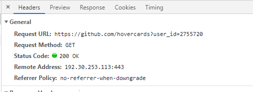

## 用傳紙條的概念解析前後端傳輸

- 發送至少三個步驟 ( 三次握手 )

    1. A 發送 給 B，B 收到訊息 ( B 接收 OK )
    2.  B 回傳給 A，A 收到訊息 ( A 的接收 OK，同時也知道 自己在第一步的發送 也 OK )
    3.  A 再回傳給 B，B 收到訊息 ( B 發現自己在第二步的發送是OK 的 )

- 紙條的資訊

    1. 數字格式統一
    2. 類別統一
    3. 回復格式統一

    

    4. 回復也統一格式，按照 2 的部分分為 head 和 body

    

    5. 統一動作

    

    

    可以了解到

    * 標準化內容格式
    * 分為 header 和 body
    * 用狀態碼標準化結果
    * 用動詞標準化動作

-------

- 更多服務

    現在不只是上面那個賣便當了，現在還有更多服務

   

   一樣有分 header 和 body，也有數字，動作統一

    那服務當然也需要統一服務帶碼啊！

    於是：

    1. 統一服務代碼

    

    2. 然後老闆千千指派一個人只能負責一種服務

    但還是可以再優化，簡化

    比如說借籃球只有借幾顆，不用像訂便當這麼複雜

    3. 加快速度

    比如說 NBA 這麼服務只需要幾秒傳一次戰況

    不需要即時性或穩定性

    

    * 新增服務代號：一人負責一個服務
    * 不同服務可以有不同格式，比如說籃球
    * 有些服務不一定要經過三次確認（小明三步驟），比如說報戰況
    * 跨校傳紙條寫校名，不寫地址也可以

## HTTP 

是作為前端和後端需要共同遵守的規範

也是為了一個安全的連線方式

可以參考你看不懂的[HTTP Wiki](https://zh.wikipedia.org/wiki/%E8%B6%85%E6%96%87%E6%9C%AC%E4%BC%A0%E8%BE%93%E5%8D%8F%E8%AE%AE)

當然也可以看到更多種協定


-------

## HTTP Request 介紹

就好比上面訂便當的案例


1. 瀏覽器 傳一個 HTTP 的 request 到 server
2. Server 回傳一個 response ，這些文字，只有瀏覽器看得懂，你看不懂

```html
<div class="pb-3 px-3">
  <div data-hovercard-tracking="{&quot;actor_id&quot;:48955965,&quot;user_id&quot;:2755720,&quot;user_login&quot;:&quot;aszx87410&quot;,&quot;subject_type&quot;:null,&quot;referrer_controller_action&quot;:&quot;files#disambiguate&quot;}"></div>
  <div data-hydro-view="{&quot;event_type&quot;:&quot;user-hovercard-hover&quot;,&quot;payload&quot;:{&quot;userId&quot;:&quot;2755720&quot;,&quot;subject&quot;:null,&quot;client_id&quot;:&quot;511173890.1556724035&quot;,&quot;originating_request_id&quot;:&quot;F912:695B:1343AF4:20D5379:5CD05A03&quot;,&quot;originating_url&quot;:&quot;https://github.com/hovercards?user_id=2755720","referrer":"https://github.com/Lidemy/mentor-program-3rd-ClayGao","user_id":48955965}}" data-hydro-view-hmac="ad47f1ff400cc724cdd0e31b8efeb83581c0ca9d7a28cd651b64be0ddf47e0b1"></div>
```

3. 瀏覽器 Read 之後，變成你看到的樣子
4. 我們再來看看剛剛的 request


5. 上圖你可以看到其實這就是類似剛剛傳紙條的資訊


6. 所以 request 的資訊是有一定格式的，只是不好看懂

-------

## HTTP 狀態碼

2 開頭 成功的意思

4 開頭 代表有錯誤

可以記開頭就好

直接引用 Wiki  https://zh.wikipedia.org/wiki/HTTP%E7%8A%B6%E6%80%81%E7%A0%81

下面提起個常用的

- 200

    204 成功處理請求，但沒有返回內容

    比如說 Delete ，我刪除成功了，但沒什麼要跟你講的就會有 204

- 301 

    假設你訪問 aaa . com回傳時會伴隨一個 header , 叫做 location : xxx . com

    下一次你再連到這邊，它就會幫你導到 xxx . com ( 永久移動 )

- 302 

    與上面的差別就是下一次不會自動幫你導到 xxx . com，還是會幫你導到 aaa . com ( 暫時移動 )

- 400 

    語法錯誤，請求錯誤

- 404 

    你要的東西我這邊沒有 ( 你要一個我沒有的東西做什麼 )

- 500 Server Error 

    Server 端錯誤，很常發生在搶票的時候

記住這個梗圖


-------

DNS ( Domain Name System )

在上述在傳紙條的最後一部分，有寫到你不用寫地址，你可以只寫地名就好

那背後一定有一個人，像是**計程車司機**，看到地名就知道要去哪


所以你在 Chrome 的開發人員工具也可以看到:



在 CLI 裡面你可以輸入 nslookup 網址 這個指令 看 IP


一個 Domain name 對應到一個 IP 位置

而 127.0.0.1 指的永遠是自己電腦的位置，不管是哪一台電腦的 127.0.0.1

DNS 的功用就是把 Domain Name 翻譯成 IP Address

## 瀏覽器是什麼 ?

瀏覽器只是一個軟體，一個程式而已

瀏覽器當你發出 req 的時候，會因其 res 回傳一些東西給你

那我們今天沒有瀏覽器，其實也能做到這一些

安裝　npm request 套件

https://www.npmjs.com/package/request

npm install request 打在 CLI

然後貼上程式碼


可以印出三選項分別是

error

statusCode

body

可以自己玩看看，對應該網站的開發人員選項

那你也可以把這個印出來的東西存到一個 html

用之前的指令 node index.js > xxx.html

start xxx.html

就會看到那個網頁出現 ( 裡面的畫面的 code 是你剛剛印出來的內容 )

可以按 F12 ，自己試試看