# 事前準備

相信大家都有 Google 帳號，然後 Google 搜尋 GCP

或可以點選[這裡](https://ephrain.net/gcp-%E4%BD%BF%E7%94%A8-gcloud-%E9%80%A3%E7%B7%9A%E5%88%B0-google-cloud-platform-%E4%B8%8A%E7%9A%84-vm/)

大概簡單介紹一下 GCP ( 文章編寫日期 2019 / 07 /18 )

它的優點是機房設在台灣，整體來說比 AWS 便宜一點，速度也比較快

這篇文章並不是廣告文，只是給想部署 LAMP 的人另一種選擇

另外就是以目前來說，目前有 $300 美金的試用金與一年期限

簡單來說應該就是如果這一年內沒把這三百美金用完，也會自動沒有

官方這邊是說到期之後會關閉你所有虛擬機，並且問你要不要購買

另外就是這一年免費版會關閉一些功能，但目前來說我們應該也不會涉獵到

這邊簡單介紹如何用 GCP 安裝 LAMP 環境

當然你要看[官方文件](https://cloud.google.com/community/tutorials/setting-up-lamp?hl=zh-tw)也可以

# 初次使用

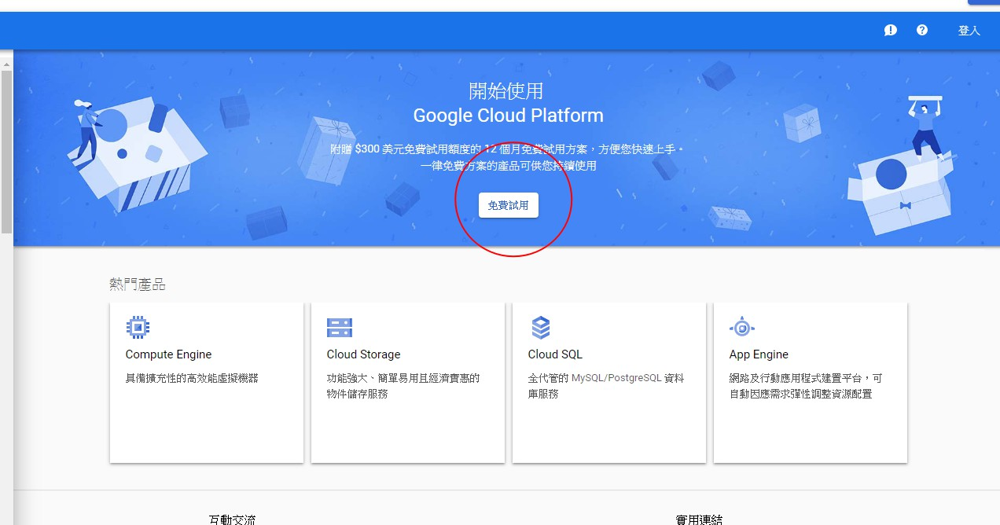

點選「免費試用」-> 看到一些介紹資訊 -> 點選「繼續」

*******

接下來應該可以申辦帳號了，這邊會跑出以下畫面

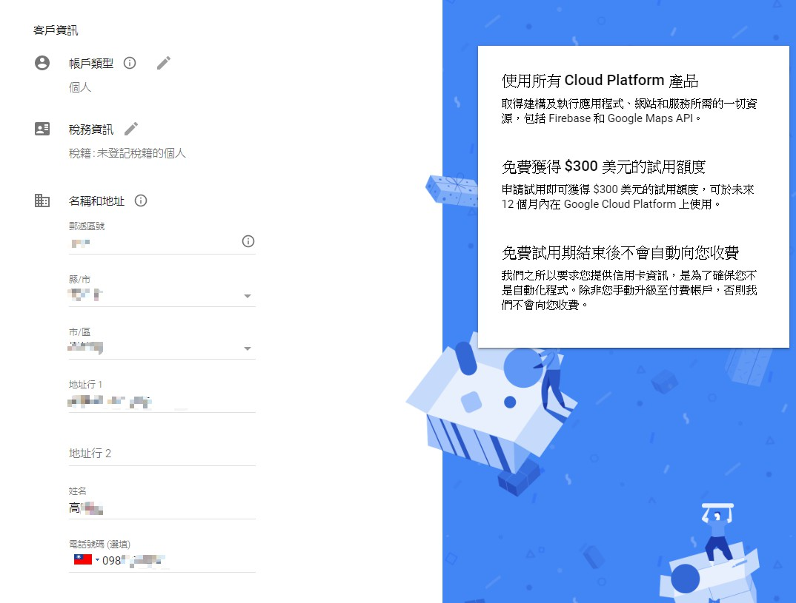

*******

填入你的資訊與信用卡資訊，接著下一步，就可以看到主控台，這邊就是我們的主菜單了

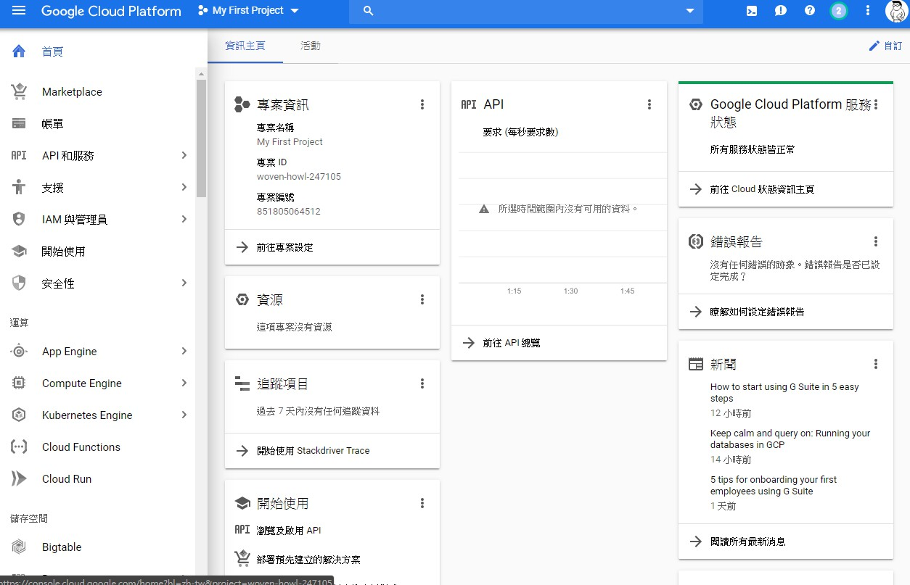

*******

你可以點選這邊，你可能會看到你有一個預設專案，或者你要新創一個專案也是可以

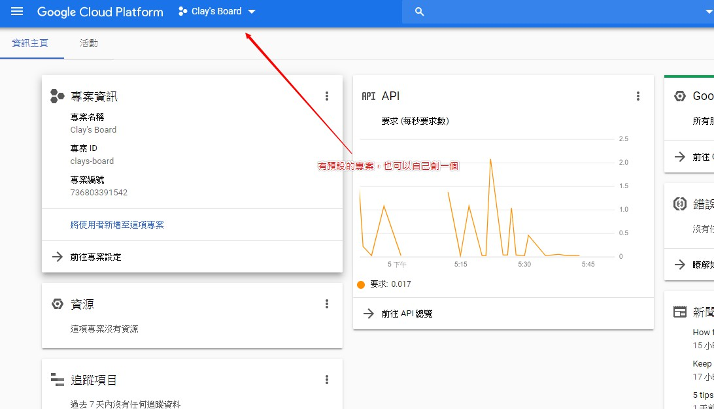

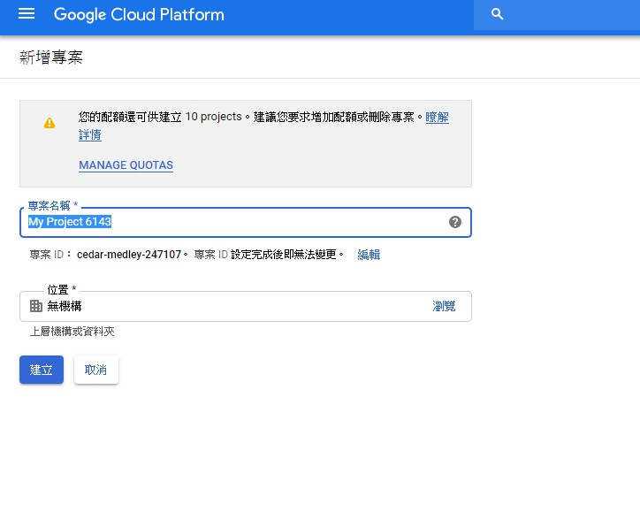

# 創建虛擬機

接下來選擇左側菜單的「Computer Engine」，這邊就是虛擬機器的意思，相關操作都在這裡，選擇之後點選「VM 執行個體」來建立虛擬機

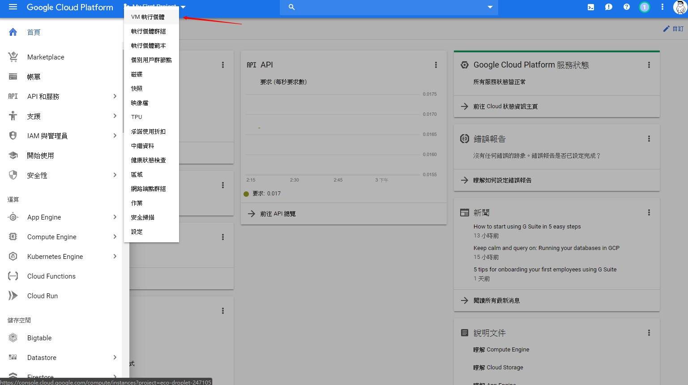

*******

一開始進來這個畫面，需要等它讀取完成，所以要等一下，不是當機唷

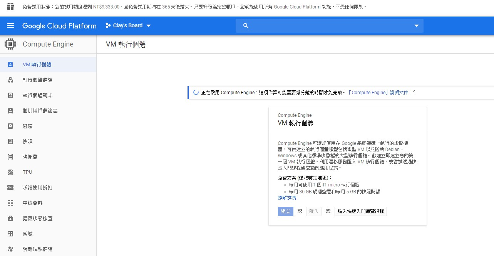

*******

然後就可以看到虛擬機選項畫面

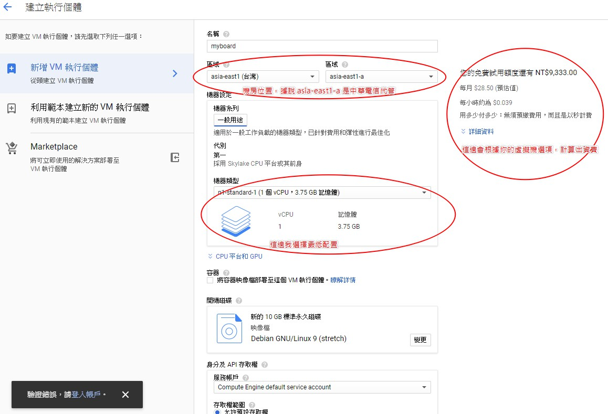

名稱 : 這邊沒有特別規定，我自己是打 myboard

區域 : 有台灣可以選就選台灣啦

機器設定[機器類型] : 這邊是選擇 CPU 與 RAM，個人是選如圖設定

*******

接著繼續往下拉

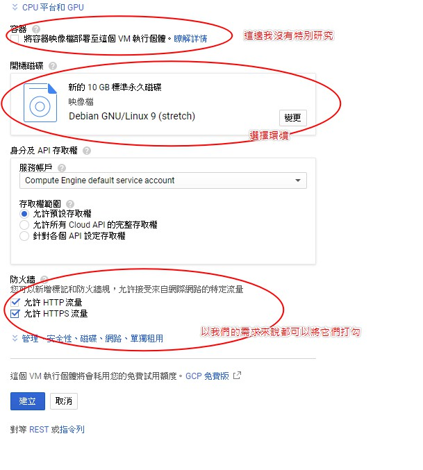

容器 : 這邊我還沒研究，個人是沒設置打勾。

防火牆 : 這邊根據我們的需求，將 HTTP 與 HTTPS 都勾選

關於環境的部分有不少選項，我這邊是選用與課程內容一樣的 Ubuntu 16.04 LTS，硬碟可以設定一般硬碟與 SSD，我也是一樣選擇 SSD，大小為 32G

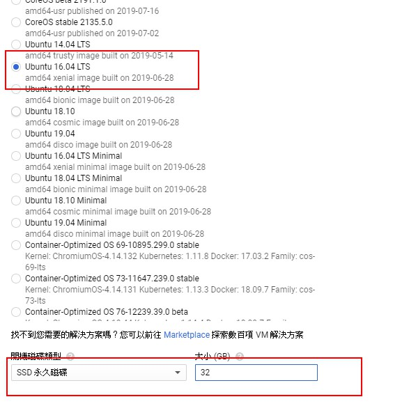

*******

都弄好了，就選擇「建立」

就可以看到虛擬機器創建完成啦！

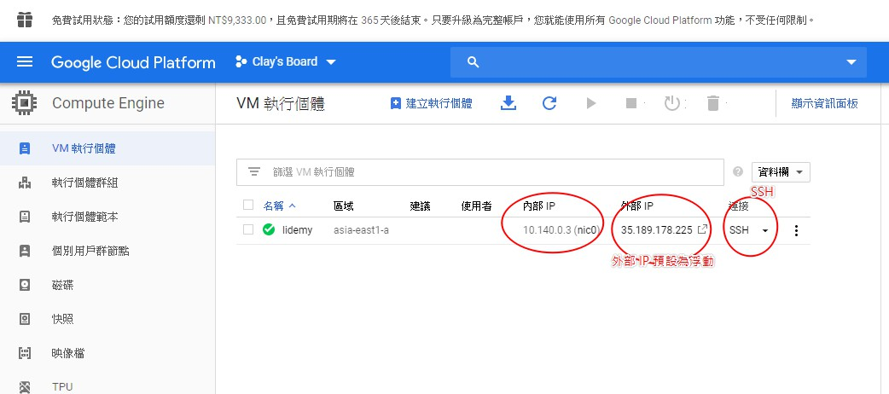

*******

但還沒有完，雖然說浮動 IP 也是可以用，但我們想要用固定 IP

這時候點選左邊菜單列的「VPC 網路」-> 「外部 IP 位址」

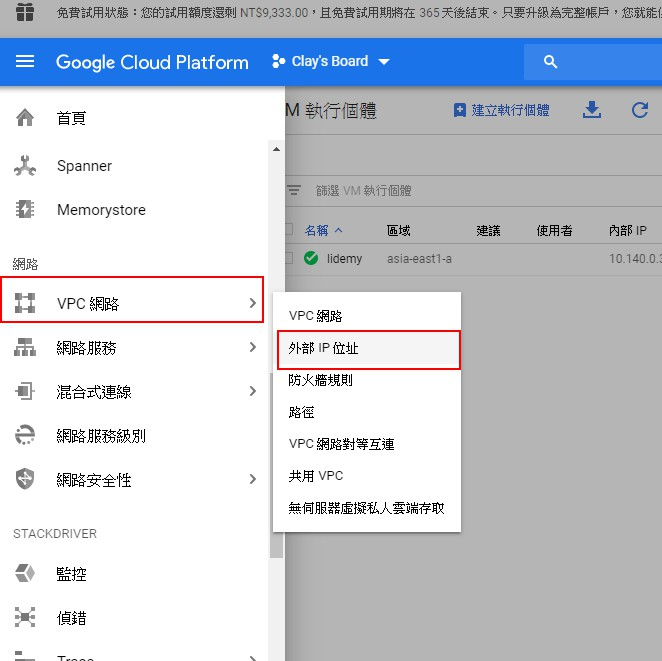

看到菜單之後，將「臨時」改為「靜態」，這時候彈出一個小視窗，設定名字按「預約」即可

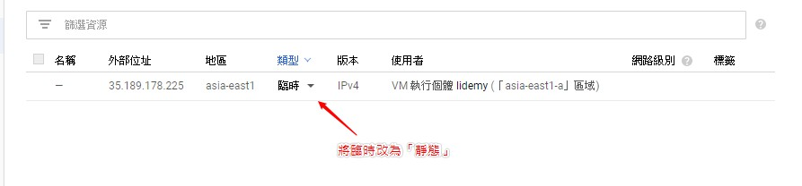

這樣虛擬機的設置就大功告成啦 !

# 開始建置環境

補充一點，虛擬機搭建好之後，扣款機制應該就已經開始運行了

不過由於試用版送 $300 美金的額度，所以暫時不用擔心

如果想查看扣款情形，可以點選左側菜單的「帳單」觀看

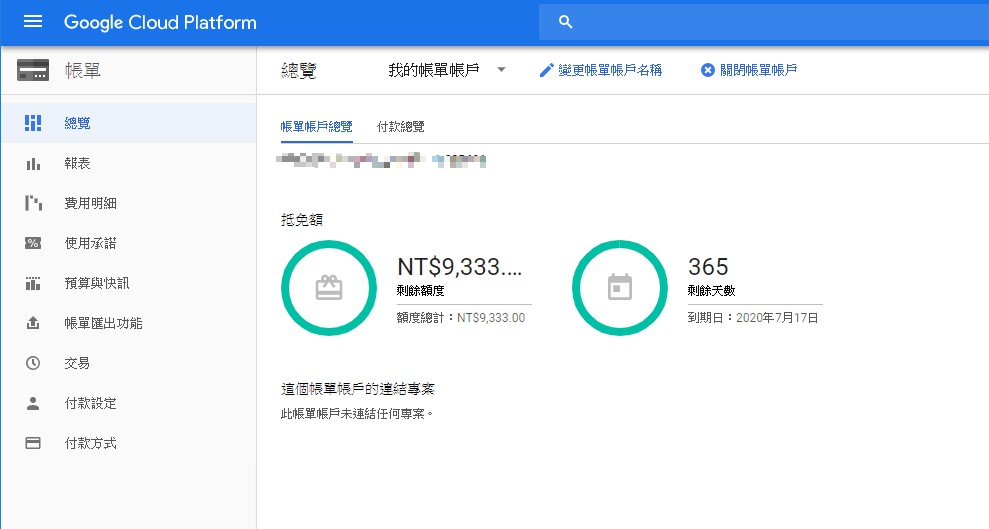

接下來就開始建置環境與設置 LAMP 了 !

*******

在開始建置環境之前，你可以選擇直接使用 Google 內建的指令系統 「Cloud Shell」

或者你也可以使用自己的終端機，這邊有前輩 EPH 撰寫的[MACOS 用如何用終端機連線到 Google Cloud Platform 上的 VM](https://ephrain.net/gcp-%E4%BD%BF%E7%94%A8-gcloud-%E9%80%A3%E7%B7%9A%E5%88%B0-google-cloud-platform-%E4%B8%8A%E7%9A%84-vm/)

***以下我們直接用 GCP 內建的 Cloud Shell 操作*** ( 未來應該還是會搭配 gCloud SDK 用自己的 Terminal )

*******

**以下範例以 Ubuntu 16 為標準，若上面創建虛擬機的步驟中，你的虛擬機安裝環境使用的與此不同，建議參考[官方文件](https://cloud.google.com/community/tutorials/setting-up-lamp?hl=zh-tw)，裡面有針對其他環境的操作範例。**

*******

首先回到「Compute Engine」菜單，點選我們剛剛創建虛擬機的「SSH」旁邊的小箭頭，選擇「在瀏覽器視窗中開啟」

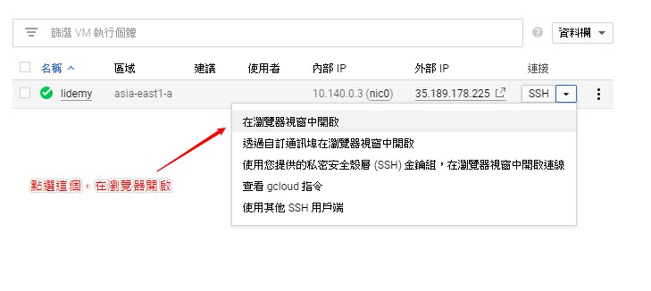

*******

等待 Google 小彩球讀取一下，然後我們熟悉的小黑窗就這麼出現了

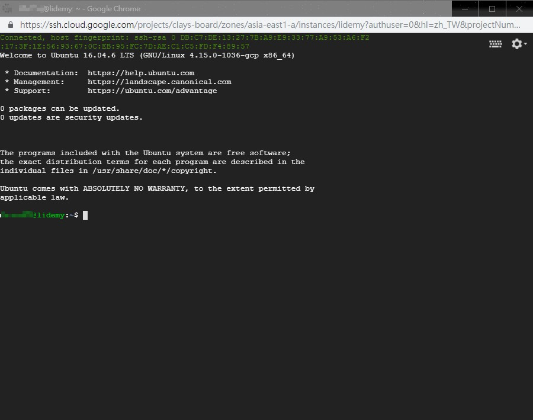

*******

## 安裝 Apache 與 PHP

在我們所使用的版本中，於小黑窗輸入以下指令以安裝 Apache 與 PHP

```php
sudo apt-get update // 先輸入這一條
```
```php
sudo apt-get install apache2 php libapache2-mod-php // 再輸入這一條
```

如果有「Y/n」選項，一律選擇 Y 輸入即可

安裝完成後，如果想檢測自己有沒有安裝成功，可以輸入 http://你的外部IP

```html
http://你的外部IP
```
如果跳出 **Ubuntu Logo Apache2 Ubuntu Default Page** 就代表安裝成功

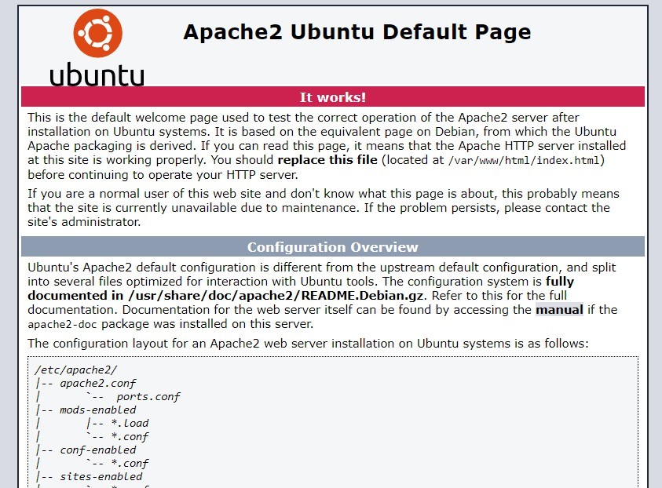

*******

這時候在 terminal 輸入 pwd，查找目前所在路徑，可以看到你會在一個你所屬 gmail 帳號名稱的資料夾，

```php
$pwd //home/你的帳號名稱
```

這時候我們的目的是要找到放網頁的目錄，這個目錄就是 /var/www/html/

於是我們使用 cd / 指令退回至根目錄，這時候輸入 ls 可以看到很多子資料夾

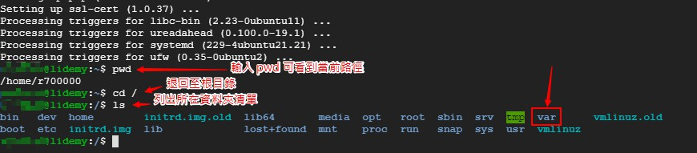

******

使用 cd 切換到 /var/www/html 底下之後可以看到 index.html，這個頁面就是我們剛剛安裝 Apache 成功之後看到的首頁

如果你想測試其他網頁，你可以使用 touch 與 VIM 創建檔案並在 html 資料夾底下增加內容，詳細內容我就不贅述了

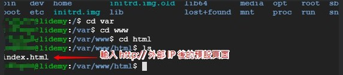

## 安裝 MySQL

要安裝 MySQL，輸入以下指令

```php
sudo apt-get install mysql-server php7.0-mysql php-pear
```

中間會有「Y/n」選項，按 Y 之後會出現紫色畫面要你建立資料庫密碼：

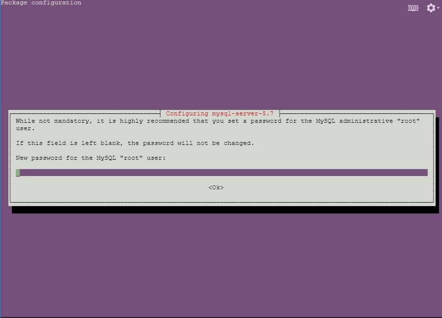

輸入完第一次之後會要你重複輸入第二次以確認

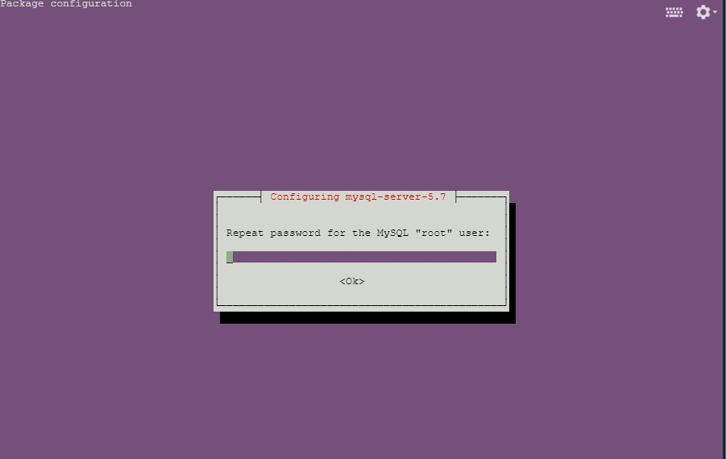

都 OK 之後就算是安裝完成了

*******

接下來就要配置 MySQL 以提高安全性，輸入以下指令

```php
sudo mysql_secure_installation
```

## 安裝 phpMyAdmin ( 可選但建議安裝 )

要安裝 phpMyAdmin，輸入以下指令

```html
sudo apt-get install phpmyadmin
```
中間會有「Y/n」選項，按 Y 之後會出現紫色畫面要你選擇伺服器

這時候**你必須按空白鍵**．出現 * 字號選項選擇 apache2 才算選擇到，選擇完按 Enter

跑了一下之後又會再次跳出紫色畫面詢問要不要以 dbconfig-common 作為資料庫設置，選 「YES」

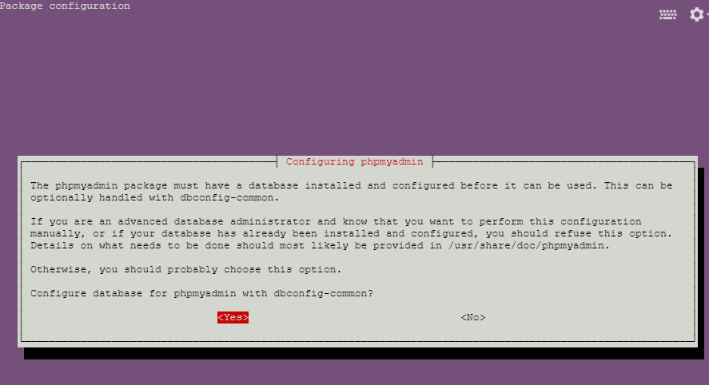

之後會要你輸入資料庫管理員密碼，一樣輸入兩次之後小黑窗就會繼續跑，安裝即完成

*******

安裝完成後，在瀏覽器網址列輸入 http://你的外部 IP/phpMyAdmin

如果成功就會正確顯示

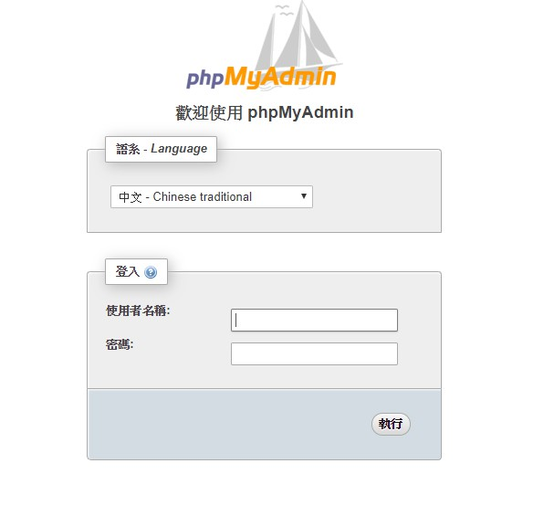

這時候輸入在安裝 MySQL 時我們設定的帳號密碼

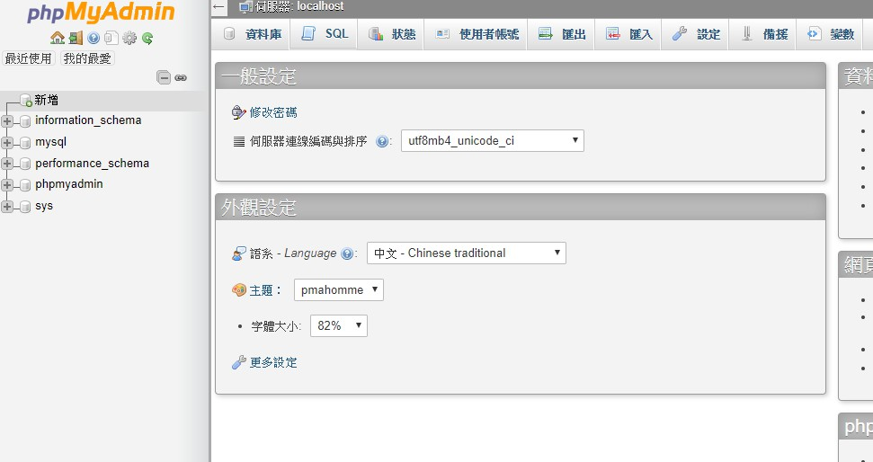

順利登入囉 !

以上就是部署 LAMP ( Lunix, Apach, MySQL and PHP)的過程 !

但還沒有結束唷，請繼續設定之後的東西

# Apache 基本設定檔

首先使用者必須了解，在  Ubuntu 底下的 apache2 設定檔與 windows 環境下 apache 的 httpd.conf 不同 

原本在 Windows 環境下的 Apache 內的 httpd.conf 檔案內中有幾乎大部分的設定檔集合，而在 Apache2 中則被拆成了不同的 conf 檔，apache2/sites-available 底下的 000-default.conf 僅是其中之一

所以我們在裝好 Apache2 之後，設定檔會存放在 /etc/apache2/sites-availabl 資料夾底下，名稱為 **000-default.conf**

( 如果是 windows 環境安裝 apache，這個設定檔則是 httpd.conf，在　/etc/httpd/conf 資料夾底下，必須記住 )

所以如果是要用 VIM 編寫這個 conf 檔案，可以直接在 terminal 輸入　vim /etc/apache2/sites-available/000-default.conf 來編寫

> $vim /etc/apache2/sites-available/000-default.conf     可以直接進入這個檔案做編修

假若是更改 var/www/html 的根目錄設定，就是在 apache2 這個資料夾底下的另一個檔案

> /etc/apache2/apache2.conf

其餘初學者需要使用的設定請參考[鳥哥](http://linux.vbird.org/linux_server/0360apache.php)的介紹，基本上就是找你要的指令然後再 Google 查 Ubuntu 環境下 Apache2 的檔案位置會比較快一點。這邊就不一一介紹了。

在修改之前也要提一下，如同我們安裝 npm 的 package.json 內的 JSON 格式設定檔一樣，apache2 底下的 conf 裡面也有既定的格式，小心不要修改錯誤了

```
<項目>
    相關參數
    ...ect
</項目>

<項目>
    相關參數
    ...ect
</項目>

<項目>
    相關參數
    ...ect
</項目>
....
```
******

## 修改副檔名執行順序

> sudo vim /etc/apache2/mods-enabled/dir.conf

找到以下位置

假設我要最優先執行 php 檔

```
<IfModule mod_dir.c>
        DirectoryIndex index.html index.cgi index.pl index.php index.xhtml index.htm
</IfModule>
```

修改為

```php
<IfModule mod_dir.c>
        DirectoryIndex index.php index.html index.cgi index.pl index.xhtml index.htm
</IfModule>
```

簡單來說就是將 index.php 排前面

******

## 修改資料夾的存取權限

</br>

輸入 ls -l 可以看到以下畫面，這代表著你在這個資料夾底下對各個子文件或文件夾的修改權限

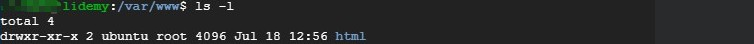

drwxr-xr-x 就是目前的權限，「-」的部分是被遮蓋掉的

</br>

這時候開啟可讀可寫的權限，**注意，這樣的做法未必是安全的，但由於作業所以我求快而使用，關於此權限類型的語法還需要多補強知識才能運用自如，關於 Lunix 權限請參考[這裡](https://blog.csdn.net/u013197629/article/details/73608613)( 轉載於 [CSDN](https://blog.csdn.net/u013197629/article/details/73608613) )**

> sudo chmod 777 -R /var/www

</br>

再輸入一次 ls -l，可以看到權限的部分被開啟了

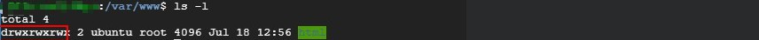

</br>

這個必須要做，這樣我們才能順利新增我們的網頁文件到目錄底下執行

若要回到原本權限，可輸入下列指令

> sudo chmod 755 -R /var/www

******

# 加入 GitHub repo

</br>

安裝完成了，可以來放入我們前幾周的作品了

如果你沒有執行剛剛的開啟權限的話，git clone 會有以下回覆，表示權限不夠 ( Permission denied )

> fatal: could not create work tree dir 'mentor-program-3rd-ClayGao': Permission denied

