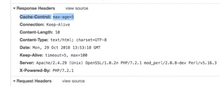
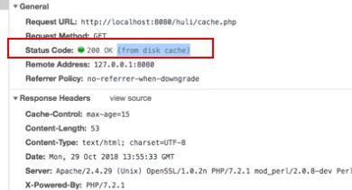
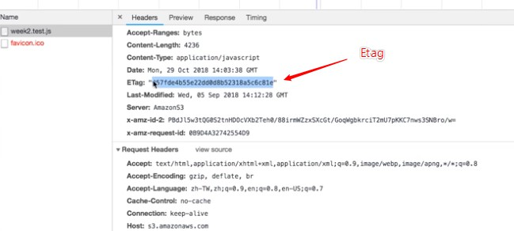
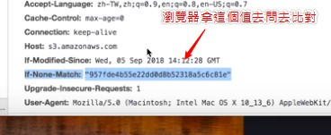

# 概念解析

工程師要有 Debug 的能力，然後有一個小技巧是逐行刪除，縮小問題範圍

# Server 是什麼 ?

就是放程式碼的主機，要連過去就是用指令 SSH

## Local 與 Server 的差別 ?

也就是本地端與伺服器端

- localhost : 指的就是你現在這台電腦，localhost 基本上算是一個網域

本地電腦有一個文件，他算是一個層級更高於 DNS 的文件

這邊你可以自定義你這台電腦所連線的 IP 與對應的網域

比如說你可以輸入 127.0.0.1 google.com

這樣的話 google.com 這個網域之於你自己就是對應到 127.0.0.1

# Port 端口 / 連接埠

你應該會看到 localhost:8080 這是我們自己設定的 ( 原為 80 )

一台主機通常不會只執行一個程式，如果我一台主機的出口塞了兩個程式，那我連接該 IP 的時候就不知道會執行哪一個

所以一個 IP 位置後面有很多端口，不同端口執行不同程式，現在已經演變成「特定程式會占用不同的 Port 」


# 防火牆

首先我們已經知道 ubuntu 已經有防火牆了，叫做　ufw

而如果是在 AWS 辦虛擬主機的話，他還會有一個新的防火牆

假設我這台電腦的 IP 位置為 152.68.68.68

http://152.68.68.68:8080 

和 http://localhost:8080 兩者有何不同呢 ?

答案是如果選擇前者，我的 request 會先經過外面的世界繞一圈找到 152.68.68.68 我的 IP 後才連進來

但如果是後者，我就直接從我電腦內部進入了

簡單來說一個會產生外在的流量，走外網，一個是走內網

所以防火牆的部分要設定好，如果檔到了特定的部分，會產生錯誤

# Transaction 的問題

在最後判斷的部分要自行做一個原子性功能

```php
#sql = "INSERT INTO...";
if ($conn->query(sql) !== TRUE) {
    $is_success = false;
}

#sql = "INSERT INTO...";
if ($conn->query(sql) !== TRUE) {
    $is_success = false;
}

#sql = "INSERT INTO...";
if ($conn->query(sql) !== TRUE) {
    $is_success = false;
}

// 這個功能要自己寫出來，不可僅僅只有 $conn->commit();
if (!$is_success) {
    $conn->rollback();
} else {
    $conn->commit();
}
```

# cache 快取

需要 cache 的理由就是這東西我要重複使用，如果一大堆人來我早餐店點火腿蛋，我當然準備好一堆火腿蛋放在櫃檯

這樣就不用每有客人要一次我就去後面做一次

cache 這次先來提 Server 和瀏覽器之間的 Cache 機制

要實作的話就在 HTTP Response Header 加入

```php
Expires: Wed, 21 Oct 2017 07:28:00 GMT
```

Response 回傳給使用者瀏覽器之後，下次如果還是一樣的請求 ( 發現上述的過期時間還沒有到 )

使用者這邊的瀏覽器就會自動去找「瀏覽器自己本身裡面的 cache」並拿資料，就不會發 request 出去

但這個後端方法有個問題，因為每台電腦的時間不一樣

如果我 Server 端是 2018 年，和使用者不對稱怎麼辦？

這問題很好解決，只要把絕對時間換成相對時間就好


```php
Cache-Control : max-age=30
```
代表這個 Response 的過期時間是 30 秒，如果說瀏覽器在第 15 秒重新整理，就會去抓 cache

另外就是重新整理的方式不同，瀏覽器處理的方法也不同

比如說 Ctrl + F5 就是不採用任何 cache　( MAC 是 ctrl + R )

## 實作看看

```php
header('Cache-Control: max-age=5');
echo time();
```

這樣就可以看到 header 有帶 cache



另外有一個值得研究的問題，就是重新整理時發現瀏覽器不會去抓 cache

這很有可能是在 request 會在 header 帶 Cache-Control: max-age=0

但這還有另一個解法

```php
header('Cache-Control: max-age=5');
echo time();
</br>
<a hrel="/clay.php">click me</a>
```
這樣不斷點按紐都會採用 cache，因為發現點擊都是在五秒內



所以發現在網址列按 Enter 不會用快取，但是點擊連結按鈕會

## 假設 cache 過期

雖然 cache 過期，但不代表他不能用

意思就是說保存期限雖然過了但不代表東西壞了

這時候要講的是一個 Last-Modified，Server 和 Client 配合的功能

Server 回傳 Response 的時候可以多加一個 Last-Modified 的 Header ( 表示這個檔案上一次更改是什麼時候 )

而瀏覽器本身再次發 Request 的時候，就可以利用這個　Last-Modified，改用 If-Modified-Since 來跟 Server 指定拿取

拿取「某個時間點以後有更改的資料」( 基於 Last-Modified )

如果瀏覽器偵測到沒有改變，就會回傳 Status Code 304 ，然後取快取

如果回傳 Status Code 200，那就會發出 Request

## Etag

Etag 檔案有無實際更動

上述的例子判斷有無更動的標準其實很廣義，就算不更改任何內容僅僅是重新儲存，也會是被編修過的狀態

而 Etag 這個 Header 就是實際來看「檔案本身到底有沒有被更動過」，這樣的話其實會比判斷編輯時間會好很多

也就是說以此來判斷是否更新快取的新條件

可以當作 hash，可以根據檔案的型態去產生 hash 值 ( 這邊是比喻 )

我們之前學過 hash 都會知道，僅僅一字之差，就會產生天差地遠的 hash 值

實際做法是我們可以在 Response 帶上這個檔案的 Etag，**等快取過期之後，瀏覽器就可以拿這個 Etag 去比對是否有被更動**

要了解的是 Etag 與 If-Modified-Since 也是得搭配使用的



然後再次發送 Request 



回傳 304 代表是沒有改變的，所以可以沿用原來的檔案

