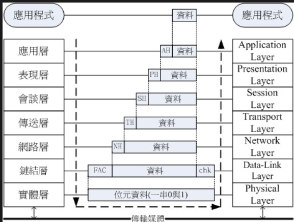
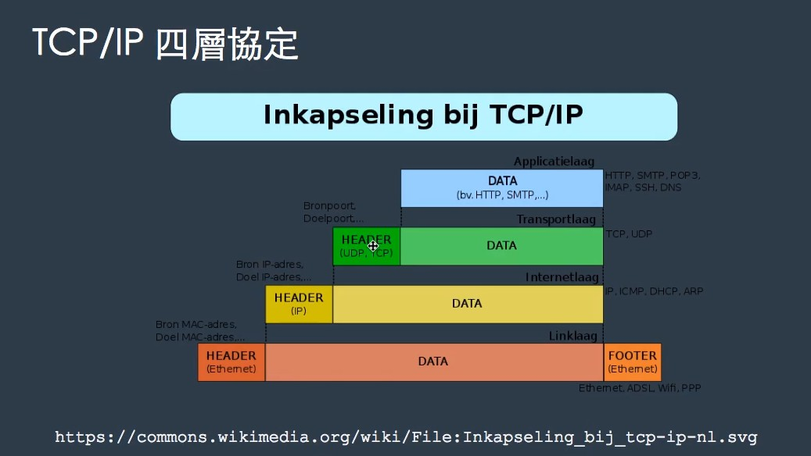
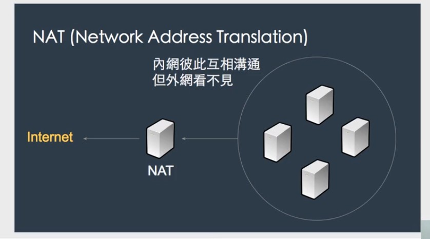
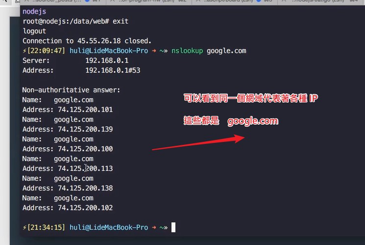
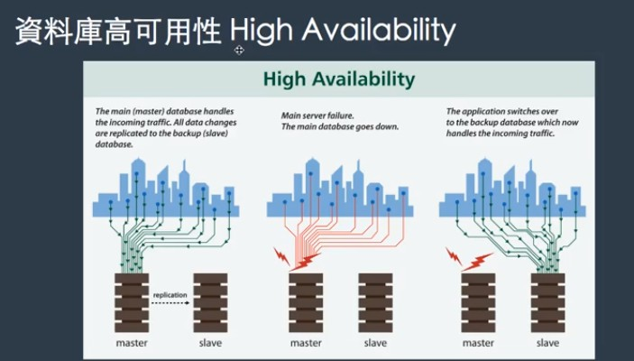

# 8-1 後端基礎與網路相關知識

- Bootstrap 和 jQuery 在現在較多小公司都有不少人在用，但 jQuery 近年來已經比較少公司在用，因為已經多使用框架等等

- 每週目標需要搞懂，主要跟面試題目有關

# 後端基礎 :　網路相關知識

- 網路如何運作 ?

    物理層面：軟體資料的傳輸必將通過現實物體當作傳送橋梁，一般我們發送 req 時，是怎麼運作的呢？

- OSI 七層協定

    最底層：實體層，0 與 1 的一些資料
    比如說海底電纜斷掉，就有大部分人不能上網，所以可以理解終究必須依賴實體層。

    

    應用層：就是我們寫程式這一塊

    在傳送的時候我們是透過應用層一層一層往下傳，傳到最底層傳出

- TCP / IP 四層協定

    

    簡化為四層，圖為各層之對應

    可以注意到 Http / FTP / SMTP 都是在應用層，另外還有 SSH

    這些都是協定，比如說固定的 header / Body 等，FTP 軟體意思也代表符合 FTP 標準的傳輸程式。

    所以網路的世界充滿著協定，因為若沒有固定的規範下交換資料，那將會非常的混亂。

    在 TCP / IP 模型中，也是應用層的資料一層一層往下傳給連結層

    

    可以看到資料會一直一直往下加長

    往回傳時，各層也會取走它所要的 Header

- IP ( Internet Protocol )

    IP 是個協定，但其實我們多指 IP Adress，以下也用此代稱

    IP 有分內網位置與外網位置

    192.168 開頭 : 內網

    10.0 : 內網

    外網就不是了，所有內網出去為外網都是一組 IP

    但是這一組 IP 不一定是固定 IP，大多數是浮動 IP

    在正常運作中，你的家外網連到電信公司機房，再從機房到你的目的地

    所以網路上公開你的 IP 只能確定你所在的機房位置，比如說大陸或台灣，但只有電信機房才能知道你家電腦的位置。

    (　那 PTT 的 IP 就不準確了 ? )

     

     IPv4 / IPv6

     IPv4 是原本的 IP 版本，有四組數字，但是 IP 位置已經不夠用，於是已經延伸到 IPv6

- TCP / UDP

    - UDP

        比較快，但不保證東西送得到

        用在網路電話 ( VoIP ) 或音樂串流  Music streaming

    - TCP 與三次握手

        TCP 保證一定送得到，比如說 http -> 有 request 必有 response，如果失敗也會回傳 404 等 statuscode

        瀏覽器等等都是必用 TCP，TCP 是走在 IP 上面的，所以上圖也可以表達囊括的意思。

        三次握手機制：TCP 就是靠這個機制保證一定連線

        第一次 : A 問候 B ( A 可發送確定 )
        第二次 : B 應答 ( B 可收到確定，B 可發送確定 )
        第三次 : A 表達收到，傳輸開始 ( A 可收到確定 )

        A，B 都經歷了可發送確定 與 可收到確定

        相反地，UDP 就沒有這種機制

- 如何連上一個網站的 ?

    - 每一個站點都有一個地址，我們一般是輸入「網址」

    網址是給人看的，但電腦看不懂

    電腦看的是 IP Adress

    所以勢必有一個東西可以將「網址」轉成「IP 位置」讓電腦去判斷

    網址又可以看成 Domain - 網域

    其實就是網址的產生，利用一個叫做 DNS ( Domain Name Server ) 由該網域查到該網域背後的 IP 位置

     

     可以用 nslookup 這個 CLI 指令查詢

     所以 DNS 可以透過網域查 IP

- 網站的背後是什麼 ?

    網站背後就是伺服器，其實就是一台電腦裝伺服器程式這樣

    更應當說：當你的瀏覽器發 request 給伺服器，伺服器運算之後回傳 response 給瀏覽器，而伺服器裝在一台實體電腦主機上，而伺服器本身就是這台電腦主機裡面的程式而已

    實體主機 : 有一台實體主機上面裝伺服器程式，或是租實體主機：比如說租中華電信的主機

    虛擬空間：底層還是一台實體主機，但是你沒有實體主機的操控權，你只是利用實體主機本身的一點空間，用這個空間架站。

    虛擬主機：如 cloud，在一台實體主機上有很多台虛擬主機，如 VB，用起來跟實體主機差不多，只是虛擬主機會占用到實體主機的記憶體和效能。

    另外就是虛擬主機的遷移性比較高，假設虛擬主機所依據的實體主機壞掉了，那可以再移到別的實體主機上，如此資料不會不見。

- 伺服器網路架構

    通常一台公司不會只有一台主機，這時候我們需要 NAT ( Network Address Translation )

    Internet <--> NAT <--> [ 內網主機, 內網主機, 內網主機, 內網主機..]

    也就是內網出去都是透過 NAT

    - 負載均衡 Load Balancer

    假設你的公司是 Facebook，公司內網不只一個伺服器主機，這時候成千上萬人連到我這邊，這些 requests 不可能都指向內部某一台主機，一定是經過某些分配，讓各個伺服器主機都能接收到使用者的 request

    這個分配機制，就稱為負載均衡 ( Laod Banlancer )，也就是平均流量

    Internet -> Load Balancer -> [ PHP-01, PHP-02..]

    Load Banlancer 本身也是有可能壞掉的，這邊有同學問到這個問題

    但應該是有其他方式避免，理論上 LB 壞掉就全壞了。


- 怎麼管理伺服器？（我跟別人租的伺服器）

    - SSH ( Secure Shell )

        1. 透過 command line 介面連到遠端自己租的虛擬主機下指令 ( 考驗指令功力 )

        ```
        ssh 網域名稱
        ```
        這樣輸入可以連線到一個遠端機器上，課程中以 UB 為例子

        ```
        ls
        ```
        這樣就可以看底下的資料了

        ```
        top
        ```
        可以使用 top 指令看使用狀況

        2. 透過遠端桌面的方式
    
    - VPN ( Virtual Private Network )

        原理：先連到某台主機，再用那台主機連到外面

        所以可以翻牆

# 資料庫

- 資料庫備份 ( Replication )

    比如說我有一個主資料庫叫做 P01，P01 存東西的時候都會將資料寫入一個叫做 P02 的資料庫，P02 伺服器也有機制當 P02 資料庫被寫入時，也會同時將資料寫入 P03 之中

    而當 P01 要讀取資料時，會自動讀 P03 內的資料，也就是說 P01 寫入到 P02，讀是讀 P03

    如此這樣 P01 的資料庫壓力就比較不會這麼大

    另外另一個通例就是讀多寫少，比如說你 IG 也是看文多，發文少，這時候這種架構就不會讓主機壓力過大，這就是讀寫分離

- 資料庫高可用性 ( High Availability )

    

    簡單來說永遠都要有 B 計畫，這個機制是說 A 主機掛掉，資料要求就會導到 B 主機，這時候就可以專心修 A 主機

- Q&A

    - 如何購買網域 ?

        [GoDADDY](https://tw.godaddy.com/offers/domains/godaddycom?isc=gofktw06&countryview=1&currencyType=TWD&gclid=Cj0KCQjwjrvpBRC0ARIsAFrFuV-nr6P4xX8bDM57WD8uc7woomvLUd_PHMNPjGATKB1PojKQyYdPtDYaArKiEALw_wcB&gclsrc=aw.ds)

        在搜尋列輸入你想要的網域名，它就會顯示價錢給你

        .com -> 公司行號

        .com.tw -> 台灣的公司行號

        價格的決定是網域供應商自己決定的，這個價錢算是一年的

    - 虛擬主機供應商 ( cloud )

        - Digital Ocean

            Products : Droplets 可以觀看產品

        - Amazon　AWS

            也提供不少雲端主機，教學在課程介紹有

            
    

    


    

    


    
