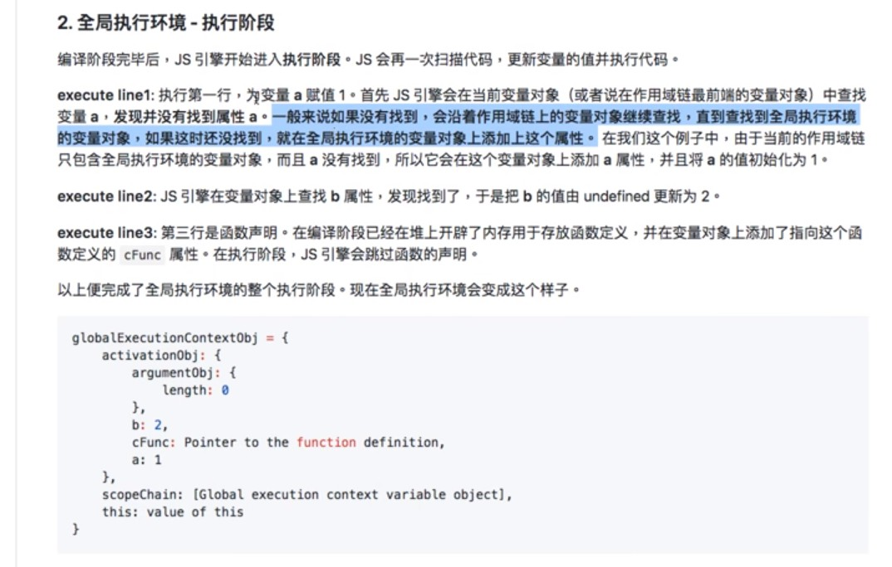

# 前言

開宗明義今天所述的課程內容有一定難度，主要會集中在 Javascript

# Hoisting 提升

思考下列兩者的差別

```javascript
console.log(a); // undefined
var a = 1;
```

```javascript
console.log(b); // b is not defined
var a = 1;
```

所以變數**提升**的意思是什麼 ?

為什麼兩者的錯誤訊息會不同呢 ?

第一段程式碼我們可以拆成以下

```javascript
console.log(a); // undefined
var a; // 宣告
a = 1; // 賦值
```

但是對於 Javascript，當需要呼叫一個變數，而全域內有變數，但還會讀到時，Javascript 會自動把該變數 hoisting 到上面來，所以可以看成這樣

```javascript
var a; // 宣告 - 變數被提升
console.log(a); // undefined
a = 1; // 賦值
```

-----

再看第二個案例，函式的案例

在某些程式語言之中，有些程式語言的規則是函式需要**先宣告**才能使用，但 JS 不用 (儘管 Eslint 也會跟你說不能) 先宣告函式，先呼叫也 OK

```javascript
test();

function test() {
    console.log("函式執行成功 !"); 
}
```

# Closure 閉包

來看看以下程式碼

```javascript
function test() {
    var a = 10;
    console.log(a); // 10
}

test();
console.log(a); // a  is not defined
```

- 原理 : 

    當 function 執行完之後，內中的變數和內容會被**釋放**，所以對渥面的區域來說，變數 a 是不存在的

    第二個原因是因為作用域不同，外面是看不到裡面的變數，而這是**作用域概念**

## 閉包用在哪 ?

參考以下案例

```javascript
var count = 0;
function addCount(){
    count++;
    return count;
}

console.log(addCount()); // 呼叫第一次
console.log(addCount()); // 呼叫第二次
```

這樣每呼叫一次，就可以計數了

但這樣有一個缺點，Count 本身在全域的部分也可以被使用到，這時候如果別人改到程式碼輸入 `count = 10`，計數就和預期不同了

為了達到使變數無法被修改的目的，所以我們可以這樣寫

```javascript
function addCount(){
    var count = 0;
    count++;
    return count;
}

console.log(addCount()); // 呼叫第一次
console.log(addCount()); // 呼叫第二次
```
如此會輸出

```
1
1
```

所以問題是，我們要怎麼讓函式被呼叫的時候忽略 `var count = 0;`，直接 count++ 呢 ?

方法是將兩個工作分開，在裡面創計步函式，並且回傳函式結果

```javascript
function createCounter() {
    var count = 0;
    function counter() {
        count++;
        return count;
    }
    return counter;
}

var counter = createCounter();
console.log(counter());
console.log(counter());
```
如此會輸出

```
1
2
```
**閉包**的使用型態就是用一個函式裡面再包一個函式，並 retrun 該函式

從這邊可以發現，用函式包起來是為了讓全域不要用到我們的變數，**利用函式創造新的作用域**就是我們的手段

這就是**閉包**的原理

習慣後也可以寫成這樣 :

```javascript
function createCounter() {
    var count = 0;
    return function() {
        count++;
        return count;
    }
}

var counter = createCounter();
console.log(counter());
console.log(counter());
```

回到我們最初討論的幾個特性

1. 函式執行過後，內中的東西會被**釋放**，但是閉包的特性使其**保存**，可以繼續沿用下去，比如說上述案例的 `count`

2. 閉包的特性可以讓我們在外呼叫內部函式 (用 return 串接)

繼續看下一個重點，這樣使用的話我們就可以用一套同樣的邏輯去計算兩個我要計算的變數

```javascript
function createCounter() {
    var count = 0;
    return function() {
        count++;
        return count;
    }
}

var counterA = createCounter();
var counterB = createCounter();
console.log(counterA());
console.log(counterA());
console.log(counterB());
console.log(counterB());
console.log(counterB());
```

如此會輸出

```
1
2
1
2
3
```
兩者之所以會分開計算，是因為看似是用同一個 `createCounter()`，但實際上回傳的內容屬於**不同的記憶體位置**，所以 `counterA === counterB 為 false`，可以回到[第五週的心得](..week5/week1-4.md)複習記憶體位置概念

另外請注意`var counterA = createCounter();` 其實只**執行**裡面包著的那個函式的內容！這邊由 `return function(){}` 可以見得 (影片 18:45)

參考網址 : https://pjchender.blogspot.com/2017/05/javascript-closure.html

# Prototype

```javascript

```

由於 ES5 沒有內建 OOP，所以以下都是這樣創建建構子來使用 OOP

```javascript
fucntion Person(name) {
    this.name = 'nick';
}

var nick = new Person('Nick');
var peter = new Person('Peter');
console.log(nick.name, peter.name) // Nick, Peter
```

那現在除了設定 name 之外，這邊還想多做一些事情

```javascript
fucntion Person(name) {
    this.name = name;
    this.getName = function() {
        return this.name;
    }
}

var nick = new Person('Nick');
var peter = new Person('Peter');
console.log(nick.name, peter.name) // Nick, Peter
console.log(nick.getName(), peter.name) // Nick
```

但是注意，若這時候輸入 `console.log(nick.getName === peter.getName)` 會是 `false`，因為兩者的 function 的記憶體位置不同，所以是兩個不同的 function

那要如何讓兩者相等呢 ?

```javascript
fucntion Person(name) {
    this.name = name;
}

Person.prototype.getName = function() {
    return this.name;
}

var nick = new Person('Nick');
var peter = new Person('Peter');
console.log(nick.name, peter.name) // Nick, Peter
console.log(nick.getName(), peter.name) // Nick

console.log(nick.getName === peter.getName) // true
```
要注意的是，即使是這樣的寫法，但 `nick.getName()` 還是會先從 `function Person(){}` 裡面開始找，若找不到，才會找到 `Person.prototype.getName`

**也就是說，在 JS 裡面的運作是，會先從 intence 開始找，若找不到，就去找 Prototype**

找到之後就會使用了，但**如果仍找不到，就會再往更上層找**

這時候，`console.log(nick.getName === Person.prototype.getName) // true`，他們是同一個 function

那這時候可以明白，呼叫時引擎之所以知道要找 prototype，肯定是因為有一個東西將他們之間的關係串連起來了，那就是隱藏屬性 __proto__，它的目的就是如果底層找不到東西，它會指引妳去哪裏找，這個隱藏屬性在每一次你創建一個 intance 的時候就會出現

`console.log(nick.__proto___ === Person.prototype) // true`

所以可以這樣理解，如果在 nick 找不到，其實就會找向 `nick.__proto___`，而這時候的的　`nick.__proto___`　則是　`Person.prototype`

如果要研究更深，其實重點就是 `new` 這個關鍵字，

其實 `var nick = new Person('Nick');` 這個甕做可以看成以下

```javascript
var obj = {
    name = 'nick';
}
obj.__proto__ = Person.prototype
```
那如果還是找不到呢 ? 整理一下步驟

1. nick 找不到，就去找 nick.__proto__(Person.prototype)
2. 仍找不到，就去 nick.__proto__.__proto__(Person.prototype.__ptoto__)
...
...

```javascript
console.log(nick.__proto___ === Person.prototype) // true
console.log(Person.prototype.__proto___ === Object.prototype) // true
```

從 Boolean 為 true，可以知道其代表的東西是一樣的，而這邊找到就停了

請注意尋找的順序是如上所述，跟函式的宣告順序**沒有關係**

這樣的尋找順序可以看做是一條鍊，我們稱為**原型鍊 prototype chain**

# 程式執行原理 Stack

## 程式是怎麼執行的 ?

Stack 是一個資料結構，並且會符合它所屬資料結構的**特性**

在 JS 中稱之為 **Call Stack**，這個資料結構解釋了 JS 底層是如何執行的

Call Stack 符合 LIFO ，當程式在跑的時候，就會依照這個結構來跑，**Call** 的意思就是 Fubction call，也就是說 Javascript 底層運行的特性是符合 Stack 

*關於 LIFO，可以當作餐廳疊的餐盤，最後放上去的一定最先被取走*

另外這邊要記住，**要 function call 才會入 Stack，宣告 function 不會**

看看以下這個例子

```javascript

```


```javascript
function a() {
    b();
}

function b() {
    c()
}

function c(){
    console.log(ddd)
}

a()
```

這邊可以預測得到 Stack 應該如下

| Stack |
|:-----:|
| c()   |
| b()   |
| a()   |

上述的 `console.log(ddd)` 是故意打錯的，可以看一下用 node 執行這個 js 所產生的錯誤訊息如下

```
λ node index.js
C:\Users\USER\Desktop\index.js:10
    console.log(ddd)
                ^

ReferenceError: ddd is not defined
    at c (C:\Users\USER\Desktop\index.js:10:17) 
    at b (C:\Users\USER\Desktop\index.js:6:5)
    at a (C:\Users\USER\Desktop\index.js:2:5)
    at Object.<anonymous> (C:\Users\USER\Desktop\index.js:13:1)
    at Module._compile (internal/modules/cjs/loader.js:701:30)
    at Object.Module._extensions..js (internal/modules/cjs/loader.js:712:10)
    at Module.load (internal/modules/cjs/loader.js:600:32)
    at tryModuleLoad (internal/modules/cjs/loader.js:539:12)
    at Function.Module._load (internal/modules/cjs/loader.js:531:3)
    at Function.Module.runMain (internal/modules/cjs/loader.js:754:12)
```
其中下列三行就是 Call Stark 的內容，可以看到符合 LIFO 原則

```
at c (C:\Users\USER\Desktop\index.js:10:17) 
at b (C:\Users\USER\Desktop\index.js:6:5)
at a (C:\Users\USER\Desktop\index.js:2:5)
```

而以下部分就是 JS 內建的一些 Function

```
at Object.<anonymous> (C:\Users\USER\Desktop\index.js:13:1)
at Module._compile (internal/modules/cjs/loader.js:701:30)
at Object.Module._extensions..js (internal/modules/cjs/loader.js:712:10)
at Module.load (internal/modules/cjs/loader.js:600:32)
at tryModuleLoad (internal/modules/cjs/loader.js:539:12)
at Function.Module._load (internal/modules/cjs/loader.js:531:3)
at Function.Module.runMain (internal/modules/cjs/loader.js:754:12)
```
又或者你這樣寫

```javascript
function a() {
    a();
}

a();
```

這樣寫就是會無限呼叫，可以大概猜到 Stack 也會無限循環

```
λ node index.js
C:\Users\USER\Desktop\index.js:1
(function (exports, require, module, __filename, __dirname) { function a() {
                                                                        ^

RangeError: Maximum call stack size exceeded
    at a (C:\Users\USER\Desktop\index.js:1:73)
    at a (C:\Users\USER\Desktop\index.js:2:5)
    at a (C:\Users\USER\Desktop\index.js:2:5)
    at a (C:\Users\USER\Desktop\index.js:2:5)
    at a (C:\Users\USER\Desktop\index.js:2:5)
    at a (C:\Users\USER\Desktop\index.js:2:5)
    at a (C:\Users\USER\Desktop\index.js:2:5)
    at a (C:\Users\USER\Desktop\index.js:2:5)
    at a (C:\Users\USER\Desktop\index.js:2:5)
    at a (C:\Users\USER\Desktop\index.js:2:5)
```

果不其然，這就會造成 **Stack Overflow** 現象

# Javascript 是怎麼執行的 ?

## 編譯與執行

這是錯誤的，否則 Hoisting 就不會存在了

也就是說在 JS 底層，程式不是第一行接著一行跑的

JS 運行是分兩階段的

> 編譯 -> 執行

在**執行階段**，程式的確是一行一行跑的，而為了能順利執行，JS 在**編譯階段**就會做一些操作，現在讓我們來看看

## Execution Content 執行環境

看看以下這個 Call Stack
    
```javascript
fun C
fun B
fun A
```

在 Call Stack 裡面堆疊的其實不只是 function 而已，我們要拆成更細來看，其實在 Stack 堆疊的是一種稱為**執行環境** (以下簡稱**EC**) 的東西，而 EC 本身其實是個物件，物件的內容記錄著該函式的細節

所以更正確地說，在 Stack 存放的不只是 function，而是**該 Function 的執行環境**

```javascript
EC of fun C
EC of fun B
EC of fun A

global EC 
// 以前有提過其實一個 .js 本身就是一個大 function，所以本身是 EC 也是很正常的一件事
```

一個 EC 的構造如下 (其實就是一個 Javascript 的物件):

```javascript
EC : {
    Variable Object, // 簡稱 VO
    scopeChain, // 
    this
}
```
再分解來看

```javascript
EC : {
    VO: {
        argument: {
            // h存放該函式參數
        },
        // 存放該函式變數
    }
    scopeChain: [] // 是一個 array，存跟範疇有關的 chaining
    this // 惡名昭彰的 this
}
```
## 跑一波

現在我們來跑看看

```javascript
console.log(a);
var a = 7;
function getTheWord() {
    var b = 3;
    var c = 15;
    a = 9;
    function inner() {
        var d = 80;
        console.log(b)
    }
    inner();
}

getTheWord();
```

- Round 1

    > 1. global EC => 編譯階段

    由於 .js 檔案本身就是一個最外圍的大 Function，所以先跑 Global EC，也可以理解成最外圍的環境

    - Function call => Pass
    - 賦值 => Pass

    程式碼 :

    ```javascript
    console.log(a); // Pass
    var a = 7; // *1，但賦值 Pass，因為其是 var a & a = 1 兩個動作
    function getTheWord(e) { // *2
        var b = 3;
        var c = 15;
        a = 9;
        function inner() {
            var d = 80;
            console.log(b)
        }
        inner();
    }

    getTheWord(32);
    ```

    Call Stack :

    ```javascript
    globalEC: {
        VO: {
            a: undefined // *1
            getTheWord: 0x02 // *2，存入一個記憶體位置
        },
        scopeChain: [globalEC.VO] 
        this: ... 
    }

    ```
    
    Round 1 編譯完成

- Round 2

    > 2. global EC => 執行階段

    step1 :

    ```javascript
    console.log(a); // *1 執行
    var a = 7; 
    function getTheWord(e) { 
        var b = 3;
        var c = 15;
        a = 9;
        function inner() {
            var d = 80;
            console.log(b)
        }
        inner();
    }

    getTheWord(32);
    ```
    Call Stack

    ```javascript
    console.log(undefined) // *1 找 VO 內的 a，印出 undefined，並移出
    globalEC: {
        VO: {
            a: undefined,
            getTheWord: 0x02 
        },
        scopeChain: [globalEC.VO] 
        this: ... 
    }
    ```
    step2 :

    ```javascript
    console.log(a); 
    var a = 7; // *2 執行
    function getTheWord(e) { 
        var b = 3;
        var c = 15;
        a = 9;
        function inner() {
            var d = 80;
            console.log(b)
        }
        inner();
    }

    getTheWord(32);
    ```
    Call Stack

    ```javascript
    globalEC: {
        VO: {
            a: 7,  // *2 執行，找到 VO 的 a，並賦值 7
            getTheWord: 0x02 
        },
        scopeChain: [globalEC.VO] 
        this: ... 
    }
    ```

- Round 3

    > 3. getTheWord EC => 編譯階段

    ```javascript
    console.log(a); 
    var a = 7; 
    function getTheWord(e) {  // *1 紀錄參數長度
        var b = 3; // *2 
        var c = 15; // *3
        a = 9; // Pass
        function inner() { // *4
            var d = 80;
            console.log(b)
        }
        inner(); // Pass
    }

    getTheWord(32); // *1 編譯這個 function
    ```
    Call Stack

    ```javascript
    // *1
    getTheWordEC: {
        VO: {
            arguments :{
                length: 1, // *1，e 長度為 1
                e: 32　// *1
            },
            b: undefined, // *2 
            c: undefined, // *3
            inner: 0x05 // 寫入 inner 這個函式的記憶體位置
        }
        scopeChain: [getTheWord.VO,  globalEC.VO],
        this: ...
    }
    
    globalEC: {
        VO: {
            a: 7,
            getTheWord: 0x02 
        },
        scopeChain: [globalEC.VO] 
        this: ... 
    }
    ```

- Round 4

    > 4. getTheWord EC => 執行階段

    ```javascript
    console.log(a); 
    var a = 7; 
    function getTheWord(e) {  
        var b = 3; // *1
        var c = 15; // *2
        a = 9;  // *3，重點
        function inner() { 
            var d = 80;
            console.log(b)
        }
        inner(); // *4
    }

    getTheWord(32); 
    ```
    Call Stack

    ```javascript
    // *4
    inner: {              
        VO: {
            argument: {

            }
        }
        scopeChain:  [inner.VO, getTheWord.VO,  globalEC.VO]
        this: ..
    }

    getTheWordEC: {
        VO: {
            arguments :{
                length: 1, 
                e: 32　
            },
            b: 3, // *1 更新成 3
            c: 15, // *2 更新成 15
            inner: 0x05 
        }
        scopeChain: [getTheWord.VO,  globalEC.VO], // *3 在這層 EC 的 VO 找不到 a 再找 globalEC.VO 
        this: ...
    }
    
    // *3 找 globalEC.VO 
    globalEC: {
        VO: {
            a: 9, // *3 透過 scopeChain 找到，更新為 9
            getTheWord: 0x02 
        },
        scopeChain: [globalEC.VO] 
        this: ... 
    }
    ```

- Round 5

    > 5. inner EC => 編譯階段

    ```javascript
    console.log(a); 
    var a = 7; 
    function getTheWord(e) {  
        var b = 3; 
        var c = 15; 
        a = 9;  
        function inner() { 
            var d = 80;     // *1
            console.log(b)
        }
        inner(); 
    }

    getTheWord(32); 
    ```
    Call Stack

    ```javascript
    
    inner: {              
        VO: {
            argument: {
                d: undefined  // *1
            }
        }
        scopeChain:  [inner.VO, getTheWord.VO,  globalEC.VO]
        this: ..
    }

    getTheWordEC: {
        VO: {
            arguments :{
                length: 1, 
                e: 32　
            },
            b: 3, 
            c: 15, 
            inner: 0x05 
        }
        scopeChain: [getTheWord.VO,  globalEC.VO], 
        this: ...
    }
    
    globalEC: {
        VO: {
            a: 9, 
            getTheWord: 0x02 
        },
        scopeChain: [globalEC.VO] 
        this: ... 
    }
    ```

- Round 6

    > 6. inner EC => 執行階段

    ```javascript
    console.log(a); 
    var a = 7; 
    function getTheWord(e) {  
        var b = 3; 
        var c = 15; 
        a = 9;  
        function inner() { 
            var d = 80;       // *1
            console.log(b)   // *2
        }
        inner(); 
    }

    getTheWord(32); 
    ```
    Call Stack

    ```javascript
    console.log(3)  // *2
    
    inner: {              
        VO: {
            argument: {
                d: 80   // *1
            }
        }
        scopeChain:  [inner.VO, getTheWord.VO,  globalEC.VO]
        this: ..
    }

    getTheWordEC: {
        VO: {
            arguments :{
                length: 1, 
                e: 32　
            },
            b: 3, 
            c: 15, 
            inner: 0x05 
        }
        scopeChain: [getTheWord.VO,  globalEC.VO], 
        this: ...
    }
    
    globalEC: {
        VO: {
            a: 9, 
            getTheWord: 0x02 
        },
        scopeChain: [globalEC.VO] 
        this: ... 
    }
    ```
    `console.log(3)` 執行完

    ```javascript
    // console.log(3)
    inner: {              
        VO: {
            argument: {
                d: 80   // *1
            }
        }
        scopeChain:  [inner.VO, getTheWord.VO,  globalEC.VO]
        this: ..
    }

    getTheWordEC: {
        VO: {
            arguments :{
                length: 1, 
                e: 32　
            },
            b: 3, 
            c: 15, 
            inner: 0x05 
        }
        scopeChain: [getTheWord.VO,  globalEC.VO], 
        this: ...
    }
    
    globalEC: {
        VO: {
            a: 9, 
            getTheWord: 0x02 
        },
        scopeChain: [globalEC.VO] 
        this: ... 
    }
    ```

    `inner` 執行完

    ```javascript
    // console.log(3)
    /*
    inner: {              
        VO: {
            argument: {
                d: 80   // *1
            }
        }
        scopeChain:  [inner.VO, getTheWord.VO,  globalEC.VO]
        this: ..
    }
    */

    getTheWordEC: {
        VO: {
            arguments :{
                length: 1, 
                e: 32　
            },
            b: 3, 
            c: 15, 
            inner: 0x05 
        }
        scopeChain: [getTheWord.VO,  globalEC.VO], 
        this: ...
    }
    
    globalEC: {
        VO: {
            a: 9, 
            getTheWord: 0x02 
        },
        scopeChain: [globalEC.VO] 
        this: ... 
    }
    ```

    `getTheWordEC` 執行完

    ```javascript
    // console.log(3)
    /*
    inner: {              
        VO: {
            argument: {
                d: 80   // *1
            }
        }
        scopeChain:  [inner.VO, getTheWord.VO,  globalEC.VO]
        this: ..
    }
    */
    /*
    getTheWordEC: {
        VO: {
            arguments :{
                length: 1, 
                e: 32　
            },
            b: 3, 
            c: 15, 
            inner: 0x05 
        }
        scopeChain: [getTheWord.VO,  globalEC.VO], 
        this: ...
    }
    */
    globalEC: {
        VO: {
            a: 9, 
            getTheWord: 0x02 
        },
        scopeChain: [globalEC.VO] 
        this: ... 
    }
    ```
    `globalEC` 也執行完了

    ```javascript
    // console.log(3)
    /*
    inner: {              
        VO: {
            argument: {
                d: 80   // *1
            }
        }
        scopeChain:  [inner.VO, getTheWord.VO,  globalEC.VO]
        this: ..
    }
    */
    /*
    getTheWordEC: {
        VO: {
            arguments :{
                length: 1, 
                e: 32　
            },
            b: 3, 
            c: 15, 
            inner: 0x05 
        }
        scopeChain: [getTheWord.VO,  globalEC.VO], 
        this: ...
    }
    */
    /*
    globalEC: {
        VO: {
            a: 9, 
            getTheWord: 0x02 
        },
        scopeChain: [globalEC.VO] 
        this: ... 
    }
    */
    ```
    執行結束

## 結論

- Hoisting 怎麼實現的 ?

    如果真的完全偵測不到變數，會回傳 `a is not defined`

    而在 Round2 的 step1 顯示的是有找到變數，但還沒有賦值，所以是 undefined

    那為什麼抓得到變數 ? 因為在編譯階段我們把 a 放到 Stack 裡面的 `globalEC.VO`，所以執行階段的時候 `console.log()` 找得到 a

    ```javascript
    console.log(a); // *1 執行
    var a = 7; 
    function getTheWord(e) { 
        var b = 3;
        var c = 15;
        a = 9;
        function inner() {
            var d = 80;
            console.log(b)
        }
        inner();
    }

    getTheWord(32);
    ```
    Call Stack

    ```javascript
    console.log(undefined) // *1 找 VO 內的 a，印出 undefined，並移出
    globalEC: {
        VO: {
            a: undefined,
            getTheWord: 0x02 
        },
        scopeChain: [globalEC.VO] 
        this: ... 
    }
    ```
- Scope 的概念

    因為自己的 VO 找不到，所以順著 `scopeChain` 一直往後找，假設是 `[funcA.VO, funB.VO, funC.VO]`，那查找順序就是

    ```
    funcA.VO => funB.VO => funC.VO
    ```

    套用在程式碼中，就可以和先前所學的作用域是由**內 => 外**來尋找變數，所以我們就透過 scopeChain 來印證這個原理了

- 如果同一個函式執行兩次呢 ?

    重新編譯再重新執行

- 假設我在 inner 裡面有一個 `aaa = 10`，但我其實沒有先宣告 aaa，那 Javascript 會在 global EC 自動宣告一個 aaa 嗎 ?

    經實測是會的，但是是在編譯階段還是執行階段這麼做的還不確定，但這不是可靠的做法，建議還是先宣告

    **之後有找到文件解說了，答案是會在執行階段於全域宣告**

    

    但是要達成這個條件妳必須直接幫這個變數**賦值**，如果你是使用 `console.log(aaa)` 則會顯示 aaa is not defined

# 閉包與 Call Stack

現在我們來看看下面這個會怎麼跑

```javascript
finction counter() {
    var count = 0;
    function addCounter() {
        count++;
        return count;
    }
    return addCounter;
}

var counterA = counter();
var k = counterA()
console.log(k)
```

- Round1

    > 1. globalEC => 編譯

    ```javascript
    finction counter() {    // *1
        var count = 0;
        function addCounter() {
            count++;
            return count;
        }
        return addCounter;
    }

    var counterA = counter();  // *2
    var k = counterA() // *3
    console.log(k)  // PASS
    ```

    Call Stack

    ```javascript
    // counter.__scope__ = [globalEC.VO]


    globalEC: {
        VO: {
            counter: 0x01,   // *1，除了記憶體位置，counter 還會偷存一個值 counter.__scope__
            counterA: undefined,  // *2
            k: undefined  // *3
        }
        scopeChain: [globalEC.VO],
        this: ...
    }
    ```

- Round2

    > 2. globalEC => 執行

    ```javascript
    finction counter() {    
        var count = 0;
        function addCounter() {
            count++;
            return count;
        }
        return addCounter;
    }

    var counterA = counter();  // *1 跑 counter，直接到 Round3
    var k = counterA() 
    console.log(k)  
    ```

    Call Stack

    ```javascript
    globalEC: {
        VO: {
            counter: 0x01,  
            counterA: undefined, 
            k: undefined  
        }
        scopeChain: [globalEC.VO],
        this: ...
    }
    ```

- Round3

    > 3. counterEC => 編譯

    ```javascript
    finction counter() {     // *1 
        var count = 0;  // *2
        function addCounter() {  // *3
            count++;
            return count;
        }
        return addCounter;
    }

    var counterA = counter();  
    var k = counterA() 
    console.log(k)  
    ```

    Call Stack

    ```javascript
    // *3，複製父函式的 scopeChain
    // addCounter.__scope__ = [counterEC.VO, globalEC.VO]

    // *1
    counterEC: {  // *1
        VO: {
            count: undefined,  // *2
            addCounter: 0x02,  // *3，除了記憶體位置，addCounter 還會偷存一個值
        }
        scopeChain: [counterEC.VO, globalEC.VO],
        this: ...
    }

    globalEC: {
        VO: {
            counter: 0x01,  
            counterA: undefined, 
            k: undefined  
        }
        scopeChain: [globalEC.VO],
        this: ...
    }
    ```

- Round4

    > 4. counterEC => 執行

    step1 :

    ```javascript
    finction counter() {     
        var count = 0; // *1 
        function addCounter() {
            count++;
            return count;
        }
        return addCounter;  // *2 回傳該 function，看 step2
    }

    var counterA = counter();  
    var k = counterA() // 前進 Round5
    console.log(k)  
    ```

    Call Stack

    ```javascript
    // addCounter.__scope__ = [counterEC.VO, globalEC.VO]
   
    counterEC: {
        VO: {
            count: 0,  // *1
            addCounter: 0x02,   
        }
        scopeChain: [counterEC.VO, globalEC.VO],
        this: ...
    }

    globalEC: {
        VO: {
            counter: 0x01,  
            counterA: undefined, 
            k: undefined  
        }
        scopeChain: [globalEC.VO],
        this: ...
    }
    ```

    step2 :

    Call Stack

    ```javascript
    // addCounter.__scope__ = [counterEC.VO, globalEC.VO]

    // 
    /* 
    counterEC: {
        VO: {
            count: 0, 
            addCounter: 0x02, // 已回傳 
        }
        scopeChain: [counterEC.VO, globalEC.VO],
        this: ...
    }
    */

    // 回傳完畢後 counterEC 移除

    globalEC: {
        VO: {
            counter: 0x01,  
            counterA: 0x02,  // *2 addCounter
            k: undefined  
        }
        scopeChain: [globalEC.VO],
        this: ...
    }
    ```

- Round5

    > 5. counterAEC => 編譯

    step1 :

    ```javascript
    finction counter() {     
        var count = 0;  
        function addCounter() {
            count++;
            return count;
        }
        return addCounter;  
    }

    var counterA = counter();  
    var k = counterA() // *1
    console.log(k)  
    ```

    Call Stack

    ```javascript
    // addCounter.__scope__ = [counterEC.VO, globalEC.VO] 
    // addCounter.__scope__ 傳入到 counterAEC 的 scopeChain

    // *1
    counterAEC: {
        VO: {
           
        }
        scopeChain: [counterAEC.VO, counterEC.VO, globalEC.VO], // 傳入 addCounter.__scope__ 之後再加自己的 VO
        this: ...
    }

    

    globalEC: {
        VO: {
            counter: 0x01,  
            counterA: 0x02, 
            k: undefined  // *1
        }
        scopeChain: [globalEC.VO],
        this: ...
    }
    ```

- Round6

    > 6. counterAEC => 執行

    step1 :

    ```javascript
    finction counter() {     
        var count = 0;  
        function addCounter() {
            count++;  // *1
            return count; // *2
        }
        return addCounter;  
    }

    var counterA = counter();  
    var k = counterA() 
    console.log(k)  // *3
    ```

    Call Stack

    step1

    ```javascript
   
    counterAEC: {
        VO: {
           // *1 找不到 count，去 counterEC.VO 找到 count 為 0 (Round4 - step2 可看到)
        }
        scopeChain: [counterAEC.VO, counterEC.VO, globalEC.VO], /
        this: ...
    }

    

    globalEC: {
        VO: {
            counter: 0x01,  
            counterA: 0x02, 
            k: undefined  
        }
        scopeChain: [globalEC.VO],
        this: ...
    }
    ```

    
    step2

    ```javascript

    /* 
    counterEC: {
        VO: {
            count: 1  // *1
        }
    }
    */
   
    counterAEC: {
        VO: {

        }
        scopeChain: [counterAEC.VO, counterEC.VO, globalEC.VO], /
        this: ...
    }

    

    globalEC: {
        VO: {
            counter: 0x01,  
            counterA: 0x02, 
            k: 1  // *2 return count 使其更新成 1
        }
        scopeChain: [globalEC.VO],
        this: ...
    }
    ```