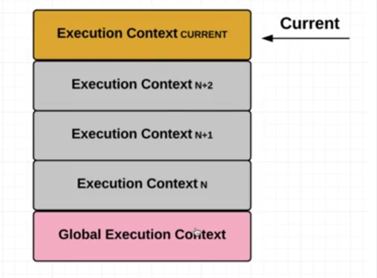

# 變數 (Varialbe)

## 資料型態

- 原始型態 (primitive type)

    1. null
    2. undefined
    3. string
    4. number
    5. boolean
    6. symbol (ES6)

- 物件型態 (object type)

    7. object(array, function, date)

## typeof

要知道型態，可以使用 `typeof` 這個語法

```javascript
// 兩種寫法都 OK
console.log(typeof a)
console.log(typeof(a))
```

如果你的引數是放一個 Array，那麼它會顯示 object，這可以理解，因為 Array 被歸類為 object

但是如果你是放的是 function，則會顯示 function

```javascript
console.log(typeof []) // object
console.log(typeof function() {}) // function
```

另外我們看看下列這個例子

```javascript
var a
console.log(typeof a) // undefined
console.log(typeof b) // undefined
```

在上面這個例子，一個是已宣告但未賦值的變數，另一個是從未宣告，都會顯示 undefined

利用這個特性，我們可以利用 `typeof` 判斷一個變數是否存在並被賦值，應用在我們的判斷式

```javascript
if (typeof a !== 'undefined') {       // 記得 undefined 是字串
    // 判斷式內容
}
```

**在 JavaScript 中，對 null 使用 `typeof` 也會回傳 object，這應該是老生常談的 bug**

MDN 官方文件也有寫到這一點


官方文件很棒，也直接幫我們列好[清單](https://developer.mozilla.org/zh-TW/docs/Web/JavaScript/Reference/Operators/typeof)了


由此可見 `typeof` 不一定能應付各種狀況，比如它就無法明確告訴開發者，一個變數裡放的是不是 Array

但以這個例子來說，我們有 `Array.isArray()`

另外這邊也提一下一個用法，那就是 `Object.prototype.toString.call()`

```javascript
console.log(Object.prototype.toString.call(4) // [object Number]
console.log(Object.prototype.toString.call('a') // [object String]
console.log(Object.prototype.toString.call([]) // [object Array]
console.log(Object.prototype.toString.call(Null) // [object Null]
```

## 原始型態不可變

在 Week5 總複習有特別提到，primitive type 不可變，不要和**對變數重新賦值**搞混了

```javascript
var a = 'aaa'
a.toUpperCase()
console.log(a) // aaa
```
我們都知道在 JavaScript 中，有些內建的方法會直接改變對象的值，比如說 `.pop()` 會直接改變對象陣列，那現在我們知道 Array 是物件型別，**物件型別是可變的**

相反的，原始型態不可變，所以就上述程式碼的例子來說，`toUpperCase()` 並不會改變 `a` 的值，而是會 return 一個處理過的值，所以我們通常會用一個變數去接住它，改成下面看看：

```javascript
var a = 'aaa'
a.toUpperCase()
console.log(a) // aaa

a = a.toUpperCase() // 重新對 a 賦值
console.log(a) // AAA
```

至此，我們可以明白，`a === 'aaa` 不會改變，除非我們重新對 `a` 賦值。意思就是 `aaa` 不會被抹除，即使經由 `toUpperCase()` 轉換出 `AAA`，`aaa` 仍是存在的，並沒有被 `AAA` 替代。

結論 :

> *原始型態不可變，而物件型態可變*

## 賦值 

另外，原始型別與物件型別在賦值的部分也有所不同

```javascript
var a = 5
b = a
console.log(a, b) // 5 5

b = 10
console.log(a, b) // 5 10
```
上述是對原始型別的重新賦值，若類似的情況發生在物件型別呢？

```javascript
var objA = { a : 5 }
var objB = objA
console.log(objA.a, objB.a) // 5 5

objB.a = 10
console.log(objA.a, objB.a) // 10 10
```

這是為什麼呢？

原因是因為 `objA` 與 `objB` 本身其實是**記憶體位置**，更正確地說，它用來存放物件的記憶體位置。當我們宣告 `objB` 的並使 `objB = objA` 時，並不是各自有各自 `{ a : 5 }`，而是 `objA` 與 `objB` 都存了相同的記憶體位置 (你可以想像成是住址)，而這個地址都指向同一個 `{ a : 5 }`

如果覺得很難記，可以試試看某個前輩舉的範例：想像物件是根吸管，那麼 `objA` 與 `objB` 就是兩根不同的吸管，插在同一杯飲料上，你不管從哪一根吸管喝，都是同一杯飲料。

所以我們可以了解上述的例子：我改變了 `objB.a` 的值，實際上也是直接改變 `objA` 所指向的 `{ a : 5 }`，因為 `objA` 與 `objB` 所指向的都是一樣的 (`var objB = objA`)

P.S. 這樣的情況也適用於 Array

**最後來談個很重要的狀況**

上面的案例並不難理解，那請再思考一下以下這個案例：

```javascript
var objA = { a : 5 }
var objB = objA
console.log(objA.a, objB.a) // 5 5

objB = { a : 80 }
console.log(objA.a, objB.a) // 5 80
```
這邊你可能會疑惑，為什麼第二次的 `console.log(objA.a, objB.a)` 是 5 與 80，這邊簡單說明一下。

當我設定 `objB = { a : 80 }` 的時候，實際上並非修改原本的 `{ a : 5 }`，而是創造了一個新的**物件型別** `{ a : 80 }` 再放入 `objB` 之中

實際上，如果你在 `=` 右邊放置的是一個 `{}` 或 `[]`，而不是單純 number 或 String 等原始型別，那麼你就等於**創建一個新的物件型別**，而其當然也有一個新的記憶體位置。(因為 `{}` 與 `[]` 都是物件型別)

如果有點困惑，不如你可以這樣想想看：為什麼 `objA` 與 `objB` 是物件 ? 究其原因就是因為我們所賦的值是物件型別 `{}`，而不是因為這個變數的名稱叫做 Obj，所以在最初 `var objA = { a : 5 }` 我們也做了一樣的事。

在 [Week5](https://github.com/ClayGao/My-study/blob/master/Lidemy/week5/week1-4.md) 的總複習中，並沒有詳細說明為什麼會是一個新的物件與記憶體位置，答案如上。

那麼我們可以更明確地得到一個結論：

當給一個變數賦值物件型別時，你所賦予的是該物件的**記憶體位置**，而非物件本身。

這樣就更好理解 `var objB = objA` 的案例了。

## == 與 ===

看以下例子：

```javascript
console.log(1 == '1') // true
console.log(1 === '1') // false
```
`===` 比 `==` 多比較了**型態**，如果僅僅用 `==`，很多狀況會是通的，比如說 `console.log([] == 0)` 為 true。

為了避免難以預期的錯誤，建議都使用 `===`

另外延續上述討論賦值的內容

```javascript
var objA = { a : 5 }
var objB = objA
console.log(objA.a, objB.a) // 5 5

objB.a = 10
console.log(objA.a, objB.a) // 10 10
```

既然我們已經知道，若賦值給變數的這個「值」是**物件型別**，那麼賦予的將不會是物件型別本身，而是該**物件型別的記憶體位置**，所以下列例子應該就不用多作解釋了。

```javascript
var objA = {
    a: 1
}
var objB = objA
objB.number = 10

console.log(objA === objB) // true
```
陣列也是相同道理 :

```javascript
var arr1 = [1]
var arr2 = [1]

console.log(arr1 === arr2) // false
```
```javascript
var arr1 = [1]
var arr2 = arr1

console.log(arr1 === arr2) // true
```
```javascript
console.log([] === []) // false
console.log({} === {}) // false
```

另外這邊來介紹一下 `NaN`，它的意思其實是「 Not a number」，以下列例子舉例它會出現的其中一個原因：

```javascript
var a = Number('ajdoajwo')
console.log(a) // NaN

console.log(typeof a) // number
console.log(a === a) // false
```

首先，`NaN` 本身屬於 number 型態，因此如果一個變數的型態是 number，其實你沒有辦法去辨識它到底真的是數字或是 `NaN`，不過也沒有這個必要就是了 XD

如果真的有必要，你可以使用 `isNaN()` 這個函式，它會回傳 Boolean

另外可以看到 `console.log(a === a)` 為 false，這無法用邏輯解釋，這是一個特殊案例，記得就好。

## 宣告變數新方式：let 與 const
`
- let

    我們在 Scope 章節會介紹

- const (constant)

    意思就是不能改變的數字，意思就是你**無法對其重新賦值**

    ```javascript
    const a = 20
    a = 50
    ```
    node.js 執行會顯示

    >Assignment to constant varible.

     ```javascript
    const a
    a = 50
    ```
    同樣顯示

    >Assignment to constant varible.

    所以可以理解成用 const 宣告變數的話，在最初就要給予初始值，因為後面的賦值都不會奏效

    另外就是延續對於物件型別的討論，看下列例子

    ```javascript
    const objA = { a : 5 }
    objA.a = 50
    ```
    執行後是**成功**的，可以理解，因為 objA 本身根本沒有被改變 (沒有動到記憶體位置)

# 作用域 (Scope) - 變數的生存範圍

作用域意指變數的生存範圍，所以焦點仍是放在變數之上

## Scope

在 ES6 之前的作用域：

```javascript
function test() {
    var a = 10
    console.log(a)
}

test() // 10
console.log(a) // a is not defined
```

在 ES6 以前，只有 function 可以產生一個新的作用域，而其實一個 .js 檔案你可以想成是一個大的 function

從這邊可以理解，程式是以**變數宣告的位置**判定該變數所屬之作用域，而 `a is not defined` 則代表對於全域而言，**`a` 根本就是不存在的**

*全域: global，代表最外圍，在此宣告的變數我們稱為「全域變數」*

接著看看下列例子：

```javascript
var a = 10
function test() 
    console.log(a) 
}

test() // 10
console.log(a) // 10
```

`test()` 與 `console.log(a)` 都成功輸出，後者可以理解，但前者之所以可以輸出，是因為**內層的作用域可以拿到外層作用域的變數**，而全域變數因為在最外層，因此是不論是在多內層的作用域，都一定可以拿得到這個變數

但是對於 `test()` 而言，它是先在 `function test(){}` 內中找尋有無 `a` 這個變數，若沒有，才再往上一層找，以此類推。所以底層其實是有一個運作機制的，這個機制稱為 **Scope chain**，這邊留待後續說明。

那下面例子就很好理解為何 `test()` 是 50 了

```javascript
var a = 10
function test() 
    var a = 50
    console.log(a) 
}

test() // 50
console.log(a) // 10
```

這邊要講解一個重要的部分，那就是基於 JavaScript 的特性，如果一個作用域 (不管是否為全域)，從本身一直往外找到盡頭都找不到它所要的變數，那麼 JavaScript 就會在最盡頭的作用域(也就是全域)自動宣告一個變數為己所用

```javascript
// step 2
var a // 自動宣告一個

// step1
function test() 
    a = 50
    console.log(a) 
}

test() // 50
console.log(a) // 50
```
其實這樣寫並不好，因為 a 本身是全域變數，很容易被其他作用域修改

最後我們來看一個特殊的例子

```javascript
var a = 'global'

function test()
    var a = 'haha'
    inner() 
}

function inner() 
    console.log(a) 
}

test() // global
```
會印出 global，原因是因為 inner 的外一層是全域，而非 `function test(){ }`，那麼這一題的重點在於對於作用域的判斷，作用域的判斷與**函式在哪裏呼叫**是完全無關的，所以儘管 inner 是在 test 內被呼叫，實際上 inner 作用域往外層找也是直接找向外層的全域

所以結論是，判斷作用域外層的方法該以**函式的宣告區域**為判準，而非呼叫函式所在的位置

而與這個機制相反，也就是會因為**呼叫函式的位置**不同而產生不同結果的則是 `this`，這邊之後會討論

## let 與 const 的生存範圍

在上述有談到，作用域範圍是以 function 來劃分，只要有 function 就會產生一個新的作用域。

```javascript
function test()
    var a = 10
    if (a === 10) {
        var b = 20
    }
    console.log(b)
}

test() // 20
```
這個例子之中，由於 `console.log(b)` 與 `var b` 都存在於同一個 function，所以也成功印出了 `b`，這邊沒問題，繼續討論。

然而，在 ES6 之後(含 ES6)，由於引進了 `let` 與 `const`，對於作用域的定義又有了新的界定，也就是**變數的宣告方式**決定了作用域範圍

- let

    剛剛的例子，我們把 var 改成 let

    ```javascript
    function test()
        var a = 10
        if (a === 10) {
            let b = 20
        }
        console.log(b)
    }

    test() // b is not defined
    ```

    可以看到由 `let` 宣告的變數 `b`，在 `if(){}` 之外無法被拿到，原因是因為**由 let 宣告的變數，其生存範圍僅在離自己最近的 block 以內**，而 `const` 也適用於這套規則

    關於 block 的定義，包括了 `function(){ ... }`，`for(){ }`，`if(){ }` 等等都是，下例以 `for(){ }` 做例子

    ```javascript
    function test()
        for( var i = 0; i < 10; i++) {
            console.log('i : '+ i)
        }
        console.log('final : ' + i)
    }

    test() 

    /* 印出
    i : 0
    i : 1
    i : 2
    i : 3
    i : 4
    i : 5
    i : 6
    i : 7
    i : 8
    i : 9
    final : 10
    */
    ```
    可以理解，因為都在同一個 function，所以  `console.log('final : ' + i)` 可以取得 i 的值

    那如果改成 let，那就會是

    ```javascript
    function test()
        for( var i = 0; i < 10; i++) {
            console.log('i : '+ i)
        }
        console.log('final : ' + i)
    }

    test() 

    /* 印出
    i : 0
    i : 1
    i : 2
    i : 3
    i : 4
    i : 5
    i : 6
    i : 7
    i : 8
    i : 9
    final : i is not defineed
    */
    ```
    而在 eslint 套件也會強迫我們將 for 迴圈的條件宣告改為 `let`

    所以我們可以得到下列結論 :

    - `var` 是屬於 function scope
    - `let`、`const` 屬於 block scope

# 從 Hoisting 開始了解底層運作

## Hoisting 現象

來看看關於**變數**的提升現象

```javascript
console.log(b) // undefined
var b = 10
```

假設程式是一行一行執行，`console.log(b)` 應該會顯示 b is not defined

但是執行後卻是 `undefined` (表示有找到這個變數)，就如同下列一樣

```javascript
var b
console.log(b) // undefined
b = 10
```

這是為什麼呢？

因為 JavaScript 在執行的過程中並非一行一行執行的

我們再看看另一個關於**函式**的提升現象

```javascript

test() // 123

function test(){
    console.log(123)
}
```

可以成功輸出 `123`，也可以當作以下來看：**函式宣告**被提升了

```javascript
function test(){
    console.log(123)
}

test() // 123
```

*這一點，在其他程式語言之中是做不到的，所以如果你學習的第一個程式語言就是 JavaScript，必須了解這現象並非所有程式語言通用*

現在我們來看一個容易讓人誤會的案例

```javascript
test() // test is not a function

var test = function test(){
    console.log(123)
}

```

這個案例是要說明，提升在意象上僅僅只是將**變數的宣告**，而非**變數的賦值**，所以你可以當作以下來看

```javascript
var test
test() // test is not a function

test = function test(){
    console.log(123)
}

```

呼叫 `test` 時，`test` 還不是一個函式，這樣就可以理解了

所以目前整理看來可以統整一些資訊 :

1. **變數宣告**與***函式宣告**可以被提升
2. **變數宣告**與**變數賦值**若寫在一起，也僅會對**變數宣告**做提升的動作

## Hoisting 的順序問題

```javascript
var a = 'global'
function test() {
    console.log(a)
    var a = 'local'
}

test() // undefined
```

按照之前討論的作用域運作方法，`test` 內的 console.log(a) 應該可以讀到 var a = 'global'，那為什麼是 undefined 呢？

抽去 var a = 'local' 來看一下，發現可以印出 global 了

```javascript
var a = 'global'
function test() {
    console.log(a)
    //var a = 'local'
}

test() // 'global'
```

可見 test 內的 var a = 'local' 的確產生了影響，那是因為我們在 test 做宣告動作的時候，var a = 'local' 這一段內的 var a 會被提升到 console.log(a) 之上，而 = 'local' 是發生在 console.log(a) 之後，所以可以理解為何是印出 undefined 了


```javascript
var a = 'global'
function test() {
    var a // 被提升，這時候的 a 沒有被賦值
    console.log(a) 
    a = 'local'
}

test() // undefined
```

看一下下面兩個特殊例子，a 同時被宣告成 function 與變數時，哪個會奏效？

```javascript
function test() {
    console.log(a)
    function a() {

    }
    var a = 'local'
}

test() // [Function: a]
```

```javascript
function test() {
    console.log(a)
    var a = 'local'
    function a() {

    }
}

test() // [Function: a]
```

可以看到 a 都被定義為 function，可見函式宣告的提升順序**優於**變數宣告的順序

下一個例子 :

```javascript
function test(a) {
    console.log(a)
    var a = 456
}

test(123) // 123
```

```javascript
function test(a) {
    var a 
    console.log(a)
    a = 456
}

test(123) // 123
```

上述兩個輸出都是 `123`，當 `123` 被作為參數傳入，`a` 為 `123`，而 `var = a` 雖然有被提升，但由於沒有賦值，所以值 `a` 仍是 `123` ( 這時候 `console.log(a)` 中的 `a` 的確是 `var a` 的 `a` 沒錯 )

這時候你可以理解 `var a` 是宣告但並**不賦值**也**不初始化**的意思 (這邊還要研究，畢竟如果在全域宣告 `a`，會直接賦予 `undefined`)

那可想而知，如果給 `a` 賦值的話就會輸出賦予的值內容了


```javascript
function test(a) {
    var a = undefined
    console.log(a)
    a = 456
}

test(123) // undefined
```

那如我把 `var a` 改為函式宣告，那會不會蓋過引數呢？

```javascript
function test(a) {
    console.log(a)
    function a() {

    }
}

test(123) // [Function: a]
```

答案是會的，函式就會被蓋過去

所以可以我們可以得到結論

在一個函式之中，宣告優先權是**函式宣告**優於**引數**，最後才是**變數宣告**

---

後記關於老師對於上述在函式中，為什麼僅僅 `var a` 並不會讓 `a` 的值變成 `undefined` ?

這是因為在原本的範例

```javascript
console.log(a)
var a
```

這時候的 `a` 被宣告的場景是一個 JavaScript 程式**原本就沒有 a 的情況下**，才會被給值 `undefined`

所以我做了以下測試:

```javascript
function test(a) {
    console.log(b)
    var b = 456
}

test(123) // undefined
```

可以看到對於 `test` 而言，`b` 是原本就不存在的，這時候的確提升 b 並被系統賦值 `undefined`

所以我們自然也可以很好理解下面這個案例

```javascript
function test(a, b) {
    console.log(b)
}

test(123) // undefined
```

雖然這個案例和提升沒有什麼關係，但可以知道 `b` 的確也被賦予了一個記憶體位置，而且存入了 `undefined`


## Hoisting 為什麼會發生？

以這個來解題

```javascript
var a = 1;
function test(){
  console.log('1.', a);
  var a = 7;
  console.log('2.', a);
  a++;
  var a;
  inner();
  console.log('4.', a);
  function inner(){
    console.log('3.', a);
    a = 30;
    b = 200;
  }
}
test();
console.log('5.', a);
a = 70;
console.log('6.', a);
console.log('7.', b);
```

1. 首先當跳到第三行 console.log('1.', a);，先檢查下面有沒有關於 a 的函式宣告，沒有，檢查有沒有變數宣告，有，所以底部的 var a 提升到上面，被賦值 undefined 

2. 到了第五行，console.log('2.', a);，這時候的 a 已經在上一行被賦值 7 了，所以是 7

3. 第六行，a++，a 這時候為 8

4. 第七行，var a，這時候對於函式而言 a 已經存在，所以不賦值也不初始化

5. 第八行 inner()，執行第十一行 console.log('3. ', a)，這時候先檢查下面有沒有關於 a 的函式宣告，沒有，檢查有沒有變數宣告，也沒有，所以我只能找上一層的 a 來用，故這邊的 a 是 8，依此道理，我下一行的 a = 30 針對的也是上一層的 a，另外下一行 b = 200 但其實整個程式都沒有宣告 b，所以 b 提升為**全域變數**

6. 第九行，console.log('4. ', a)，這時候的 a 為 30

7. 回到全域 console.log('5. ', a)，這一層的 a = 1，故為 1

8. 下一行 a 被賦值為 70

9. console.log('6. ', a)，a 為 70

10 console.log('7. ', b)，b 為 200

所以總結答案是

```
1. undefined
2. 7
3. 8
4. 30
5. 1
6. 70
7. 200
```

## ECMAScript

ECMAScript 可以當作是 JavaScript 的說明書，也就是 JavaScript 的規格書，所以可以參考

- Execution Contexts

    當程式**執行**的時候必定會創造 Execution Contexts，各個 EC 會按照 Stack 的方式堆疊，所以疊在最上面的 EC 必定是**當前正在執行的 EC**，而 Stack 最下面的 EC **必定是 Global EC**

    

    而程式內的函式**執行**的時候也會創建一個 EC 堆疊在 Stack 之中，直到該函式執行完畢，就會將該 EC 移除 (pop) 該 Stack
    以釋放記憶體

    這樣的過程循環直到整個程式執行完畢，到最後的 Global EC 也移除 Stack，程式結束

- Variable Object

    每一個 EC 都有 Variable Object (之後簡稱 VO)，在該函式中每一個**宣告的變數或宣告的函式**都會納入該 EC 的 VO 之中，而其中也提到，當**進入 (一說是創建)**一個 EC 時，會按照一個**規則順序**把變數 / 函式綁入 (bound) 該 EC 的 VO 之中

    1. 對於該函式之中的參數，就會將參數放入 VO，而該參數 value 就會是呼叫時代入的數 (如 `test(123)`)，若沒有代入且未曾宣告就代入 undefined

        ```javascript
        function test(a, b) {

        }

        test(123)

        /*

        VO: {
            a: 123,
            b: undefined
        }

        */
        ```
    
    2. 對於**函式宣告**，一樣將將這個函式放入 VO，如果說這個已經存在*同樣名稱*的 VO，則**取代它的值**

        原本 : 

        ```javascript
        function test(a, b) {

        }

        test(123)

        /*

        VO: {
            a: 123,
            b: undefined
        }

        */
        ```
        被 `function a` 取代

        ```javascript
        function test(a, b) {
            function a() {

            }
        }

        test(123)

        /*

        VO: {
            a: point to function a,
            b: undefined
        }

        */
        ```

    3. 對於函式內**宣告變數**，也會將其加入 VO，並初始化成 `undefined`，但倘若**宣告的變數已存在且有值 (包括`undefined`)，則直接忽略該宣告**

        這邊要注意的是，是忽略**宣告**，而不是忽略賦值，所以在下列案例中，`var a` 的確被提升了，但對於 EC 運作而言，這個 `var a` 被忽略了，僅僅生效的只有賦值 `a = 456`


        ```javascript
        function test(a, b) {
            console.log(a)
            var a = 456
        }

        test(123) // 123

        /*

        VO: {
            a: 123,
            b: undefined
        }

        */
        ```

        可以看成

        ```javascript
        function test(a, b) {
            // var a 提升卻被忽略，a 仍是 123
            console.log(a)
            a = 456
        }

        test(123) // 123

        /*

        VO: {
            a: 123,
            b: undefined
        }

        */
        ```

        另外，即使我參數不代入，但由於系統會自動代入 undefined，因此也算是有值，不要搞混了

        ```javascript
        function test(a, b) {
            console.log(a)
            var a = 456
        }

        test() // undefined

        /*

        VO: {
            a: undefined,
            b: undefined
        }

        */
        ```

## 實際 Run 一次執行環境

現在我們再解一次題目，用 Execution Context 的方式 

```javascript
var a = 1;
function test(){
  console.log('1.', a);
  var a = 7;
  console.log('2.', a);
  a++;
  var a;
  inner();
  console.log('4.', a);
  function inner(){
    console.log('3.', a);
    a = 30;
    b = 200;
  }
}
test();
console.log('5.', a);
a = 70;
console.log('6.', a);
console.log('7.', b);
```

- Round 1，進入 .js，創建 Global EC

    ```javascript
    global EC :{
        VO: {
            test : point to function test,　// 先找函式宣告，因為前面提過函式宣告權重優先於變數宣告
            a: undefined
        }
    }
    ```

- Round 2，執行 Global EC

    ```javascript
    global EC :{
        VO: {
            test : point to finction test, // 被執行
            a: 1 // 賦值     
        }
    }
    ```
- Round 3，因為 test()，所以初始化 test EC

    ```javascript
    test EC : {
        AO: {
            inner: point to function inner, // 先找函式宣告，因為前面提過函式宣告權重優先於變數宣告
            a: undefined
        }
    } 

    global EC :{
        VO: {
            test : point to finction test, 
            a: 1     
        }
    }
    ```

- Round 4，接續上一步，執行 test EC

    ```javascript
    console.log('1. ', a) // 執行，這時候找到 test EC 的 a 為 undefined，輸出 undefined，移出

    test EC : {
        AO: {
            inner: point to function inner, 
            a: undefined
        }
    } 

    global EC :{
        VO: {
            test : point to finction test, 
            a: 1  
        }
    }
    ```
- Round 5，接續上一步，繼續執行 test EC ( 程式走到 `var a = 7` 與 `console.log('2.' ,a)`)

    ```javascript
    console.log('2.' ,a) // step2: 這時候找到 test EC 的 a 為 7，輸出 7，移出

    test EC : {
        AO: {
            inner: point to function inner,
            a: 7 // step1: 程式走到 var a = 7，a 被賦值 7 ( var a 已在創建階段被忽略，這邊其實僅是 a = 7)
        }
    } 

    global EC :{
        VO: {
            test : point to finction test, 
            a: 1     
        }
    }
    ```

- Round 6，接續上一步，繼續執行 test EC ( 程式走到 `a++` 與 `var a` 與 `inner()`)

    ```javascript
    test EC : {
        AO: {
            inner: point to function inner,
            a: 8 // 由於 a++，所以 a 為 8，走到 var a 時被忽略
        }
    } 

    global EC :{
        VO: {
            test : point to finction test, 
            a: 1     
        }
    }
    ```

- Round 7，接續上一步，由於 inner 被呼叫，所以初始化 inner EC

    ```javascript
    inner EC : {
        AO: {
            // 這邊沒有宣告變數也沒有宣告函式，inner() 也無參數
        }
    }

    test EC : {
        AO: {
            inner: point to function inner,
            a: 8
        }
    } 

    global EC :{
        VO: {
            test : point to finction test,
            a: 1
        }
    }
    ```
- Round 8，接續上一步，執行 inner EC (`console.log('3.' a)`)

    ```javascript
    console.log('3.' a) // 在 inner EC 中找不到 a，繼續往下一層找，找到 test EC 下的 a 為 8，輸出 8，移出

    inner EC : {
        AO: {
            // 這邊沒有宣告變數也沒有宣告函式，inner() 也無參數
        }
    }

    test EC : {
        AO: {
            inner: point to function inner,
            a: 8
        }
    } 

    global EC :{
        VO: {
            test : point to finction test,
            a: 1
        }
    }
    ```
- Round 9，接續上一步， 繼續執行 inner EC

    ```javascript
    inner EC : {
        AO: {
            // 這邊沒有宣告變數也沒有宣告函式，inner() 也無參數
        }
    }

    test EC : {
        AO: {
            inner: point to function inner,
            a: 30 // 因為 inner EC 中沒有 a，所以往上找 test EC，test EC 有 a，把 a 賦值為 30
        }
    } 

    global EC :{
        VO: {
            test : point to finction test,
            a: 1,     
            b: 200 // 因為 inner EC 中沒有 b，所以往上找 test EC，test EC 也沒有 b，再往上找 global EC，還是沒有 b，但已經沒有再外一層了，這時候底層只好在 global EC 創建一個 b，之後執行賦值 b = 20，結束
        }
    }
    ```

- Round 10，inner EC 已執行結束，整個 inner EC 被移出，繼續執行 inner() 的下一行 console.log('4.', a)

    ```javascript
    console.log('4.', a) // step2: 找到 a: 30，輸出 30，移出

    /*  step1: inner EC 已全數執行完畢，移出
    inner EC : {
        AO: {
            // 這邊沒有宣告變數也沒有宣告函式，inner() 也無參數
        }
    }
    */

    test EC : {
        AO: {
            inner: point to function inner,
            a: 30 // step1: 因為 inner EC 中沒有 a，所以往上找 test EC，test EC 有 a，把 a 賦值為 30
        }
    } 

    global EC :{
        VO: {
            test : point to finction test,
            a: 1,     
            b: 200 
        }
    }
    ```

- Round 11，整個 test EC 至此已執行完畢，移出

    ```javascript
    /* test EC 已全數執行完畢，移出
    test EC : {
        AO: {
            inner: point to function inner,
            a: 30 // 因為 inner EC 中沒有 a，所以往上找 test EC，test EC 有 a，把 a 賦值為 30
        }
    } 
    */

    global EC :{
        VO: {
            test : point to finction test,
            a: 1,     
            b: 200 
        }
    }
    ```

- Round 12，執行　`console.log('5.', a)`

    ```javascript
    console.log('5.', a)　// 找到 a 為 1，輸出 1 結束

    global EC :{
        VO: {
            test : point to finction test,
            a: 1,     
            b: 200 
        }
    }
    ```


- Round 13，執行　a = 70

    ```javascript
    global EC :{
        VO: {
            test : point to finction test,
            a: 70,  // a 被賦值為 70  
            b: 200 
        }
    }
    ```

- Round 14，執行　`console.log('6.', a)`

    ```javascript
    console.log('6.', a)　// 找到 a 為 70，輸出 70，移出

    global EC :{
        VO: {
            test : point to finction test,
            a: 70,     
            b: 200 
        }
    }
    ```

- Round 15，執行　`console.log('7.', a)`

    ```javascript
    console.log('7.', a)　// 找到 b 為 200，輸出 200，移出

    global EC :{
        VO: {
            test : point to finction test,
            a: 70,     
            b: 200 
        }
    }
    ```

- Round 16，global EC 已全部執行完畢，global EC 移出

    ```javascript
    /*
    global EC :{
        VO: {
            test : point to finction test,
            a: 70,     
            b: 200 
        }
    }
    */
    ```

    
- Round 17，Stack，程式全數執行完畢

    ```javascript
  
    ```

「提升」這個說法

## let 與 const 的部分

這邊回頭談一下 let 與 const

```javascript
console.log(a) //  a is not defined
let a = 10
```

為什麼用 `let` 宣告的 a，沒有提升呢？

再看看下一個例子，來確定到底有沒有提升

```javascript
let a = 10
function test() {
    console.log(a) 
    let a = 10
}

test() //  a is not defined
```
在這個案例之中，如果沒有提升 ( 也就是 test 無視 let 的宣告 )，那麼 a 應該是 10

但是卻仍然印出了 a is not defined，這就代表 a 還是有提升，只是**方式不同**

現在我們來探究原因：

## TDZ (Temporal Dead Zone)

事實上，let (or const) 的確是有被提升，只是初始化時的方法不同

一般的 var，會在初始化時被賦予 undefined (非重複宣告狀況下)

而 let 則**否**，初始化時 let 並不會被給予任何值，而且**在被賦值之前，不得被存取執行**

所以如果把程式碼當作一張圖來看，從**let 宣告到被賦值**的這一個區段，稱為 Temporal Dead Zone (暫時性死區，簡稱 TDZ)，**在 TDZ 中的變數無法被存取與執行**，以剛剛兩個例子來看就是：

- 第一個例子

    ```javascript
    console.log(a) //  a is not defined
    let a = 10
    ```

    可以看成

    ```javascript
    let a /* TDZ
    console.log(a) */
    a = 10
    ```

- 第二個例子

    ```javascript
    let a = 10
    function test() {
        console.log(a) 
        let a = 10
    }

    test() //  a is not defined
    ```

    可以看成

    ```javascript
    let a = 10
    function test() {
        let a /* TDZ
        console.log(a) */
        a = 10
    }

    test() //  a is not defined
    ```


## 後記

之後關於 Hoisting，可以參考文章複習：https://github.com/aszx87410/blog/issues/34

# 從閉包 (Closure) 更進一步理解 JS 運作

我們來看看閉包的應用範例

```javascript
function test() {
    var a = 10
    function inner() {
        a++
        console.log(a)
    }
    inner()
}

test() // 11
```

改成這樣

```javascript
function test() {
    var a = 10
    function inner() {
        a++
        console.log(a)
    }
    return inner
}

var func = test() // 由於是 return 一個函式，所以要有個變數來接
func() // 11 
```

`fun()`，其實就是呼叫 `inner`，因為 `func` 等於 `test()` 回傳的整個函式 `inner`，這時候呼叫 `func` 其實就是呼叫 `inner`

但是重點是什麼？重點是因為 inner 又可以存取 test 中宣告的 a，所以等於是我在 test 外面間接操縱了 a 的值

這時候重複呼叫，可以發現神奇的事情

```javascript
function test() {
    var a = 10
    function inner() {
        a++
        console.log(a)
    }
    return inner
}

var func = test() // 由於是 return 一個函式，所以要有個變數來接
func() // 11 
func() // 12
func() // 13
func() // 14
```

可以看到 a 不斷增加，也就是說我一直在執行 inner，沒有經過外層包覆的 test 之下的 var a = 10

這時候 inner 其實本身就是一個閉包，僅作內部的執行，所以可以目前我們可以先簡單定義閉包為：

> **在一個 function 回傳一個 function，而被回傳的這個 function 可以把在外宣告的值記起來，並鎖在自己的 function 之中**，若照底層運作來看，也就是該 function 的 EC 沒有消失，持續執行

我們再來看另一個案例

```javascript
function complex(num) {
    return num*num
}

console.log(complex(2)) // 4
console.log(complex(2)) // 4
console.log(complex(2)) // 4
```

那如果我想要記得上一次計算完的狀態，我就可以用閉包寫法：

```javascript
function complex(num) {
    function cache() {
        num = num*num
        console.log(num)
    }
    return  cache
}

var func = complex(2)
func() // 4
func() // 16
func() // 256
```

又或者我可以直接這樣寫

```javascript
function complex(num) {
    return function() {
        num = num*num
        console.log(num)
    }
}

var func = complex(2)
func() // 4
func() // 16
func() // 256
```

改成箭頭函式

```javascript
function complex(num) {
    return () => {
        num = num*num
        console.log(num)
    }
}

var func = complex(2)
func() // 4
func() // 16
func() // 256
```

接下來我們來看一個比較複雜的例子，我想做要傳入一組數字，如果這個數字是第一次被輸入，那麼就會執行運算，如果已經輸入這個數字，就直接輸出結果

但由於都要通過一個函式來執行，所以我們可以利用閉包保存值的特性，來幫我們判斷這個值的現況

```javascript
function complex(num) {
    return num*num
}

function cache(func) {
    var ans = {}
    return function(num) {
        if (ans[num]) {
            console.log('已經算過了')
            return ans[num]
        } 
        console.log('第一次計算')
        ans[num] = func(num) // 如果沒有數字，就將 ans 內的 num 設為 complex 回傳的 num*num
        return ans[num]
    }
}

const cachedComplex = cache(complex) // 將以 complex 為參數的函式代入
console.log(cachedComplex(20)) // 第一次計算
console.log(cachedComplex(20)) // 已經算過了
console.log(cachedComplex(20)) // 已經算過了
console.log(cachedComplex(20)) // 已經算過了
```

第一次計算對於內層 function 來說才剛剛宣告，所以 `ans[num]` 一定是空的，所以一定會印出`第一次計算`且賦值，又由於參數 `func` 本質是一個 function，所以可以用 `fun(num)` 的形式，`fun(num)` 其實就是

```javascript
function complex(num) {
    return num*num
}
```
所以 `ans[num]` 的值也就會是 `num*num` 的結果

在第二到四次的呼叫，閉包功能奏效，對於內層 function 而言，`ans[num]` 一直有值而且是 `400`，所以後續呼叫都會 log `已經算過了`，這就是閉包的實際應用

## 閉包的原理 - Scope chain

繼上次參閱 ECMAScript 之後，現在我們要再一次從中尋找閉包的原理，內容如下

> 如果進入一個 Function EC，那麼該 EC 的 scope chain 就是 [AO, [[Scope]]]

> 所謂 AO 就是 Activation Object，當你進入一個 Function EC 的時候，AO 會被創造並且聯繫該 EC，AO 內中有預設屬性 argument (參數)

可以簡單記得 global EC 是存 VO (因為全域 EC 沒有所謂參數)，而 Function EC 是存 AO

來看看下列例子範例

```javascript
var a = 1
function test() {
    var b = 2
    function inner() {
        var c = 3
        console.log(b)
        console.log(a)
    }
    inner()
}

test()
```

Stack 就是

```javascript

console.log(a) // 找 scope chain 直至 global EC 的 a : 1
console.log(b) // 找 scope chain 直至 test EC 的 b : 2

inner EC : {
    AO: {
        argument: { }
        c = 3
    }
    scope chain:[inner EC.AO, inner.[[Scope]]] // 此處 inner.[[Scope]] 為 test EC.AO, global EC.VO
}

test EC : {
    AO: {
        argument: { }
        inner: point to inner,
        // inner.[[Scope]] 被創建 == test EC.scope chain 
        b : 2
    }
    scope chain:[test EC.AO,　test.[[Scope]]] // 此處 test.[[Scope]] == global EC.VO
}

global EC : {
    VO: {
        test : point to test,  
        // 初始化這個 test 為 function 時，test.[[Scope]] 被創建 == global EC.scope chain == global EC.VO
        a : 1
    }
    scope chain: [global EC.VO] // 進入程式初始化時創建，但因為所屬最外層，因此只有 global EC.VO
}
```

## 實際跑一次閉包與底層

```javascirpt
var a = 10
function test() {
    var b = 20
    function inner() {
        console.log(a, b)
    }
    return inner
}

var inner = test()
inner()
```

- Round 1 ，進入程式，開始 global EC 初始化

    ```javascript
    global EC: {
        VO: {
            test : point to test, // 於此同時建立 test.[[Scope]]
            a : undefined,
            inner : undefined
        }
        scope chain: [global EC.VO]
    }

    test.[[Scope]]
    ```

- Round 2 ，執行 global EC 

    ```javascript
    global EC: {
        VO: {
            test : point to test, 
            a : 10, // step1 : a = 10
            inner : undefined // 由於是 test()，所以開始進入 test EC
        }
        scope chain: [global EC.VO]
    }

    test.[[Scope]]
    ```
    - Round 3 ，test EC 初始化

    ```javascript
    test EC: {
        AO: {
            inner: point to inner, // 於此同時建立 inner.[[Scope]]
            b: undefined,
        }
        scope chain: [test EC.AO, test.[[Scope]]]
    }

    inner.[[Scope]]


    global EC: {
        VO: {
            test : point to test, 
            a : 10, 
            inner : undefined 
        }
        scope chain: [global EC.VO]
    }

    test.[[Scope]]
    ```

- Round 3 ，執行 test EC 

    ```javascript
    test EC: {
        AO: {
            inner: point to inner, 
            b: 20, // step1: b = 20
        }
        scope chain: [test EC.AO, test.[[Scope]]]
    }

    inner.[[Scope]]


    global EC: {
        VO: {
            test : point to test, 
            a : 10, 
            inner : point to inner // step2 : return inner
        }
        scope chain: [global EC.VO]
    }

    test.[[Scope]]
    ```

- Round 4 ，執行 test EC 完畢，test EC 結束

    ```javascript
    /**
    照理來說，test EC 會被結束，但由於內中的 inner function 被回傳，被判定仍須使用
    因此，inner.[[Scope]] ( 即 test EC.AO, global EC.VO )，會被保存下來，也就是說，
    由於還會被使用到，所以 test EC.AO, global EC.VO 無法被底層的機制給回收掉，這就是閉包原理

    test EC: {
        AO: {
            inner: point to inner, 
            b: 20, 
        }
        scope chain: [test EC.AO, test.[[Scope]]]
    }
    **/

    inner.[[Scope]]　// 被保存

    ↓↓↓↓↓↓↓↓↓↓↓↓↓↓↓↓↓↓↓↓↓↓

    test EC.AO {  // 被保存
        inner: point to inner, 
        b: 20, 
    }

    global EC: {
        VO: {
            test : point to test, 
            a : 10, 
            inner : point to inner // step2 : return inner
        }
        scope chain: [global EC.VO]
    }

    test.[[Scope]]
    ```
- Round 5 ，inner()，初始化 inner function，並執行

    ```javascript
    // step2: 執行 inner EC
    console.log(a, b) // 循著 scope chain 找，在 global EC.VO 找到 a 為 10，在 test EC.AO 找到 b 為 20

    // step1: 初始化 inner EC
    innerEC: {
        AO: {
            無
        }
        scope chain:[inner EC.AO, inner.[[Scope]] ]
    }

    /* 被保存
    inner.[[Scope]]

    test EC.AO { 
        inner: point to inner, 
        b: 20, 
    }
    */

    global EC: {
        VO: {
            test : point to test, 
            a : 10, 
            inner : point to inner // step2 : return inner
        }
        scope chain: [global EC.VO]
    }

    test.[[Scope]]
    ```

## 使用閉包注意事項

從上述案例，可以了解由於使用閉包的緣故，所以 `inner.[[Scope]]` 被保存了下來，也就是說 `test EC.AO` 與 `global EC.VO` 被保存了

但是假若 `test EC.AO` 或 `global EC.VO` 內中有龐大的資料，那代表我每一次呼叫閉包時都要經過長久的搜尋，因為資料太龐大了，以 `console.log(a, b)` 來說，如果 test EC.AO 有很多資料，那我在內中搜尋的時間就變長了

所以使用閉包時需要特別注意這個情況

## 閉包常出錯的地方

這是一個知名的閉包錯誤

```javascript
var arr = []
for (var i=0; i<5; i++) {
    arr[i] = function() {
        console.log(i)
    }
}

arr[0]() // 5
```
```javascript
var arr = []
for (var i=0; i<5; i++) {
    $('.num' + i).click(function(){
        console.log(i)
    })
}

// 點擊都會印出　5
```

在第一個案例中，global EC 於執行階段時，global EC.VO 一直被賦予 function，i 也不斷增加，直到 for loop 執行完，往下呼叫 `arr[0]` 並初始化該 function EC 與執行時，循著 scope chain 往外找到 global EC.VO 的 `i` 是 `5`，所以印出為 5

解決方法:

- 第一種解法 : 用一個新的 function 代替，因為建立一個新 function，所以有一個新作用域來記住 i 的值

    ```javascript
    var arr = []
    for (var i=0; i<5; i++) {
        arr[i] = logN(i)
    }

    function logN(n) {
        return function() {
            console.log(n)
        }
    }

    arr[0]() // 0
    ```
- 第二種解法 : 使用立即呼叫函式寫法 IIFE，即寫即呼叫

    通常我們寫一個函式並呼叫，是下列寫法：

    ```javascript
    function test() {
        console.log(123)
    }

    test()
    ```
    但如果是個匿名函式或箭頭函式，該如何呼叫呢？使用 `( )` 包住該函式宣告，並在尾端再加 `()` 即可

    ```javascript
    (function (){
        console.log(123) // 123
    })()

    // 帶參數
    (function (a){
        console.log(a) // 456
    })(456)
    ```
    所以，我們就可以改寫成這樣 :

      ```javascript
    var arr = []
    for (var i=0; i<5; i++) {
        arr[i] = (function(num) {
            return function( {
                console.log(num)
            })
        })(i)
    }

    arr[0]() // 0
    ```
    其實這個方法就是把上一個解法放入 for 迴圈中

    ```javascript
    var arr = []
    for (var i=0; i<5; i++) {
        //arr[i] = logN(i)
        arr [i] = (
            function (n) {
                return function() {
                    console.log(n)
                }
            }
        )(i)
    }

    /* 丟入 arr[i] 並且改為匿名函式且使用　() 包住且代入參數 (i)，就一樣了
    function logN(n) {
        return function() {
            console.log(n)
        }
    }
    */

    arr[0]() // 0
    ```

    這種解法的好處是可以不用多寫一個 function，但是可讀性比較差，所以其實比較推薦上一個寫法


- 第三種解法 : 使用 let 宣告 i

    ```javascript
    var arr = []
    for (let i=0; i<5; i++) {
        arr[i] = function() {
            console.log(i)
        }
    }

    arr[0]() // 5
    ```

    原因的部分關於老師講解的影片不太懂，這邊我再研究看看

## 閉包的使用時機

- 當你需要隱藏某些特性的時候

    ```javascript
    var money = 99

    function add(num) {
        money += num
    }

    function deduct(num) {
        if (num >= 10) {
            money -= 10
        } else {
            money -= num
        }
    }

    add(1)
    deduct(100)
    console.log(monry)
    ```
    假設今天我有一個帳戶系統，deduct 這個函式用來扣我錢包的錢，add 則是存入的錢

    但是 money 本身是全域變數，很容易在外面被修改，為了不要使它可以被隨意修改，我用個 function 包住它

    ```javascript
    var money = 99

    function createWallet(initMoney) {
        var money = initMoney
        return {
            add: function(num) {
                moeny += num
            },
            deduct: function(num) {
                 if (num >= 10) {
                    money -= 10
                } else {
                    money -= num
                }
            },
            getMoney() {
                return money
            }
        }
    }

    var myWallet = createWallet(99)
    myWallet.add(5)
    myWallet.deduct(5)

    console.log(Wallet.getMoney())
    ```

    順帶一提，回傳一個物件內含三個參數的寫法可以參考

    有了這樣的寫法，money 就不會在全域被改變了


## 後記

Closure 相關內容可參考此篇進行複習：https://github.com/aszx87410/blog/issues/35


# 物件導向基礎與 Prototype

# this