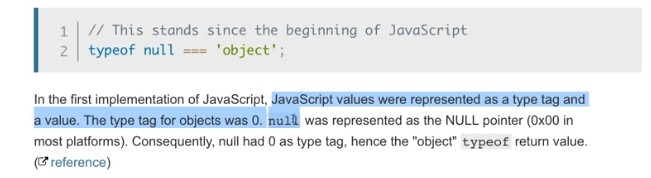
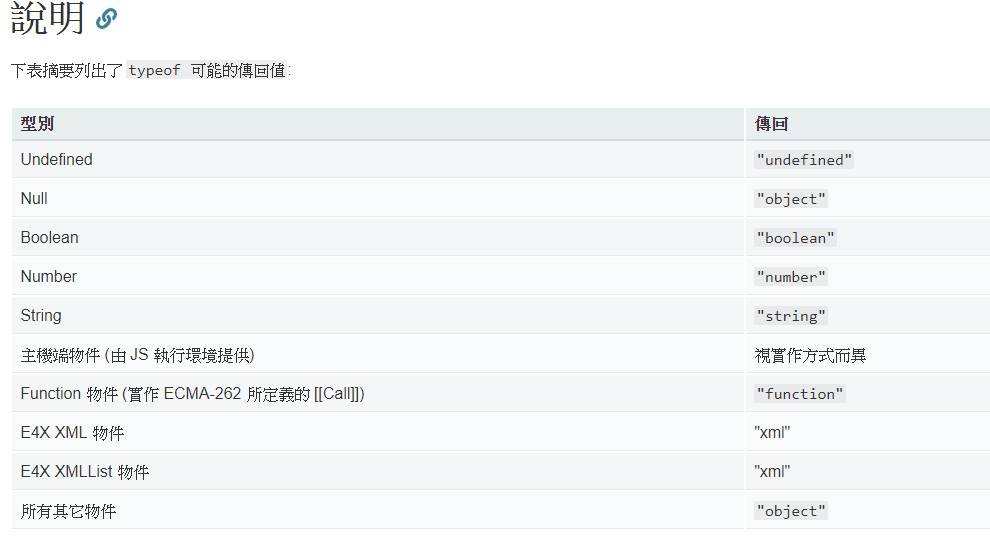

# 變數 (Varialbe)

## 資料型態

- 原始型態 (primitive type)

    1. null
    2. undefined
    3. string
    4. number
    5. boolean
    6. symbol (ES6)

- 物件型態 (object type)

    7. object(array, function, date)

## typeof

要知道型態，可以使用 `typeof` 這個語法

```javascript
// 兩種寫法都 OK
console.log(typeof a)
console.log(typeof(a))
```

如果你的引數是放一個 Array，那麼它會顯示 object，這可以理解，因為 Array 被歸類為 object

但是如果你是放的是 function，則會顯示 function

```javascript
console.log(typeof []) // object
console.log(typeof function() {}) // function
```

另外我們看看下列這個例子

```javascript
var a
console.log(typeof a) // undefined
console.log(typeof b) // undefined
```

在上面這個例子，一個是已宣告但未賦值的變數，另一個是從未宣告，都會顯示 undefined

利用這個特性，我們可以利用 `typeof` 判斷一個變數是否存在並被賦值，應用在我們的判斷式

```javascript
if (typeof a !== 'undefined') {       // 記得 undefined 是字串
    // 判斷式內容
}
```

**在 JavaScript 中，對 null 使用 `typeof` 也會回傳 object，這應該是老生常談的 bug**

MDN 官方文件也有寫到這一點



官方文件很棒，也直接幫我們列好[清單](https://developer.mozilla.org/zh-TW/docs/Web/JavaScript/Reference/Operators/typeof)了



由此可見 `typeof` 不一定能應付各種狀況，比如它就無法明確告訴開發者，一個變數裡放的是不是 Array

但以這個例子來說，我們有 `Array.isArray()`

另外這邊也提一下一個用法，那就是 `Object.prototype.toString.call()`

```javascript
console.log(Object.prototype.toString.call(4) // [object Number]
console.log(Object.prototype.toString.call('a') // [object String]
console.log(Object.prototype.toString.call([]) // [object Array]
console.log(Object.prototype.toString.call(Null) // [object Null]
```

## 原始型態不可變

在 Week5 總複習有特別提到，primitive type 不可變，不要和**對變數重新賦值**搞混了

```javascript
var a = 'aaa'
a.toUpperCase()
console.log(a) // aaa
```
我們都知道在 JavaScript 中，有些內建的方法會直接改變對象的值，比如說 `.pop()` 會直接改變對象陣列，那現在我們知道 Array 是物件型別，**物件型別是可變的**

相反的，原始型態不可變，所以就上述程式碼的例子來說，`toUpperCase()` 並不會改變 `a` 的值，而是會 return 一個處理過的值，所以我們通常會用一個變數去接住它，改成下面看看：

```javascript
var a = 'aaa'
a.toUpperCase()
console.log(a) // aaa

a = a.toUpperCase() // 重新對 a 賦值
console.log(a) // AAA
```

至此，我們可以明白，`a === 'aaa` 不會改變，除非我們重新對 `a` 賦值。意思就是 `aaa` 不會被抹除，即使經由 `toUpperCase()` 轉換出 `AAA`，`aaa` 仍是存在的，並沒有被 `AAA` 替代。

結論 :

> *原始型態不可變，而物件型態可變*

## 賦值 

另外，原始型別與物件型別在賦值的部分也有所不同

```javascript
var a = 5
b = a
console.log(a, b) // 5 5

b = 10
console.log(a, b) // 5 10
```
上述是對原始型別的重新賦值，若類似的情況發生在物件型別呢？

```javascript
var objA = { a : 5 }
var objB = objA
console.log(objA.a, objB.a) // 5 5

objB.a = 10
console.log(objA.a, objB.a) // 10 10
```

這是為什麼呢？

原因是因為 `objA` 與 `objB` 本身其實是**記憶體位置**，更正確地說，它用來存放物件的記憶體位置。當我們宣告 `objB` 的並使 `objB = objA` 時，並不是各自有各自 `{ a : 5 }`，而是 `objA` 與 `objB` 都存了相同的記憶體位置 (你可以想像成是住址)，而這個地址都指向同一個 `{ a : 5 }`

如果覺得很難記，可以試試看某個前輩舉的範例：想像物件是根吸管，那麼 `objA` 與 `objB` 就是兩根不同的吸管，插在同一杯飲料上，你不管從哪一根吸管喝，都是同一杯飲料。

所以我們可以了解上述的例子：我改變了 `objB.a` 的值，實際上也是直接改變 `objA` 所指向的 `{ a : 5 }`，因為 `objA` 與 `objB` 所指向的都是一樣的 (`var objB = objA`)

P.S. 這樣的情況也適用於 Array

**最後來談個很重要的狀況**

上面的案例並不難理解，那請再思考一下以下這個案例：

```javascript
var objA = { a : 5 }
var objB = objA
console.log(objA.a, objB.a) // 5 5

objB = { a : 80 }
console.log(objA.a, objB.a) // 5 80
```
這邊你可能會疑惑，為什麼第二次的 `console.log(objA.a, objB.a)` 是 5 與 80，這邊簡單說明一下。

當我設定 `objB = { a : 80 }` 的時候，實際上並非修改原本的 `{ a : 5 }`，而是創造了一個新的**物件型別** `{ a : 80 }` 再放入 `objB` 之中

實際上，如果你在 `=` 右邊放置的是一個 `{}` 或 `[]`，而不是單純 number 或 String 等原始型別，那麼你就等於**創建一個新的物件型別**，而其當然也有一個新的記憶體位置。(因為 `{}` 與 `[]` 都是物件型別)

如果有點困惑，不如你可以這樣想想看：為什麼 `objA` 與 `objB` 是物件 ? 究其原因就是因為我們所賦的值是物件型別 `{}`，而不是因為這個變數的名稱叫做 Obj，所以在最初 `var objA = { a : 5 }` 我們也做了一樣的事。

在 [Week5](https://github.com/ClayGao/My-study/blob/master/Lidemy/week5/week1-4.md) 的總複習中，並沒有詳細說明為什麼會是一個新的物件與記憶體位置，答案如上。

那麼我們可以更明確地得到一個結論：

當給一個變數賦值物件型別時，你所賦予的是該物件的**記憶體位置**，而非物件本身。

這樣就更好理解 `var objB = objA` 的案例了。

## == 與 ===

看以下例子：

```javascript
console.log(1 == '1') // true
console.log(1 === '1') // false
```
`===` 比 `==` 多比較了**型態**，如果僅僅用 `==`，很多狀況會是通的，比如說 `console.log([] == 0)` 為 true。

為了避免難以預期的錯誤，建議都使用 `===`

另外延續上述討論賦值的內容

```javascript
var objA = { a : 5 }
var objB = objA
console.log(objA.a, objB.a) // 5 5

objB.a = 10
console.log(objA.a, objB.a) // 10 10
```

既然我們已經知道，若賦值給變數的這個「值」是**物件型別**，那麼賦予的將不會是物件型別本身，而是該**物件型別的記憶體位置**，所以下列例子應該就不用多作解釋了。

```javascript
var objA = {
    a: 1
}
var objB = objA
objB.number = 10

console.log(objA === objB) // true
```
陣列也是相同道理 :

```javascript
var arr1 = [1]
var arr2 = [1]

console.log(arr1 === arr2) // false
```
```javascript
var arr1 = [1]
var arr2 = arr1

console.log(arr1 === arr2) // true
```
```javascript
console.log([] === []) // false
console.log({} === {}) // false
```

另外這邊來介紹一下 `NaN`，它的意思其實是「 Not a number」，以下列例子舉例它會出現的其中一個原因：

```javascript
var a = Number('ajdoajwo')
console.log(a) // NaN

console.log(typeof a) // number
console.log(a === a) // false
```

首先，`NaN` 本身屬於 number 型態，因此如果一個變數的型態是 number，其實你沒有辦法去辨識它到底真的是數字或是 `NaN`，不過也沒有這個必要就是了 XD

如果真的有必要，你可以使用 `isNaN()` 這個函式，它會回傳 Boolean

另外可以看到 `console.log(a === a)` 為 false，這無法用邏輯解釋，這是一個特殊案例，記得就好。

## 宣告變數新方式：let 與 const
`
- let

    我們在 Scope 章節會介紹

- const (constant)

    意思就是不能改變的數字，意思就是你**無法對其重新賦值**

    ```javascript
    const a = 20
    a = 50
    ```
    node.js 執行會顯示

    >Assignment to constant varible.

     ```javascript
    const a
    a = 50
    ```
    同樣顯示

    >Assignment to constant varible.

    所以可以理解成用 const 宣告變數的話，在最初就要給予初始值，因為後面的賦值都不會奏效

    另外就是延續對於物件型別的討論，看下列例子

    ```javascript
    const objA = { a : 5 }
    objA.a = 50
    ```
    執行後是**成功**的，可以理解，因為 objA 本身根本沒有被改變 (沒有動到記憶體位置)

# 作用域 (Scope)

# 從 Hoisting 開始了解底層運作

# 從閉包 (Closure) 更進一步了解

# 物件導向基礎與 Prototype

# this