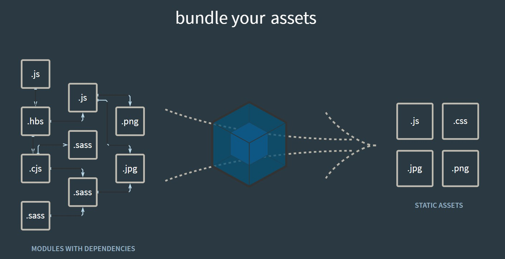
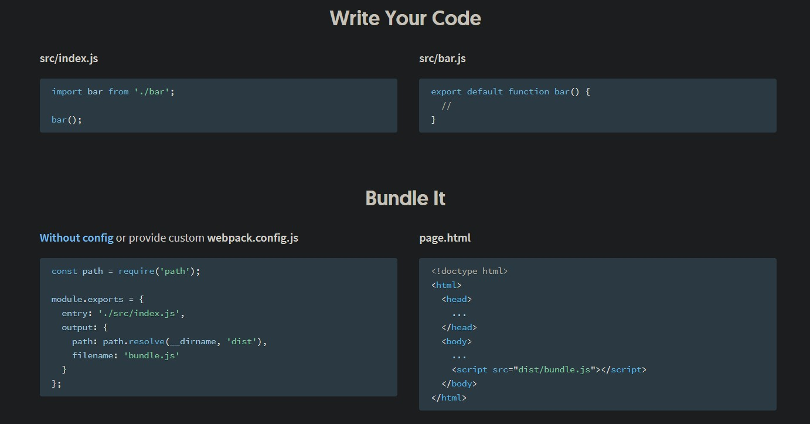
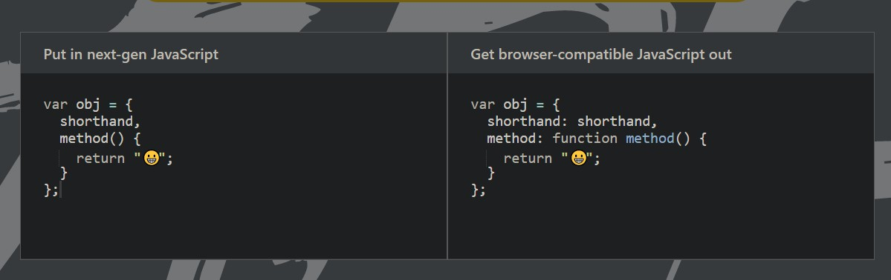
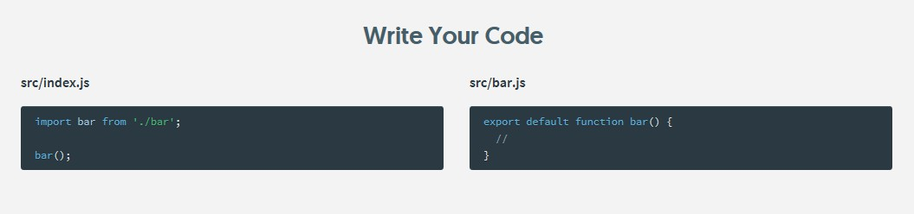

# Gulp 加強工作流程

我們的目的就是自動化工作流程，比如說像 Week16 的 scss，我不想要每一次都要用 CLI 轉換 scss 成為 css，另外我們可以藉由 gulp 做壓縮 (雖然程式碼可能會搞到可讀性很差，但不影響效能與內容)，但是這是部署必備的流程。

所以重點：

1. 工作流程自動化
2. 壓縮檔案 (也可以編寫進自動化腳本中)

Gulp 本身是有固定語法的，先簡單介紹如下：

```javascript
var gulp = require('gulp') // 要先安裝 gulp 套件
var less = require('gule-less') // gulp 的模組之一
var minifyCSS = require('gulp-csso') // gulp 的模組之一

gulp.task('css', function() {
    return gulp.src('client/templates/*.less') // 取用我要處理的檔案，代表所有的 .less 檔案
        .pipe(less()) // 先處理
        .pipe(minifyCSS()) // 再壓縮
        .pipe(gulp.dest('build/css')) // 再把檔案輸出到 dest 資料夾
})

gulp.task('default',['css'])
```

**注意，src 通常為來源資料夾，dest 則為輸出資料夾，約定俗成的用法需要留意**

另外就是 pipe 的概念，這是之前在 Week1 課程教過的指令名稱，用處是「將前者的輸出做為後者的輸入」

其實 gulp 的格式超級好理解，以下是 [Gulp 官方網站](https://gulpjs.com/)的範例 :

```javascript
const { src, dest, parallel } = require('gulp'); // 1. 引入官方套件
// 2. 引入模組功能
const pug = require('gulp-pug');　
const less = require('gulp-less');
const minifyCSS = require('gulp-csso');
const concat = require('gulp-concat');

// 3. 設計腳本，包含來源與輸出和處理順序
function html() {
  return src('client/templates/*.pug')
    .pipe(pug())
    .pipe(dest('build/html'))
}

function css() {
  return src('client/templates/*.less')
    .pipe(less())
    .pipe(minifyCSS())
    .pipe(dest('build/css'))
}

function js() {
  return src('client/javascript/*.js', { sourcemaps: true })
    .pipe(concat('app.min.js'))
    .pipe(dest('build/js', { sourcemaps: true }))
}

//
exports.js = js;
exports.css = css;
exports.html = html;
exports.default = parallel(html, css, js);　// 4. 設定 CLI 輸入 glup 就會跑這些腳本


// 5. 在 CLI 輸入 gulp 就會開始跑腳本了(node 環境)
```

承第 5 點，既然我們是從 CLI 去執行 gulp 的，可想而知是使用 node.js 環境，並且你可以使用 npm / yarn 下載 glup

接下來開始安裝 :

```javascript
npm install --global gulp-cli -g
```
或是

```javascript
npm install --save-dev gulp
```

這樣可以把記錄檔放在 package.json 之中

接著創建一個檔案 `gulpfile.js`，這個檔名是 gulp 預設拿來執行設定檔的檔名，也就是我們放腳本程式碼的地方，在這個腳本裡面你可以做兩件事情

1. 自己寫腳本 (通常是測試 gulp 能不能 work 而已)
2. 下載套件，可以到官網的 [Pluguns](https://gulpjs.com/plugins/) 去看

我們專注在第 2 點就好，gulp 就只是一道大門而已，重點是我們要執行哪些**腳本功能**，去下載對應的**套件**

比如說現在我想要一個腳本，可以幫我將 scss 轉為 css 這件事情自動化，這時候 Google 一下就會找到 [gulp-sass](https://www.npmjs.com/package/gulp-sass)，依照教學來下載安裝。

這邊假設我有一個 scss 檔案叫做 abc.scss

看看 gulp-sass 的安裝方法 :

```
npm install node-sass gulp-sass --save-dev
```

這邊來看一下 gulp-sass 的範例程式碼 :

```javascript
'use strict';
 
var gulp = require('gulp');
var sass = require('gulp-sass');
 
sass.compiler = require('node-sass');
 
gulp.task('sass', function () {
  return gulp.src('./sass/**/*.scss')
    .pipe(sass().on('error', sass.logError)) // 有錯誤會 log 出來
    .pipe(gulp.dest('./css')); // () 內為目標資料夾位置
});
 
gulp.task('sass:watch', function () {
  gulp.watch('./sass/**/*.scss', ['sass']);
});
```

接著，輸入

```
gulp
```

這樣就會去找 gulpfile.js 檔案來執行，或者你也可以輸入

```
gulp task名稱
```

這樣就會直接去找檔名了，然後直接執行腳本了！


# Webpack

簡單來說，其中一個使用案例就是將 node 環境的 `require` 與 `import` 等功能搬到連瀏覽器環境都能使用

有同學提問說為什麼不是用 `<script>` 引入 ? 因為引入就是引入一整個檔案，不方便

用 `require` 與 `import` 的方式可以針對 function 來引入，我就可以把 function 集放在一個 func.js 檔案來用

總結 :

>Webpack 可以用類似 node.js 模組化開發

我們來開創一個檔名為 webpack.config.js 的檔案，現在來看看 Webpack 設定檔的規格 :

```javascript
const path = require('path');

module.exports = {
  entry: './src/index.js', // 引入的檔案
  output: {
    path: path.resolve(__dirname, 'dist'), // 輸出的位置
    filename: 'bundle.js' // * html 要引入的檔案
  }
};
```

要執行則是可以使用以下 CLI

```
webpack 檔名
```

執行之後轉換就成功了，成功就可以引入

引入則是以下

```html
<!doctype html>
<html>
  <head>
    ...
  </head>
  <body>
    ...
    <script src="dist/bundle.js"></script> <!-- 引入方法 -->
  </body>
</html>
```

# 其他教材補充

以下課程內容來自 [Mike 老師的公開直播](https://www.youtube.com/watch?v=vyI-Ko6fvKU)，僅作為個人練習與參考使用，請勿轉載，有興趣的人也可以點影片連接，給老師按個讚！

## Webpack 概念 :

將眾多模組，如 React / sass / vue / jQuery 等等打包成一個入口點，也就是說我只要引入一個 js 檔案就好

好處 : 

1. 適合多人開發集中管理套件
2. 不用引入很多套件，讓 html 碼載入一堆，這樣在大型專案 (平台) 很難維護
3. 承上，如果引入套件有順序問題，如果一個載入有錯後續都會錯誤

所以 Webpack 的好處是把所有引入套件變成一支，透過 Webpack 打包

這邊補充下關於 node 環境家族與 Webpack 的關係 :

```
NVM
    => node
        => npm
            => Webpack
            => gulp
            => eslint...
                => Project (React, Vue, jQuery..)
```

**之所以把 NVM 放在頭，是因為我們其實可以下載 NVM 並從此安裝 node.js，可以選擇版本安裝**

---
## 這邊來示範一下 Webpack + BABEL

**Babel 就是將高版本 ES6 轉成 ES5 以下，相容性高，好工具**

首先我們在桌面創立一個資料夾

```
// Desktop

webpack
```

然後到 Webpack 官網，可以看到官網圖片就呈現了 Webpack 的概念 :



Webpack 其實可以想像成是一個「設定檔」，內中沒有邏輯可言，Webpack 本身並不難理解

檔案設定得好，編譯的流程都會照腳本走

接著往下看如何安裝 :



簡單來說，我們需要一個檔案，這個檔案就是我們的腳本，腳本內容是「如何打包？」

所以我們先在 Webpack 這個資料夾裡面創立 `webpack.config.js`

```
// webpack

webpack.config.js
```

然後我們套用基本格式：

```javascript
// webpack.config.js
const path = require('path');

module.exports = {
  entry: './src/index.js',
  output: {
    path: path.resolve(__dirname, 'dist'),
    filename: 'bundle.js'
  }
};
```
然後開始安裝 :

```
npm install webpack webpack-cli --save-dev
```

webpack-cli 是 4.0 版本才新增的內容，而 --save-dev 則是將這個安裝寫入 package.json 作為預設值，另外 webpack 本身也會依賴其他套件，所以在 node_modules 中也會被安裝其他套件。記得 node_modules 本身是沒在上傳的。

現在我們回到 webpack.config.js :

```javascript
// webpack.config.js
const path = require('path');

module.exports = {
  entry: './src/index.js',
  output: {
    path: path.resolve(__dirname, 'dist'),
    filename: 'bundle.js'
  }
};
```
注意 `require` 與 `module.exports` 這兩個其實是 node.js 語法，在 node.js 中，「path」 是拿來做路徑處理的套件。

而 path.resolve 就是將相對路徑轉換為絕對路徑的功能

這邊要介紹一下 `entry` 與 `output` 這兩個最重要的語法：

- `entry` 進入點

  entry 就是一開始的進入點，從這個進入點決定我要引入處理的檔案。通常是在 src 資料夾中

- output

  path 就是要輸出在哪個路徑，通常是在 dist 資料夾，命名的部分要注意，以引入為 index.js 的情況而言，輸出我們不單單只會命名為 bundle.js，而是 index.bundle.js

都設定好之後，就在 CLI 輸入以下:

```
webpack
```

這樣就可以**啟動** Webpack 幫你做編譯，這時候看 dist 資料夾裡面就會有 index.bundle.js 這個編譯後檔案。

打開這個檔案你會看到一堆程式碼，可以看到 Webpack 已經幫你做好一堆預設處理。

entry => Webpack => output

但是打開 index.bundle.js 實際上除了一些 Webpack 幫我們加入的一些函式之外，並沒有看到其他的內容，這是因為我們還沒有安裝相關的套件。

---
## 現在，我們安裝 Babel 來試試看 :

首先，我們 Google 一下 **Babel Loader**，這邊有[中文網站](https://webpack.docschina.org/loaders/babel-loader/)

官網告訴我們可以輸入下列這串指令來安裝

```
npm install -D babel-loader @babel/core @babel/preset-env webpack
```
-D 本身就是 --save-dev 的縮寫，有了這個就不用再加了

趁這個安裝時間看一下 [babel 的官網](https://babeljs.io/)

這邊可以看到官網的程式碼在跑，這邊就是在示範 ES6 的高版本轉換到低版本地對照，而要實現這項功能，使用 Babel 就好



安裝好之後，我們回到 webpack.config.js，並將 babel-loader 官網的引入程式碼貼上 :

```javascript
// webpack.config.js
const path = require('path');

module.exports = {
  entry: './src/index.js',
  output: {
    path: path.resolve(__dirname, 'dist'),
    filename: 'bundle.js'
  }
};

// 以下貼上
module: {
  rules: [
    {
      test: /\.m?js$/,
      exclude: /(node_modules|bower_components)/,
      use: {
        loader: 'babel-loader',
        options: {
          presets: ['@babel/preset-env']
        }
      }
    }
  ]
}
```
注意到 `module : { }`，這邊，這邊就是負責放入我們的套件的聲明方式，看你是要放 Sass、jQuery 還是什麼，都是如此聲明，在這個地方通常可以直接參考套件的安裝程式碼介紹

基本上這邊不用做更動，再次於 CLI 輸入 webpack，就可以利用現下安裝的 babel 幫我們編譯出 index.bundle.js 了!

然後 html 這邊我就可以引入

```html
<!doctype html>
<html>
  <head>
    ...
  </head>
  <body>
    ...
    <script src="./dist/index.bundle.js"></script> <!-- 引入方法 -->
  </body>
</html>
```

---
## 接下來介紹幾個好用的設定 :

1. webpack 語法補充

    在 package.json 找到 `"script": { }`

    以下為範例 :

    ```
    "main": "webpack.config.js",
    "script": {
        "watch": "webpack --mode development --watch"
        "start": "webpack --mode development"
        "deploy": "webpack --mode production"
    }
    ```

    在開發的時候通常分為:

    - 只執行一次
    - 不斷保持執行
    - 上線前執行

    這邊先提一下，在 webpack 轉換之後，你應該有注意到 `bundle.js` 的程式碼只有一行，意思是這個東西是「上線用的」完成版本，所以 webpack 幫你壓縮了多餘空間。

    那麼，如果要保持開發中的程式碼結構，我下 webpack 指令這邊就要輸入成

    ```
    webpack --mode development
    ```

    而預設則是下列指令，也就是壓縮版：

    ```
    webpack --mode production
    ```

    那麼 `--watch` 是什麼意思呢 ?

    可以想像成「監視」的意思，這個方法可以讓 webpack 監視 `src` 內的 `entry`，一但來源更新，我也會即時更新我的 `bundle.js`，這樣的用法可以幫助我們讓程式保持運作。

    如果要中斷，CLI 按下 `Ctrl` + `C`

    另外要注意的是，由於預設的 `--mode production` 會額外執行其他程序，所以如這邊你搭配 `--watch` 來使用，執行速度將會**超級無敵慢 !**

2. 用 npm 來執行 webpack
    
     ```
    "main": "webpack.config.js",
    "script": {
        "watch": "webpack --mode development --watch"
        "start": "webpack --mode development"
        "deploy": "webpack --mode production"
    }
    ```

    `"script"` 可以幫我們執行簡易操作，只要在 CLI 輸入

    ```
    npm run script名稱
    ```

    就可以自動執行指令了，而上述的 watch、start 與 deploy 也等於是開發流程，可以參考看看。記得最後一定要輸入 "webpack --mode production" 就是了。

## Webpack 模組化

接下來我們來談談如果綜合各種 `<script>` 引入

首先我們創建一個 menu.js 的檔案

接著看官方網站的介紹 :



簡單來說，就是讓瀏覽器的 js 支援 node.js 的 `export` 與 `import` 的功能

現在打開 menu.js

```javascript
// menu.js
export default function Menu(){
    console.log('haha')
}
```

然後 index.js 我們輸入

```javascript
// index.js
import Menu from "./menu.js"
window.onload = function(){
    Menu() // haha
}
```

---

補充參考資料 : 

    - https://medium.com/html-test/%E5%BE%9E%E7%84%A1%E5%88%B0%E6%9C%89%E5%BB%BA%E7%AB%8B-webpack-%E8%A8%AD%E5%AE%9A%E6%AA%94-%E4%B8%80-42fbc76a2d37
    - https://medium.com/html-test/webpack-%E7%9A%84%E5%9F%BA%E6%9C%AC%E5%B7%A5%E4%BD%9C%E6%B5%81%E7%A8%8B-585f2bc952b9


# Gulp 與 Webpack 的差別

- Gulp : 

    將任務**自動化**，如壓縮圖片，移動檔案，compile css，轉換 JS，minify js and css...

- Webpack :

    將資源用 `import` 的方式加載進來，包括圖片、css 等等

兩者皆用會是不錯的方法，不必非要擇一

