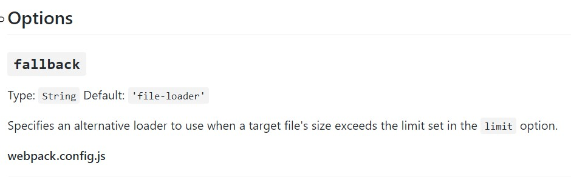

576# 前言

由於這週所教的部分筆記有做起來，所以實際上的心得筆記可以回看之前的就好

這週想針對這個月 ( Week16 - Week19 ) 做一些補充，而複習的部分寫心得

會這樣做的原因是因為，第十六與十八週都是教工具應用，第十七週教 JavaScript 底層運作與程式機制，第十九週談網頁架構

所以本週複習週不會以週區分，而是以主題區分，Sass / Gulp / Webpack 一區，JavaScript 運作一區，MVC / SPA / MPA 架構一區

心得筆記由於已經有撰寫，這邊就不再重寫了

# Webpack

## 所以 Webpack 到底是什麼 ? 它與 Gulp 又有什麼區別 ?

當我們把這個問題提出來的時候，基本上這個問題本身就很有問題了

在問這個問題之前，必須先下一個前提，那就是：在 XXX 功能上，Webpack 與 Gulp 有什麼區別 ?

假設我今天的前提，是要讓 Scss 自動轉成 css，那兩者的功能可以說是毫無區別

但假設今天我的問題的前提是，兩者將 Scss 轉成 css 的 Work flow 是否一樣 ? 那答案就是有所差別

所以我認為這一個問題，其實不能算是問題，因為就實務上來說，你沒有必要擇一，你可以都使用

於是乎我們來談談實務上 Webpack 到底能為我們做什麼，至少，就目前我們所學而言，它能怎麼做？

## webpack.config.js

其實 webpack 就是一個打包工具，目的是打包，其餘套件僅僅是附帶的功能，所以如果談套件，那其實 gulp 也可以做到一樣的事情

但打包引入這個功能是 gulp 無法做到的，`export { }` 與 `import { }` 的運行環境是僅在 node.js 才被允許，這點可不能忘記

但通過 webpack 「打包」之後，我們就可以讓瀏覽器裡的 JavaScript 做到這個功能

現在讓我們來了解 webpack.config.js 的構造

```javascript
const path = require('path');
const webpack = require('webpack');

module.exports = {
  entry: './src/index.js', // 引入要編譯的 code
  output: {
    // 輸出的位置，__dirname 所指為 webpack.config.js 所在位置
    path: path.resolve(__dirname, 'dist'),
    filename: 'index.bundle.js' // 打包完成品
  },
  module: {
    rules: [   // 一個 Array, 編譯這份 code 的順序
      {
        test: /\.css$/,
        loaders: ["style-loader","css-loader"]
      },
      {
        test: /\.(jpe?g|png|gif)$/i,
        loader:"file-loader",
        options:{
          name:'[name].[ext]',
          outputPath:'assets/images/'
          //the images will be emited to dist/assets/images/ folder
        }
      },
      {
        test: /\.s[ac]ss$/i, // 一種 regex (正規表達式)，用來比對檔名，也可寫 /\.(scss|sass)$/
        use: [
          // Creates `style` nodes from JS strings
          'style-loader',
          // Translates CSS into CommonJS
          'css-loader',
          // Compiles Sass to CSS
          'sass-loader',
        ],  
        // 總結，只要是 sass/scss 的副檔名，都要經過　use: [ ] 內的 loader 處理，處理順序是由最尾至前頭
      },
    ],
  },
  resolve: {
    alias: {
      //
      jquery:  'jquery/dist/jquery.min.js',
      "jquery-ui": "jquery-ui/jquery-ui.js",  
      'jquery-ui': path.resolve('./node_modules/jquery-ui/ui'),      
      // bind to modules;
      modules: path.join(__dirname, "node_modules"),
    }
  },
  plugins: [
    new webpack.ProvidePlugin({
      $: "jquery",
      jQuery: "jquery",
      jquery: "jquery",
      "window.jQuery": "jquery",
      "window.$": "jquery"
    })
  ]
};
```
https://ithelp.ithome.com.tw/articles/10194056

## loader 與　plugins 的差別 ?

兩者的差別在於，loader 用於轉化檔案，使 webpack 打包過程中添加原本不附帶的能力 (講是這樣講，但其實一些 loader - 如 babel 的編譯與 mibify-JS 的壓縮都內建在 webpack 4.0 之中了)，一個 loader 檔案格式為 xxx-loader.js，所以也可以自己寫來測試看看。

另外，loader 的執行順序是**由下至上** (由右至左)

而就時點來講，loader 是在 webpack 執行編譯時一併執行

而 plugin 則是在 webpack 編譯前或編譯後執行

若從對象而言，loader 針對的是 test 包含的檔案

而 plugins 是針對「整個 webpack 架構」做監聽，若有符合的狀況則執行該操作

可以理解成

```
plugins => webpack(loader)

或是

webpack(loader) => plugins
```

https://blog.csdn.net/qq_34629352/article/details/83628917

https://blog.csdn.net/keliyxyz/article/details/51579078

## 如何理解 loader ?

loader 就是設定 webpack 該「怎麼處理」引入的檔案，這邊的檔案不限於 .js，也可以是 sass/scss/css 等

而 webpack chain 的概念其實看起來跟 gulp 的處理流程有點像，你也可以理解成 curl 的 pipe 概念，也就是將前一個處理的輸出當作後一個處理的輸入。

## module 下 test 的寫法與 loader 

- test

  test 的正規表達式要怎麼表達呢 ?

  如果要搜尋所有 .js 檔名，則是 `/\.js$/`

  如果要搜尋所有 .js 或 .jsx，則是 `/\.jsx?$/`

  而你也可以看看下列範例中的 `/\.s[ac]ss$/`，由 `[ ]` 包住的每個字母都可以視作內容，如 `[ac]` 可以代表 `[a]` 或 `[c]`，所以可以看做 sass / scss 都可以

- loader

  在 run webpack 時，test 通過就會來檢驗 loader 的部分，名稱用 use 或 loader 的方式並不同

  loader 搭配 `""` 與 `!` :

  ```javascript
    test: /\.s[ac]ss$/,
    loader: "style!css!sass" // loader 改成 use 也可以
  ```

  use 就是個陣列表達方式，比較推薦，好讀：

  ```javascript
    test: /\.s[ac]ss$/,
    use: ["style-loader" , "css-loader" , "sass-loader"] // 感覺比較好讀
  ```
  這樣寫也是可以

  ```javascript
    test: /\.s[ac]ss$/,
    loader: ["style" , "css" , "sass"] // 感覺比較好讀
  ```

  記住上列處理的順序是 sass-loader -> css-loader -> style-loader

  這邊講一下為什麼 sass-loader 後面還要接 css-loader 和 style-loader

  事實上 css-loader 是我們要編譯 .css 檔案的標配，而 style-loader 則是要用來實現引入 .css 檔案的 .js 檔案可以順利被 HTML 用 `<script>` 引入

  所以光是我們要引入 .css 檔案就會需要 css-loader 與 style-loader

  那麼 sass-loader 就只是更多了一步 - 將 .scss / .sass 檔案轉換為 .css 檔

  這邊也可以比較好理解 ass-loader -> css-loader -> style-loader 的順序排列

- 補充 : 目前安裝 sass-loader 時應該連 node-sass 也一起安裝

## 來介紹一個壓縮圖片的 loader

`file-loader` 與 `url-loader`

在第十八週我們學過 Data URL 與 CSS Spirits，現在我們來討論前者，webpack 有一個 loader 可以幫我們設定當圖片檔案大小於多少範圍時，可以自動將其轉成 base64，那就是 `url-loader`

而 `file-loader` 則是壓縮圖片，那這時候你可能會想，這兩個 loader 我選一個就行了吧 ? 反正感覺 base64 也會壓縮圖片啊 ?

不對啊！將圖片轉成 base64 會把圖片檔案變大啊 ! 33% 記得嗎 ?　它不是用來壓縮的啦

那簡單來說如果要轉成 base64，就不要挑大圖了，如果是大圖，我們就老老實實發送 Request 去取，所以是用 `file-loader` 去壓縮

總之我們不用管這麼多，看看 `url-loader` 的官方說明文件 :

url-loader works like `file-loader`, but can return a DataURL if the file is smaller than a byte limit.

這邊說明 `url-loader` 是類似於 `file-loader` 的工作方式．但僅能轉換大小低於限制的圖片



`url-loader`有一個 `fallback` 參數，意思是說「當圖片超過 limit 設定的限制大小時」我們要怎麼做？預設值就是 file-loader，所以我們不用另外設定 file-loader

> **也就是說，當圖片大小不大的時候，轉為 base64，而超過設定大小時則使用 file-loader 進行壓縮**

而同樣的，由於預設值包含 `file-loader`，所以在其 `options` 加入 `file-loader` 相關參數也是沒問題的

但要記住一點，由於 url-loader 的輸出不是參數
，所以不會有指定檔名格式的設定值。

[url-loader GitHub](https://github.com/webpack-contrib/url-loader)

[url-loader](https://www.webpackjs.com/loaders/url-loader/)

## 參數相關

- options

  看完上面這個壓縮圖片的套件案例之後，我們學到了 `options` 這個設定，use 底下的每一個 loader 都有自己的 `options` 可以設定

  ```javascript
  {
    test: /\.(svg|png)$/,
    use: [
      {
        loader: 'file-loader',
        options: {
          emitFile: false,
          // 不複製檔案到 ./dist
          name: '[name]-[hash].[ext]'
          // 產生 hash 之後的檔名
        }
      },
      {
        loader: 'url-loader',
        options: {limit: 40000}
      }
    ]
  }
  ```

  假若你不想在 `options` 設定，你也可以設定在 loader 之中，不使用 `options` 範例是：

  ```javascript
  {
    test: /\.(svg|png)$/,
    use: [
      {
        loader: 'file-loader?emitfile=false',
      }
    ]
  }
  ```

  不過感覺 `options` 比較易讀就是了

- include / exclude

  也是一個正規表達式，用 `/.../` 包裝

  ```javascript
  rules: [
      {
          test: /\.s[ac]ss?$/,
          loader: 'style-loader!css-loader!sass-loader',
          exclude: /node_modules/,
      }
  ]
  ```

  exclude 的意思是「排除」，上述例子就是我要排除掉 node_modules 這個資料夾

  若是 include，則是「只」處理該資料夾的檔案

# Plugin 

https://blog.csdn.net/weixin_38516688/article/details/86537567


# 進階 webpack-dev server 相關

https://segmentfault.com/a/1190000005614604


