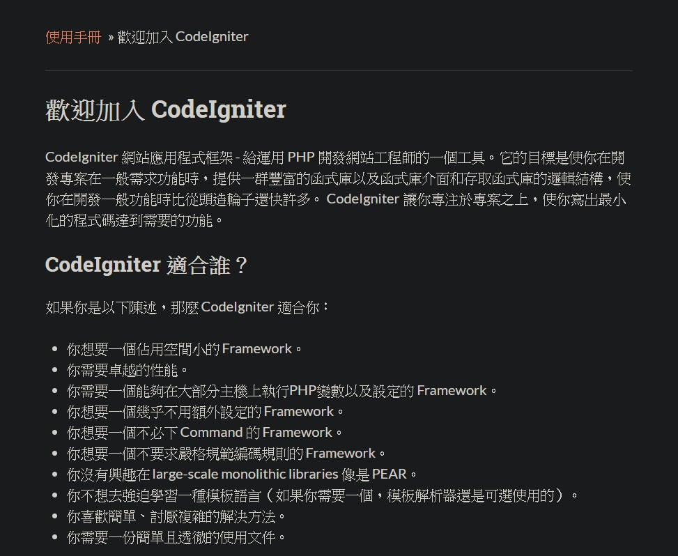
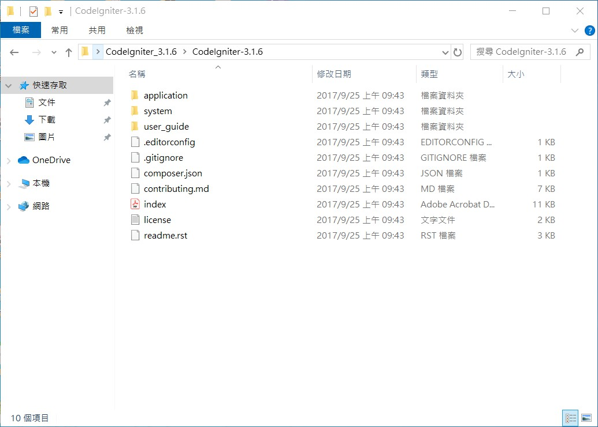

# 後端框架

## 教 CodeIgniter 框架的原因 :

確認對框架的熟練度，並用更結構性的方法撰寫 PHP 程式語言，簡稱為 CI

CodeIgniter 是一個小但完整的 PHP框架，為一完整的 MVC 框架，有很多內建的 helper function

## CodeIgniter 簡介

直接看官網介紹 :



## 安裝

到[官方網站](https://codeigniter.org.tw/userguide3/installation/)下載檔案，下載並解壓縮在**Server 的資料夾中**



上述這整個資料夾內的內容，可以看到 index.php，因此其餘的檔案都是連結這個 index.php 的，框架本身 CI 都替我們準備好了

而我們的 Code 會放在 application 內

進入 application 內，可以看到一個 config 資料夾，內中的 config.php 是我們的設定檔，來進入看看

```php
<?php
defined('BASEPATH') OR exit('No direct script access allowed');

/*
|--------------------------------------------------------------------------
| Base Site URL
|--------------------------------------------------------------------------
|
| URL to your CodeIgniter root. Typically this will be your base URL,
| WITH a trailing slash:
|
|	http://example.com/
|
| WARNING: You MUST set this value!
|
| If it is not set, then CodeIgniter will try guess the protocol and path
| your installation, but due to security concerns the hostname will be set
| to $_SERVER['SERVER_ADDR'] if available, or localhost otherwise.
| The auto-detection mechanism exists only for convenience during
| development and MUST NOT be used in production!
|
| If you need to allow multiple domains, remember that this file is still
| a PHP script and you can easily do that on your own.
|
*/
$config['base_url'] = '';

/*
|..
..
..*/
```

以 `$config['base_url'] = '';` 來說，這裡就是我們要跑 index 的位置，若不設定可能容易出錯

其他部分就不用設定了，但還是可以閱覽一下

接下來同個資料夾中，我們可以看到 database.php，進去之後就可以預先設定好我們在原本專案中設定在 conn.php 內的內容

如下 :

```php
$active_group = 'default';
$query_builder = TRUE;

$db['default'] = array(
	'dsn'	=> '',
	'hostname' => 'localhost',
	'username' => '',
	'password' => '',
	'database' => '',
	'dbdriver' => 'mysqli',
	'dbprefix' => '',
	'pconnect' => FALSE,
	'db_debug' => (ENVIRONMENT !== 'production'),
	'cache_on' => FALSE,
	'cachedir' => '',
	'char_set' => 'utf8',
	'dbcollat' => 'utf8_general_ci',
	'swap_pre' => '',
	'encrypt' => FALSE,
	'compress' => FALSE,
	'stricton' => FALSE,
	'failover' => array(),
	'save_queries' => TRUE
);
```

設定好之後，大概就差不多了，接下來繼續看目錄，可以看到 MVC 架構，也就是 models、views 與 controllers 這三個資料夾

而 config 資料夾中的 routes.php 則是用來設置路由

等等，在這之前我們先來看 CI 官網介紹的[路由規則](https://codeigniter.org.tw/userguide3/tutorial/static_pages.html)

什麼意思 ? 過去我們在寫純 php 的時候，我們的檔案路徑是什麼，URL 結構就是什麼

但在 MVC 架構上並不一樣，雖然資料夾上分為 models / views / controllers，但在 URL 上我們不傾向這樣顯示

現在我們來看官網範例：

> 例如，當瀏覽器發出一個請求給:
```
http://example.com/news/latest/10
```
> 我們可以想像那邊有個控制器名為 “news” 。而 news 控制器將會被呼叫的方法(method)為 “latest” 。 這個 latest 方法的工作可能是抓取十個新聞項目，並顯示在頁面上。這在 MVC 中很常見，你看到的 URL 格式將會是這種格式:

```
http://example.com/[controller-class]/[controller-method]/[arguments]
```

為了達到這個目的，我們可以在 controllers 資料夾創建一個名為 Page.php 的controller，並且設定這個 controller 的運作邏輯，與 View 做交互，首先設定內容為


```php
<?php
class Pages extends CI_Controller {

        public function view($page = 'home')
        {
        }
}
```


`extends CI_Controller` 代表我們要用到，CI 會為我們做一些事情

`$page‵ 代表**要被讀取的頁面名稱**，這些頁面被放在 application/views/pages/ 底下

`$page = 'home`　這種指定參數值的寫法，在這邊指的是若 $page 若沒有傳進值，則指定為 `'home'`，也就是沒有指定頁面就會設置成首頁的意思

接下來官網談到我們可以在 Views 資料夾創立一個資料夾名為 templates，內創兩個檔案 header.php 與 footer.php，內容就是一個頁面的 head 與 footer。

```php
// header.php
<html>
    <head>
        <title>CodeIgniter Tutorial</title>
    </head>
    <body>
        <h1><?php echo $title; ?></h1>
```

```php
//footer.php
        <em>&copy; 2019</em>
    </body>
</html>
```
在 header.php 中，有一個變數 `$title` ，變數的內容經由 `echo` 將渲染在頁面上，待會兒我們會在 `Page.php` 定義這個變數

接著，我們繼續回頭寫 `Page.php`：

從頭回憶一下，剛剛我們宣告了一個 function 叫做 view，$page 這個參數代表的是頁面名稱，我們所要增加的邏輯就是當 controller 接收到 request 時，經由內部邏輯運算，導至我們希望使用者前往的檔案，這邏輯將一反我們過去寫純 php 時那種資料夾路徑的表示方法

回憶一下，剛剛我們所寫的：

```php
<?php
class Pages extends CI_Controller {

        public function view($page = 'home')
        {
        }
}
```
為了要測試我們等等寫的邏輯是否成功，我們需要建立兩個測試檔案，我們在 Views 資料夾中創立 Pages 資料夾，命名為 Pages 表示可以專門放頁面使用，我們在裡面創立 home.php 與 about.php，並在裡面打一些字：

```php
// home.php
I am Home;
```

```php
// about.php
I am about;
```

現在我們來看看目前的資料結構 (有省略不相關的枝葉）：

```
│  .htaccess
│  index.html
│
├─cache
│      index.html
│
├─config
│      autoload.php
│      config.php
│      constants.php
│      database.php
│      doctypes.php
│      foreign_chars.php
│      hooks.php
│      index.html
│      memcached.php
│      migration.php
│      mimes.php
│      profiler.php
│      routes.php
│      smileys.php
│      user_agents.php
│
├─controllers
│      index.html
│      Pages.php　
│      Welcome.php
│
├─models
│      index.html
│
└─views
    │  index.html
    │
    │
    ├─Pages
    │      about.php
    │      home.php
    │
    └─templates
            footer.php
            header.php
```

現在，我們為 Pages.php 寫邏輯

```php
public function view($page = 'home') // 沒給值則為 home
{
        if ( ! file_exists(APPPATH.'views/pages/'.$page.'.php')) // 邏輯重新導向，APPPATH 指根目錄
        {
                // Whoops, we don't have a page for that!
                show_404();
        }

        $data['title'] = ucfirst($page); // Capitalize the first letter

        $this->load->view('templates/header', $data);
        $this->load->view('pages/'.$page, $data);
        $this->load->view('templates/footer', $data);
}
```

`file_exists()` 判斷檔案是否存在於預期的位址，`show_404()` 則是 CodeIgniter 內建的函式，

可以看到 `header` 與 `footer` 都是去讀固定的頁面，也就是我們剛剛建的 `header.php` 與 `footer.php`，只有中間 `body` 的部分會隨著瀏覽頁面不同而變化，若頁面不存在，則顯示 `"404 Page not found"`

`uscfirst()` 也是 CodeIgniter 內建的函式，將第一個字母轉為大寫

當
