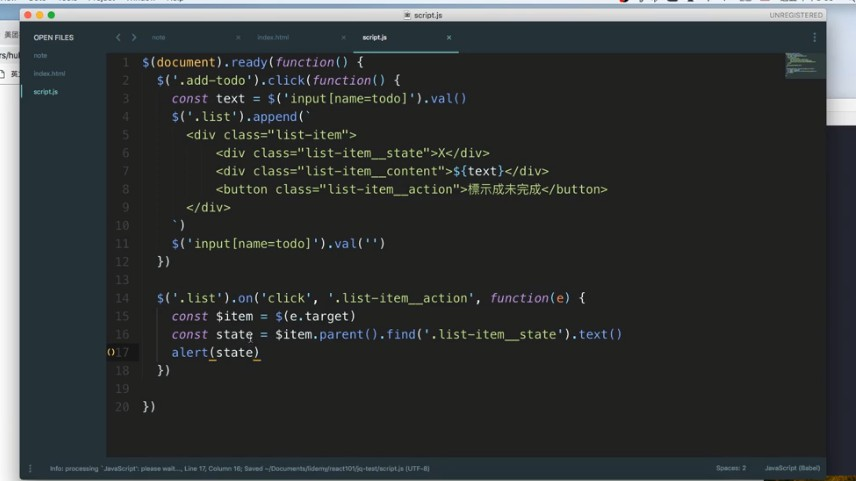

# 談談 React 之前，先用 jQuery 寫 todol list

這邊看教學影片 live coding 就好，就不贅述，只標記重點 :

## HTML 與 CSS 切版部分

- 老師用字元的 O / X 來標記已完成 / 未完成，還蠻特別的
- 老師的 css 命名，先使用 `-` 才是 `_`，是特別的用法

    

- 對於要並排，很直覺地在父容器設置為 display: flex
- 對於內部子元件要靠最右，使用直覺的方法：

    ```css
    .list-item_action {
        position: absolute;
        right: 0;
    }
    ```
## jQuery 部分

- 這邊的作法是新增的時候，前端 append 一個 todo task，往後端這邊一樣是發 request，append 完之後輸入框清空。
- 對於 todo task 的選擇一樣是用事件代理的方式，這樣也可以在 task 新增後一樣能觸發父監聽器，這時候你可以選定你父監聽器底下的某一個子項目：

    ```javascript
    $('.list').on('click','.list-item_mark', function(e){
        const $item = $(e.target)
        const state = $item.parent().find('list-item__state').text()

        if (state === 'X') {
            // 略
        } else { // O
            // 略
        }
    })
    ```

- 屬於 jQuery 的東西習慣用 $() 包起來，如以下：

    

- 由於 O / X 有自己的 `<div>`，所以可以選取它的 `text()` 改成 O 或 X，很聰明的方法

- 關於 filter 的部分，我需要有一個東西來辨別該 task 是否完成，這邊的作法是在前面更改 O 或 X 的部分，再附帶一個 class (addClass()) 進去，打 X 則移除該 class(removeClass)，這樣的話 filter 只要判定有無該 class 

    ```javascript
    $('.filter__all').click(function(){
        $('.list-tasks').show()
    })

    $('.filter__completed').click(function(){
        $('.list-tasks').hide()
        $('.list-tasks.completed').show()
    })
    ```
## 加一個新功能

我們沒有替這個 todo list 做後台，但又希望在重新整理之後可以保存我的的內容，我們可以把其儲存在瀏覽器的 Loacl Storage 之中

作法我們可以這樣寫 :

- 宣告一個陣列 :

    ```javascript
    var todo = []
    ```

- 然後新增任務時，陣列插入這個任務的物件：

    ```javascript
    $('.add-todo').click(function(){
        const text = $('input[name=todo]').val()
        todo.push({
            text: text,
            isComplete: false
            id: id // 因應下面要做的刪除
        })
    })
    ```
    > 補充一點，在 ES6 之中，物件名稱與物件內容若相同則可以省略，也就是可以寫成下列寫法：

    ```javascript
    $('.add-todo').click(function(){
        const text = $('input[name=todo]').val()
        todo.push({
            text,
            isComplete: false
            id // 因應下面要做的刪除
        })
    })
    ```

- 刪除任務時比較特別，我們要確定點下刪除按鈕的時候要刪除什麼，所以新增一個 id

    

    這邊和我的想法是一樣的，讓 DOM 屬性新增一個 data-id 以識別，然後 id 遞增 (不過我的做法是用 for 迴圈的 i)

    於是我們就可以在移除的部分，利用 id 找到相對應的 DOM 來刪除，這邊不贅述

    ```javascript
    $('.list').on('click','.list-item_delete', function(e){
        // 取上層再上層的屬性
        const id = $(e.target).parent().parent().attr('data-id')
        // 把不等於所選取 id 的任務留下來，id 會是字串，要轉數字
        todos = todos.filter(todo.id => todo !== Number(id))
        $(e.target).parent().parent().remove() // 移除這個 DOM
    })
    ```

## 將資料放在 localStorage

```javascript
function setData() {
    window.localStorage.setItem('todoapp', JSON.stringfy(todos))
}
// 接著在 CRUD 每個動作都 call 一次 setData
```

啟動的時候也要呼叫 localStorage 內的資料 :

```javascript
$(document).ready(function(){
    const todoData = window.localStorage.getItem('todoapp')
    if (todoData) {
        todos = JSON.parse(todoData) // 將儲存的內容存回 todos
        for (var i=0;i<todos.length; i++) {
            $('.list').append( 
                // 一堆 DOM 元素
            )
        }
    }
})
```

## 這樣寫的問題在哪 ?

剛剛寫的問題在哪 ?　答案是程式碼重複

每一次資料變動的時候都需要去操控 todos 這個陣列，比如說新增的時候，標示成完成或是未完成的時候，刪除的時候也要重新 call setDate()

現在的狀況是資料歸資料，畫面歸畫面，若程式碼沒寫好，可能會有畫面與資料不同步的問題。

如何解決？

我們可以每一次做 CRUD 的時候，所有畫面都重新 render 一次，我只要畫面呈現的方式都是從資料而來，每一次 CRUD 的時候都先清空畫面，然後重新 call render()，既然我每次的畫面都是由最新的資料而來，那我就可以確保**我的畫面一定是最新的**

```javascript
function render(todoList) {
    $('.list').empty()
    todos = JSON.parse(todoData) // 將儲存的內容存回 todos
        for (var i=0;i<todos.length; i++) {
            $('.list').append( 
                // 一堆 DOM 元素
            )
        }
}

/* 以下這些都不用寫了
$('.list').on('click','.list-item_mark', function(e){
        const $item = $(e.target)
        const state = $item.parent().find('list-item__state').text()

        if (state === 'X') {
            // 略
        } else { // O
            // 略
        }
    })

    $('.filter__all').click(function(){
        $('.list-tasks').show()
    })

    $('.filter__completed').click(function(){
        $('.list-tasks').hide()
        $('.list-tasks.completed').show()
    })
*/
 
/* 刪除也不用寫了，刪除資料之後 call render 即可
$('.list').on('click','.list-item_delete', function(e){
        // 取上層再上層的屬性
        const id = $(e.target).parent().parent().attr('data-id')
        // 把不等於所選取 id 的任務留下來，id 會是字串，要轉數字
        todos = todos.filter(todo.id => todo !== Number(id))
        $(e.target).parent().parent().remove() // 移除這個 DOM
    })
*/
```

這樣的寫法幫我們解決一個很重要的問題：也就是不用考慮前端 DOM 要怎麼改變

因為我每一次的前端 DOM 都是來自於資料，所以我只要操作資料 -> 由資料 render 就好

所以相較於原先的程式碼，我們就可以省去非常多部分，我們的 UI 由 State 延伸出來，所以不可能會有狀態 (State) 與 UI 不同步的問題

那為什麼沒有人想用這個方法呢 ? 不是很方便嗎 ?

那是因為這樣的做法有下列這個缺點 :

為了一個狀態上的小改變，就要把整個畫面清空並重新 render，雖然保證 UI 與 State 不會出錯，但試想若有一兩百個 item，會非常耗效能。原先的方法在程式碼雖然比較複雜，但會**針對單一的操作去操作單一個 DOM**，不會有太大的效能耗費

## 這就是 React

前面鋪梗鋪很久，其實上述這種 render 就是 React 的觀念

在 React 的概念中，會有一個 `state`，它永遠會對應到一個 UI

當這個 state 改變的時候，就會重新 render，也就是上述範例中，render() 所做的事情

```javascript
state => UI

state changed => re-render
```

所以核心概念就是

> 當你要改變畫面時，不直接改變畫面，只會改變 state，讓 state 去 render 出 UI

接下來，我們來介紹如何安裝 React 環境