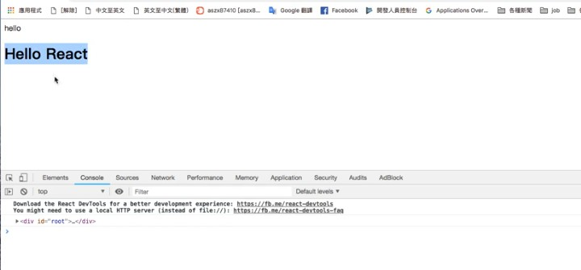

# 安裝 React 環境

[React 官網](https://reactjs.org/)

點選 Docs 底下的 Add React to a Website

可以看到如何將 React 放入網站內的一些指南

順帶一提，官方網站有簡體中文能用

有幾種方法：

1. 使用 `<script>` 引入

```html
  <!-- ... 其它 HTML ... -->
    <div id="like_button_container"></div> 
  <!-- ... 其它 HTML ... -->

  <!-- 加载 React。-->
  <!-- 注意: 部署时，将 "development.js" 替换为 "production.min.js"。-->
  <script src="https://unpkg.com/react@16/umd/react.development.js" crossorigin></script>
  <script src="https://unpkg.com/react-dom@16/umd/react-dom.development.js" crossorigin></script>

  <!-- 加载我们的 React 组件。-->
  <script src="like_button.js"></script>

</body>
```

`<div id="like_button_container"></div>` 是我們要引用 React 的對象，接下來我需要在同一層資料夾中建立一個文件叫做 `like_button.js`

```javascript
// like_button.js
'use strict';

const e = React.createElement;

// 定義一個名為 LikeButton 的組件
class LikeButton extends React.Component {
  constructor(props) {
    super(props);
    this.state = { liked: false };
  }

  render() {
    if (this.state.liked) {
      return 'You liked this.';
    }

    return e(
      'button',
      { onClick: () => this.setState({ liked: true }) },
      'Like'
    );
  }
}

// 下列兩行 code 會找到 <div id="like_button_container"></div>，然後會在內部顯示　React 的 Like 按鈕
const domContainer = document.querySelector('#like_button_container');
ReactDOM.render(e(LikeButton), domContainer);
```
完成

## 使用 Webpack 來引入 React 環境

為什麼要用到 Webpack ? 因為我們需要使用到 `import`

安裝 webpack 與 webpack-cli，這邊不贅述

現在來寫 webpack.config.js 設定檔

```javascript
const path = require('path')

module.exports = {
    entry: './src/index.js',
    output: {
        path:path.join(__dirname, './dist'),
        filename: 'bundle.js'
    }
}
```
接下來我們在 package.json 新增幾條基本的

```json
"script": {
    "start": "webpack --mode development",
    "build": "webapck --mode production",
    "test": "echo \ "Error: no test specified\" && exit 1"
}
```
說明一下，webpack 打包有分開發模式與產品模式，有些套件是專門用於開發模式的，比如說 Sass 就是很好的例子

## 加入 babel-loader

安裝 babel 相關套件 :

```
npm -i @babel/core babel-loader @babel/preset-env
```

與 Webpack 最相關主要是這個 babel-loader，接下來我們創建一個 `.babelrc`

這個檔案的意思就是選擇要用什麼標準來轉譯 ES6，這邊使用我們剛剛安裝的 `@babel/preset-en

```
{
    "presets": ["@babel/preset-env"] 
}
```

接下來回到 webpack.config.js

```javascript
const path = require('path')

module.exports = {
    entry: './src/index.js',
    output: {
        path:path.join(__dirname, './dist'),
        filename: 'bundle.js'
    }
    module: {
        rules: [
            {
                test: /\.js/,
                exculde: /node_modules/,
                use: { loader: 'babel-loader' }
            }
        ]
    }
}
```

這樣就 OK 了，你可以在 index.js 放入 `const a` 看看執行 webpack 過後的 bundle.js 是否為 `var a`，以判斷 babel 是否發揮功效

## 加入 React

```
npm -i react react-dom @babel/preset-react
```

由於 React 還會用到一些關於 Babel 的套件，所以要安裝 `@babel/preset-react`

所以剛剛的 .babelrc 也要加上來 :

```
{
    "presets": ["@babel/preset-env", "@babel/preset-react"] 
}
```

接下來我們開一個名為 Add.js 的文件當作測試檔案，來寫一些 React 程式碼 :

```javascript
// App.js

import React, {Component} from ' react'

class App extends Component {
    render() {
        returb (
            <h1>Hello React<h1>
        )
    }
}

export default App

```

然後看看 index.js 的部分 :

```javascript
// index.js

import React from ' react'
import ReactDOM form 'react-dom'
import App from './App'

// 當我執行並 render 時，選取到 id = root 的 DOM
ReqctDOM.render(<App />), document.getElementById('root')

```

接著回到我們範例的 index.html :

```html
<!DOCTYPE html>
<html>
<head>
    <meta charset="UTF-8">
    <meta name="viewport" content="width=device-width, initial-scale=1.0">
    <title>Hello</title>
</head>

<body>
    hello
    <div id="root"></div>
    <script src="./dist/bundle.js"></script>
</body>

</html>
```

就會出現 :



如此，React 就會抓到這個 DOM 物件了

接下來我們要弄 webpack-dev-server 來做到即時開發

## 小小補充

這邊補充一下關於 webpack.config.js 的一些小功能 :

```javascript
const path = require('path')

module.exports = {
    entry: './src/index.js',
    output: {
        path:path.join(__dirname, './dist'),
        filename: 'bundle.js'
    }
    module: {
        rules: [
            {
                test: /\.js/,
                exculde: /node_modules/,
                use: { loader: 'babel-loader' }
            }
        ]
    }
}
```

關於 output 的寫法可以寫成下列兩種 :

- [name].bundle.js

    ```javascript
    filename: '[mame].bundle.js
    ```

    name 就是 entry 檔案的檔名，也就是若 `entry: 'index.js'`，輸出就是 `index.bundle.js`

- bundle.[hash].js

    ```javascript
    filename: 'bundle.[hash].js
    ```
    webpack 會自動幫這個檔案 hash，只要你 index.js 有一點點不同，輸出的 bundle.js 檔名就會有巨大差異 (回憶過去關於 hash 的課程)

    但在這邊你可能會有疑問，如果每次更動檔名都不一樣，我的 HTML 要如何去引入這個檔案，總不能在那邊改 `<script>` 吧 !

    這時候我們就要用到一個 plugin，稱為 `html-webpack-plugin`

    ```
    npm -i html-webapck-plugin
    ```

    安裝之後回到 webpack.config.js 設定

    ```javascript
    const path = require('path')
    const HtmlWebpackPlugin = require("html-webpack-plugin") // 引入 plugin

    module.exports = {
        entry: './src/index.js',
        output: {
            path:path.join(__dirname, './dist'),
            filename: 'bundle.js'
        }
        module: {
            rules: [
                {
                    test: /\.js/,
                    exculde: /node_modules/,
                    use: { loader: 'babel-loader' }
                }
            ]
        },
        plugins: [
            new HtmlWebpackPlugin({
                template: './index.html' // 用我們的 index.html 當作 template
            })
        ]
    }
    ```

    接著回到 index.html

    ```html
    <!DOCTYPE html>
    <html>
    <head>
        <meta charset="UTF-8">
        <meta name="viewport" content="width=device-width, initial-scale=1.0">
        <title>Hello</title>
    </head>

    <body>
        hello
        <div id="root"></div>
        <!-- <script src="./dist/bundle.js"></script>  這行可以不用了-->
    </body>

    </html>
    ```

    這時候於 CLI 輸入 $npm run start，看到原本存放 bundle.js 檔案的 dist 資料夾中，有一個 index.html

    打開 index.html 來看，發現原本上述刪去的 `<script>`，確實引入了 hash 過後的 bundle.js 檔案

    ```html
    <!DOCTYPE html>
    <html>
    <head>
        <meta charset="UTF-8">
        <meta name="viewport" content="width=device-width, initial-scale=1.0">
        <title>Hello</title>
    </head>

    <body>
        hello
        <div id="root"></div>
        <script src="./dist/bundle.289ecd45456asdawd4565.js"></script> 
    </body>

    </html>
    ```

    透過這種方式，就不用每一次都改檔名了。

# webpack-dev-server

要做到一存檔就直接更新，不用 F5，這時候就要安裝 webpack-dev-server

首先安裝

```
npm -i webpack-dev-server
```

接著到 package.json 改 script 的 start

```json
"script": {
    "start": "webpack-dev-server --mode development --open --hot",
    "build": "webapck --mode production",
    "test": "echo \ "Error: no test specified\" && exit 1"
}
```

這時候一樣下 $npm run start

這時候會自動開啟瀏覽器開啟網頁，這就是一個會隨改隨更新的模擬網站了！

# create react app

現在介紹 React 官方提供[另一個方式](https://zh-hans.reactjs.org/docs/create-a-new-react-app.html) :

```
npx create-react-app my-app
cd my-app
npm start
```

一個懶人包就可以把上述所有部分都安裝好了，好處是這個指令會幫我們設定好所有部分，省下不少時間，但實際上你還是要先會自己 build 環境就是了

輸入 $npm start 之後，連 webpack-dev-server 都幫我們準備好了，連預先資料夾 src 等等都幫我們建好了，但也多了不少我們目前暫時用不到的功能就是了


