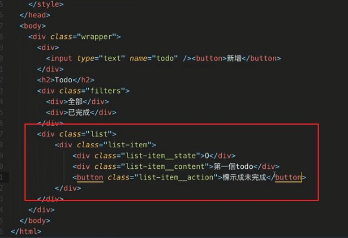
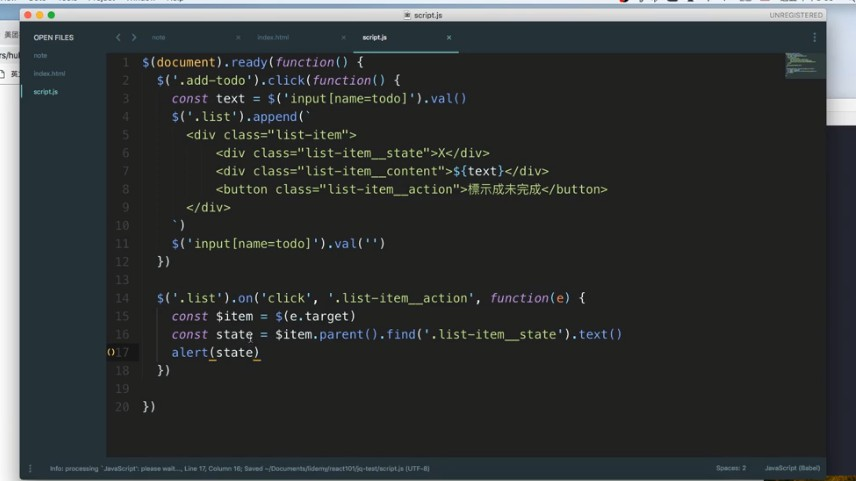

# 談談 React 之前，先用 jQuery 寫 todol list

這邊看教學影片 live coding 就好，就不贅述，只標記重點 :

## HTML 與 CSS 切版部分

- 老師用字元的 O / X 來標記已完成 / 未完成，還蠻特別的
- 老師的 css 命名，先使用 `-` 才是 `_`，是特別的用法

    

- 對於要並排，很直覺地在父容器設置為 display: flex
- 對於內部子元件要靠最右，使用直覺的方法：

    ```css
    .list-item_action {
        position: absolute;
        right: 0;
    }
    ```
## jQuery 部分

- 這邊的作法是新增的時候，前端 append 一個 todo task，往後端這邊一樣是發 request，append 完之後輸入框清空。
- 對於 todo task 的選擇一樣是用事件代理的方式，這樣也可以在 task 新增後一樣能觸發父監聽器，這時候你可以選定你父監聽器底下的某一個子項目：

    ```javascript
    $('.list').on('click','.list-item_mark', function(e){
        const $item = $(e.target)
        const state = $item.parent().find('list-item__state').text()

        if (state === 'X') {
            // 略
        } else { // O
            // 略
        }
    })
    ```

- 屬於 jQuery 的東西習慣用 $() 包起來，如以下：

    

- 由於 O / X 有自己的 `<div>`，所以可以選取它的 `text()` 改成 O 或 X，很聰明的方法

- 關於 filter 的部分，我需要有一個東西來辨別該 task 是否完成，這邊的作法是在前面更改 O 或 X 的部分，再附帶一個 class (addClass()) 進去，打 X 則移除該 class(removeClass)，這樣的話 filter 只要判定有無該 class 

    ```javascript
    $('.filter__all').click(function(){
        $('.list-tasks').show()
    })

    $('.filter__completed').click(function(){
        $('.list-tasks').hide()
        $('.list-tasks.completed').show()
    })
    ```