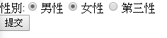

## HTML 概論 / html / head / body

* 定義：標記格是語言，不算程式碼
* 為表方便，本周所有的語法塊註解我還是會使用 //
* Html - 包住所有的東西的基礎

    ```html
    <!DOCTYPE html> // 需要寫，告訴瀏覽器我們是使用 html 
    <html>
        <head>
        </head>
        <body>
        </body>
    </html>
    ```

- Head

    ```html
    <head>
        <title> 標題 </title> // title 裡面會標註標題
        <meta charset="utf-8" /> // 空格/> 適用於只有一個內容的語法，尾端使用空格 />
    </head>
     ```
    若要加入註解，不是像程式碼使用斜線，而是　<!--  與 --> 框住你要註解的東西

- Body : 裡面包我們最主要的東西

## Body 裡面的東西

[塊級元素與內聯元素](http://www.w3school.com.cn/html/html_blocks.asp)

- \<div\> division 就是分組的概念

    包起來的東西為「一組」，外觀不會改變，會在元素部分加入 CSS 語法決定該區塊的 Style

- \<span\>

    和 div 的差別在於：
    \<span\>包的東西不會換行，常用於文本中針對獨特的部分使用 css 樣式

- h1 ~ h6
        
    1 ~ 6 代表級別，數字越小級別越大，內中包含文字

    ```html
    <h1>安安</h1>
    <h2>安安</h2>
    <h3>安安</h3>
    <h4>安安</h4>
    <h5>安安</h5>
    <h6>安安</h6>
    ```
    

- \<p\> 則是內文 paragraph

    內文的部分本身並不會記錄格式，也就是你內文，裡面的空格等和換行都不會被包含在裡面
    若要包含格式，使用 \<pre\>
    \<p\> 你要輸入的文章內容\</p\>

- img ( 顯示圖片 )

    \ 是一個單行的語法，不用包

    除了 src 這個元素之外，還有 table

    \

    alt 為替代文字，也就是如果 src 內的圖片網址失效，將以 alt 內的文字代之

- title 則是滑鼠移到該圖片上會顯示的文字

- \<ul\> 與 \<ol\> 皆使用 \<li\>

    使用用法 :

    ```html
    <body>
    <ul>
      <li>aaa</li> 
      <li>bbb</li> 
      <li>ccc</li> 
    </ul>
    <ol>
      <li>aaa</li>
      <li>bbb</li>
      <li>ccc</li>
    </ol>
    </body>
    ```
    顯示出來是：

    

- \<pre\> 格式過的文字

    和 \<p\> 相同，但是內容的格式會是你和編輯所見相同，不用特地加 

- \<br\>

    就是截斷並換行用的，通常使用\<br /\>

- \<table\> 的 表格用法 :

    \<table\>  \</table\> 包起來

    \<tr\> - table row = 縱行，\<tr\>  \</tr\> 包起來為一行

    \<td\> table cell - 被 \<tr\> 和 \</tr\> 包起來，該行的內容\<td\> \</td\> 包起來，從上至下，其實是從左至右

    ```html
    <body>
        <table>
            <tr>
                <td>英文課</td>
                <td>老皮</td>
                <td>一小時</td>
            </tr>
            <tr>
                <td>國文課</td>
                <td>老趙</td>
                <td>一小時</td>
            </tr>
        </table>
    </body>
    ```

    英文課　老皮　一小時
    國文課　老趙　一小時

    \<td\> 的另外一種是 \<th\>，h 是頭的意思，想當然爾就是標題啦

    所以第一組 row 可以改成 th

    ```html
    <body>
        <table>
            <tr>
                <th>課程</th>
                <th>姓名</th>
                <th>課程時間</th>
            </tr>
            <tr>
                <td>英文課</td>
                <td>老皮</td>
                <td>一小時</td>
            </tr>
            <tr>
                <td>國文課</td>
                <td>老趙</td>
                <td>一小時</td>
            </tr>
        </table>
    </body>
    ```
    **課程  姓名  課程時間** 
    英文課  老皮 一小時
    國文課  老趙  一小時

- \<a\> href ( hypertext reference ) 錨點

    - **超連結功能，語法：**

        \<a href="http://www.google.com"\>帶我去 Google \</a\>

        - 超連結還有兩個元素： target 的 "_self" 與 "_blank"

        ```html
        <a href="http://www.google.com" target="_self">帶我去 Google </a> // 自己網頁變為目標網頁

        <a href="http://www.google.com" target="_blank">帶我去 Google </a> // 幫這這網頁開一個新視窗
        ```
    - **錨點功能，語法：**

        寫一個語法 \<a href=#name>帶我去name</a\>

        然後在妳要前往的目的地加上 name

        加上去的方法為在標籤加入一個元素 id=name

        ```html
        <body>
        <div>
            <a href="#target">帶我去目標</a>
            <pre>
            踏入演藝圈
            2000年，還在藝校學習的文章參演了他人生的第一部電視劇《青春正點》飾演中學生陳龍，並立志考入中央戲劇學院。2006年，在中央戲劇學院上學的文章出演電視劇《與青春有關的日子》，成功飾演配角卓越，開始在大陸電視圈展露頭角。2006年，出演第一部古裝劇《錦衣衛》與妻子馬伊琍相識。
            人氣上升
            2008年，文章在熱播劇《奮鬥》中出演男二號向南，引起廣泛關注。這也是文章和妻子馬伊琍的第二次合作。2009年，文章進入電影屆，主演第一部電影《走著瞧》。該片在上海國際電影節新片展映單元和東京國際電影節「亞洲風」單元獲獎。文章也憑主演的北京青年馬傑一角獲得第12屆上海國際電影節最受關注新人演員獎。2009年，文章主演電視劇《愛在日月潭》，參演熱播電視劇《蝸居》，成功飾演配角小貝，知名度得到進一步提高。2010年，文章與李連杰共同主演文藝片《海洋天堂》，文章飾演青年自閉症患者大福，被認為是中國的「達斯汀·霍夫曼」。文章憑此片獲得第14屆中國電影華表獎優秀新人男演員獎，第13屆上海國際電影節最佳男主角獎和第18屆北京大學生電影節最受大學生歡迎男演員獎。該片獲得上海國際電影節「金爵獎」，中國電影華表獎優秀故事片獎和第18屆北京大學生電影節人文關懷獎。同年，文章主演電視劇《雪豹》，該劇被各大電視台反覆播放。文章憑藉周衛國一角獲得第12屆四川電視藝術節金熊貓獎電視劇類最佳男演員，第9屆中國金鷹電視藝術節最具人氣男演員和第26屆中國電視金鷹獎最受觀眾喜愛男演員。
            </pre>
            <p id=target>
            安安妳逆
            2014年，文章參演姜文導演的電影《一步之遙》，飾演主角之一武七。該片入圍第65屆柏林電影節。2016年，文章主演張黎導演的電視劇《少帥》飾演歷史人物張學良。文章憑此片獲得2017中國電視劇品質盛典年度品質表演劇星。同年七月，由文章的君竹（上海）影視文化有限公司參與製作的喜劇愛情電影《陸垚知馬俐》在中國大陸，美國，加拿大，澳大利亞及紐西蘭上映。文章不僅擔任導演，還兼任編劇。此片以中小成本獲得近2億票房。文章的導演風格被一些影評人譽為「文房四寶」-- 「鬥嘴皮、飆演技、抖機靈、戳心窩」。文章憑此處女作提名第十九屆上海國際電影節之亞洲新人獎最佳導演獎。同年八月《陸垚知馬俐》獲得第40屆加拿大蒙特婁國際電影節中國電影銀獎。2017年，《陸垚知馬俐》獲得第31屆中國電影金雞獎七項提名 - 最佳導演處女作，最佳男主角，最佳女主角，最佳男配角，最佳女配角，最佳錄音和最佳攝影。最後文章榮獲最佳導演處女作獎。2017年，文章的君竹（上海）影視文化有限公司參與製作諜戰劇《剃刀邊緣》，文章擔任導演並飾演男主角許從良。妻子馬伊俐出演女主角。此片打破以往諜戰劇的套路，以小人物的成長為主線，加入愛情，探案等元素。電視劇播出後，口碑收視均取得良好的成績。同年三月，文章重返舞台，出演獨角話劇《每一件美妙的小事》。文章憑此劇獲得2017上海靜安現代戲劇谷壹戲劇大賞年度最佳男演員獎。
            </p>
            </div>
        </body>
        ```
        目標位置可以寫在任何地方，入口起點也可以寫在任何地方

- 語意化 UI 標籤 : main / nav / footer / main

    把你主要的內容，用<main> 包起來

    ```html
    <body>
        <main>
        <table>
            <tr>
                <td>英文課</td>
                <td>老皮</td>
                <td>一小時</td>
            </tr>
            <tr>
                <td>國文課</td>
                <td>老趙</td>
                <td>一小時</td>
            </tr>
        </table>
        </main>
    </body>
    ```
    網頁上看起來不會有任何變化，但可讀性就高很多

    - nav : 基本上就是網頁顯示這一塊的部分

        

    - footer : 頁尾

        顧名思義就是網頁最底部的部分，這邊就不多說

        \<footer\> \</footer\>

        原則上上述三種都和 div 效果一樣，但他們是屬於一種語意化元素

        也就是可以使開發者一看就知道這些是妳要拿來放頭，身體，或者是底部

        還有很多類似的語意化元素

    https://developer.mozilla.org/en-US/docs/Glossary/Semantics
    https://www.w3schools.com/html/html5_semantic_elements.asp      
- \<iframe\> 用別人的網頁

    你就想像是 img 的網頁版，語法類似

    ```html
    <iframe src="URL" />
    ```
    屬性也有語法 width (%)
    與 height (pixel 寫作 px)

    ```html
    <iframe src="URL" width="100%" height="500px" />
    ```
    做出來，就會像這樣

    

    但要注意，不是每一個網頁都可以給你做取用，其實大部分的網站都有設定不讓你存取它的網頁。

- * form 表單 ( 給你寫入帳號密碼用的 )

    \<input\> 輸入框，有下列幾種 type= 的屬性，以下介紹

    - text

        操作一樣，用\<form\> \</form\> 包起來，然後語法是\<input type="屬性\">，\<input \>內中的東西就是框框內容本身

        ```html
        <body>
            <div>
                <form>
                姓名:<input type="text" />
                </form>
            </div>
        </body>
        ```

    - submit

        這時候你也可以幫它做一個按鈕，比如說送出，那你可以再幫他加一行，屬性是 submit

        ```html
        <body>
            <div>
                <form>
                姓名:<input type="text" />
                <input type="submit" />
                </form>
            </div>
        </body>
        ```
        至此，你可以看到這樣的顯示

        

        「提交」本身是 Chrome 瀏覽器預設的

        你可以加上 value 這個元素

        <input type="submit" value="送出啦爽" />

        

        如果你不想讓按鈕放在表單右邊，而是下面，那就用我們一開始教的\<div\> 包起來，記得嗎？\<div\>提供了換行的作用

        ```html
        <body>
            <div>
                <form>
                    <div>
                    姓名:<input type="text" />
                    </div>
                    <div>
                    <input type="submit" value="送出啦爽" />
                    </div>
                </form>
            </div>
        </body>
        ```
        注意，submit 是一次送出整個 <form> </form> 中的內容哦 !

    - password

        那如果我們今天輸入的是密碼呢 ? 密碼都是 * 字號的，對吧

        所以我們可以使用 password 密碼 這個 type

        使用出來就會變這樣

        

    - email 電子郵件地址

        如果今天屬性是 email ，就會被檢查是否為 email 格式，所以平常辦帳號如果輸入的不是電子郵件，會跳出不是正確的 email 這個訊息，就是由來於此

        

    - date 日期

        就是要你輸入日期

        

        原來 html 都幫我們做了這些介面，很酷吧 ! 

    - radio 單選框

        這個 type 是讓你做一個單選圓圈框

        ```html
        <form>
            <div>
                性別:<input type="radio" />男性
                <input type="radio" />女性
                <input type="radio" />第三性
            </div>
        </form>
        ```
        這樣寫你會發現

        

        不是單選框啊 ! 

        若要做單選框，方法是你要讓這三個 input 都在同一個 name 之內，比如現在我就讓這三個 input 都在同一個 name 底下

        ```html
        <form>
            <div>
                性別:<input type="radio" name="gender"/>男性
                <input type="radio" name="gender"/>女性
                <input type="radio" name="gender"/>第三性
            </div>
        </form>
        ```

        就會變成只能選一個了 !

        但如果每次我都要點準這個原框框才選得到非常麻煩，能不能點字就選到呢

        而且我看現在網頁都是這樣在做的

        這時候有一個語法就很重要，它叫做 label 也就是 標籤 的意思

        用法是在圓圈圈本身的地方加上 id 命名一個元素，然後在把用\<label\>\</label\> 包起來的頭端加入元素　for=\<label 名\>

        就是像下列這樣：

        ```html
        <form>
            <div>
                性別:<input type="radio" name="gender" id="male" /><label for="male">男性</label>
                <input type="radio" name="gender" id="female" /><label for="female">女性</label>
                <input type="radio" name="gender" id="other" /><label for="other">第三性</label>
            </div>
        </form>
        ```
        如此便成功了 !

    - checkout 顧名思義就是 核選方塊

        可以比照 radio 的概念啦 ! 這邊不多做敘述了。

        ```
        <form>
            <div>
                <div>
                興趣:<input type="checkbox" id="sports" /><label for="sports">運動</label>
                <input type="checkbox" id="hittong" /><label for="hittong">打東東</label>
                <input type="checkbox" id="playone" /><label for="playone">參一咖</label>
                </div>
            </div>
        </form>
        ```
        但由於核取方塊預設是複選的，所以自然用不到 name 的作法，而且經過實測，就算加了也沒有用

- 更多 type 種類：https://developer.mozilla.org/en-US/docs/Web/HTML/Element/input
- textarea 補充 : http://www.w3school.com.cn/html/html_blocks.asp
