## SEO  ( Search Engine Optimization ) 搜尋引擎優化

簡而言之就是：幫助搜尋引擎理解你的網頁

多丟幾條線索讓搜尋引擎找，這邊帶你了解一下它的原理

- meta 裡有什麼 ?

    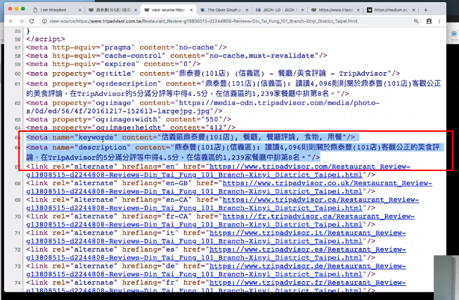

    有很多 meta 啦，但我們來找一下第一個元素是 name 的

    看到 content 裡面有很多關鍵字，第二行 content 有很多描述

    所以可以得到結論

    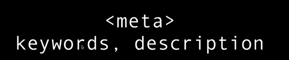

- og

    這時候往上看，也可以看到很多 meta ，元素為 property ( 不是剛剛的 name 哦 ) 為 og 開頭的字

    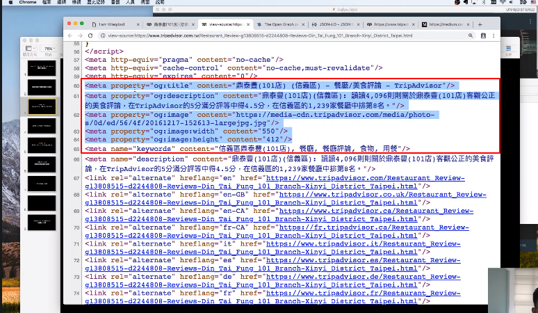

    og 是啥 ? 是給 SEO 和網路爬蟲用的哦 !

    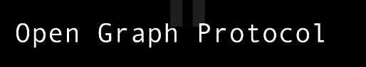

    說明頁面 ( 看不懂啦 ) :  http://ogp.me/

    這是為了要讓更多社交媒體了解你的網頁，通常是 Facebook 在用的，如果你貼到 Facebook 偵錯工具，可以看到裡面是什麼樣子

    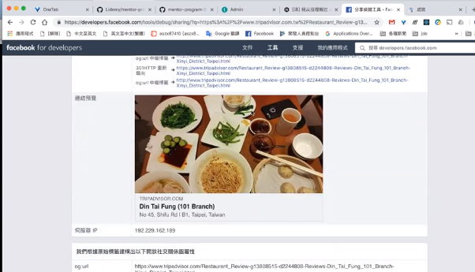

    可以看到剛剛 og 那行 content 內容變成一個圖片了，代表 Facebook 看到會是這個圖片，也就是說當你分享到 FB 的時候就會產生這個圖片

    這是很重要的功能，不放的話，分享到 FB 可能就不會有圖片了

- **JSON-ld ( JSON for Linking Data )**

    再往上看可以看到一些 JSON 格式的東東

    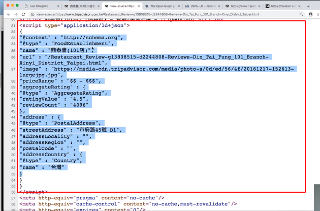

    可以看到很多資訊，比如 name , adress , price 等等

    這整塊東西我們叫做

    

    其實這個跟 open graph 有點像，也就是固定化描述的方式表示這個網頁

    通常是給 Google 看的，所以你如果 Copy 裡面的關鍵字，就很容易被 Google 找到

    也就是說，只要按照這個「提供好的格式」填入你的關鍵字，Server 就更好來搜尋你的網頁

    格式化結構的東西幫助機器更好的，標準化的找到你的網頁

    另外，如果裡面有放一些額外的資訊，在 Google 的時候也會連帶顯示資訊給使用者看

    比如說

    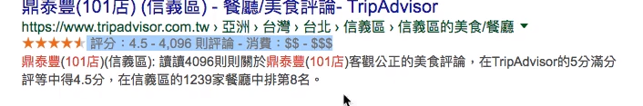

    裡面的星星和 評分，就是寫在 JSON-ld 裡面

    所以是這個網站提供這些資訊給 Google 的

    提供資訊越完整，更能讓搜尋引擎搜尋到

    看官網就可以找到範例 :  https://json-ld.org/

- robots.txt ( 給網路爬蟲看的檔案 ) http://URL/robots.txt

    在網址根目錄加上 robots.txt 可以看到以下

    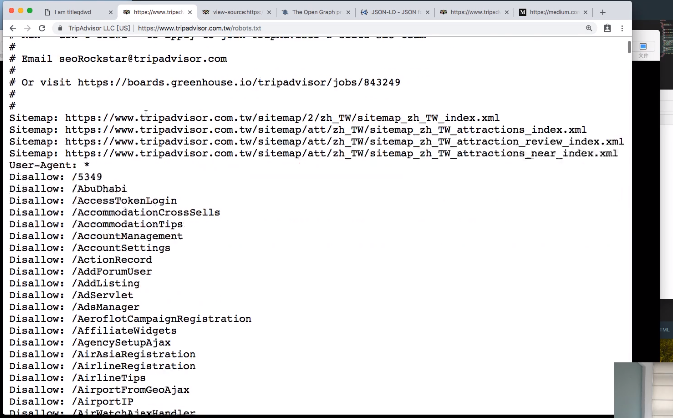

    Disallow : 表示的是希望爬蟲不要爬這些網頁

    Allow : 就是告訴網頁爬蟲你可以爬這些

    通常這個檔案會藏一些給開發者的訊息

    那通常你會看到 sitemap

    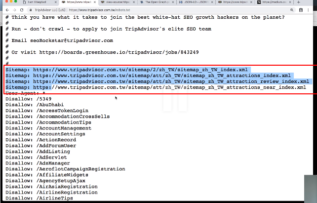

    這些 sitemap.xml，代表的是會給網路爬蟲在我這個這麼大的網站要爬哪些網頁

    不然一個網站其實有很多網頁的，所以它就像是一個地圖指引爬蟲一樣

    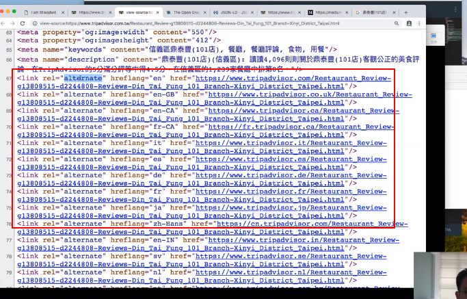

    這些 link 後面接一個語言，代表這個網址還有其他語言給使用者用，那它就是在告訴搜尋引擎說：「 我有很多語言，但都是指向同一個頁面。」

    再看看接下來這個

    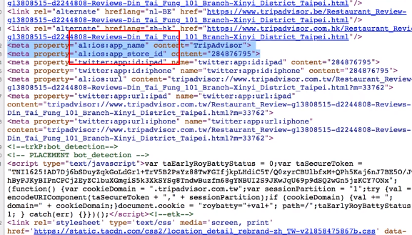

    跳出說這個網頁有 App 版，你要不要下載？

    下列這個

    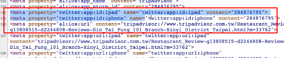

    意思是將這個分享或到 Twitter 或用 Twitter 瀏覽會有不同效果

    當然，如果沒有這些東西，搜尋引擎還是搜尋得到你的網頁，但效果就比較原始

    以上都只是簡單介紹

- 補充 :

    Google SearchConsole

    SEO 工作者大多都會用，可以玩看看

    通常是 SEO 工作者要工程師放什麼內容，我們就放什麼內容

    善用這些東西可以提升你的「原生流量」，而不用花錢買關鍵字