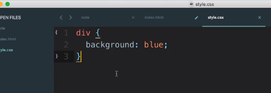
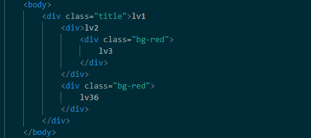
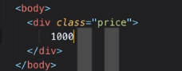
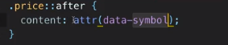

## CSS 與 CSS Selector 簡介

- CSS ( Cascading Style Sheets )

    用了之後可以改變網頁樣式，有三種改變方法

- CSS Selector 

    - 第一種：
    
        在標籤的元素部分使用 style 元素並加入 CSS 語法

        

        不常用，很難維護

    - 第二種 : 

        在\<header\>標籤包裡面加入\<style\>標籤包，在\<style\>標籤包裡面輸入 css 語法

        這邊有一個固定的寫法：

        ```css
        selector {
            attribute : value;
        }
        ```
        

    - 第三種 :

        直接開一個 .css 檔案，直接把上面 selector { } 的部分貼入

        

        然後在 html，直接寫下 \<link\> 語法，href 為引用的 css 位置

        

## CSS Selector 介紹

- Unuversal selector *

    ```
    * {
        color: red;
    }
    ```
    一旦使用 * 號，html 一旦引入會使頁面「全部」套用該格式

-----

- CSS Selector　標籤如何選到元素 ? 介紹一下「標籤」

    

    圖片中的 div / body 就是標籤

    會對應到 html 中的 \<body\>\</body\> 與 \<div\>\</div\>

    但如果這樣做的話，以 div 來說，那不就我 html 裡面所有 div 都會被染色了 ?

    所以標籤其實不是那麼常用到，現在我們教一下常用到的

- id select

    實際開發上最常用的 Selector，是這樣用的 : 那就是使用 id

    在 html 中，替你想要套用樣式的標籤上加上元素「id 」

    ```
    <div id="id1">
        hello
    </div>
    ```
    但是 id 只會有一個，獨一無二，所以在 css 中，你只能有一個 id

    這時候在 css 這邊，開頭用「＃」加上標名
    ```
    #id1 {
        background: green
    }
    ```
    就成功了 ! 

    

- class select

    這個比較特別，在 html 中，可以有多個 class，這點就和 id 截然不同

    ```
    <div id="id1">
        hello
    </div>
    <div class="bg-green">
        hello2
    </div>
    <div class="bg-green">
        hello2
    </div>
    <div class="bg-green">
        hello2
    </div>
    ```

    然後在 css 這邊，標題元素也不一樣，要用「．」開頭而非「＃」

    ```
    #id1 {
        background: green
    }

    .bg-green {
        background: greenyellow
    }
    ```

    做出來就會是這樣：

    

    在 html 中，class 「裡面」還可以接更多東西，剛剛的 bg-green 的作用是把變背景，現在我們加一個元素改字的顏色

    ```
    <div class="bg-green text-orange">
        hello2
    </div>
    <div class="bg-green">
        hello2
    </div>
    ```

    css 這邊，我們也增加一個叫做 text-orange 的區塊

    ```
    .bg-green {
        background: greenyellow
    }

    .text-orange {
        color: orange // color 改變文字顏色
    }
    ```

    然後就會改變了 !

    

    總結，一個元素可以有多個 class ，但只能一個 id，各個元素可以共享一個 class，你命名的 id 也只會有一個

------

- 補充：多重符合條件

    假設我現在有兩個 html 標籤共用同一個 class，但是這兩個標籤一個是\ <div\>包，一個是\<span\>包，這時候我希望 \<div\>包能有綠色背景，\<span\> 不要，該怎麼辦 ? 

    

    這時候就可以使用「同時符合」這項要件

    開啟 css 語法，在 .bg-green 前面加上 div

    這樣就代表你必須**同時符合 <div> 包與 class="bg-green" 的狀況下才能讀到這個 CSS 區塊**

    ```
    div.bg-green {
        background: greenyellow
    }

    .text-orange {
        color: orange
    }
    ```
    這樣 \<span\> 就讀不到 bg-green 了

    另一種用法是如果你的 class 還有其他內容，比如說

    ```
    <div class="bg-green bg-iwantgreen">
        hello1
    </div>
    ```

    若你希望要同時擁有 bg-green 和 bg-iwantgreen 才會套用到目前的樣子

    那就在 CSS 語法改為

    ```
    .bg-green.bg-iwantgreen {
        background: red
    }
    ```

    用「 . 」連接兩個元素作為條件

    所以總結來說，如果你要附加的條件為標籤，加在左邊

    如果你要附加的條件為元素內容，加在右邊

    當然左邊和右邊條件你也可以同時加

-------

- 底下的元素

    有時候你會遇到一個狀況，就是多層級的語法

    

    顯示出來為這樣，不意外

    

    這時候我想要 lv1 這一層用紫色，lv1 就好，所以我這樣寫：

    

    然後顯示出來是這樣，因為畢竟我\<div\>lv\</div\> 包住了裡面

    

    我要怎樣更改 lv2 的顏色 ???

    **這時候 CSS 語法可以這樣寫 :**

    ```css
    .lv1 {
        background: purple
    }

    .lv1 > div {  // 代表 lv1 的下一層的 div
        background: orange
    }
    ``` 
    .lv1 > div { } ，「>」代表下一層，div 代表指向的標籤

    這時候印出來，就會是

    

    可以了解，lv3 也被改變了，畢竟只往下指一層

    所以我要動 lv3，就這樣寫

    ```css
    .lv1 {
    background: purple
    }

    .lv1 > div {
        background: orange
    }

    .lv1 > div > div{　// 其實就是往下再往下
        background: blue
    }
    ```
    成功啦 !

    

    **但你也可以知道，如果假設今天 lv2 底下不只 lv3 這個 div，假設有一個 lv33 好了，那 lv33 也是會被改色的**

    現在教一個特別的

    - 選底下全部

        ```css
        .lv1 div {  // 選底下「所有的」div
            background: orange
        }
        ```
        有點難理解，假設我今天設一個 lv1 的 class 為 title，內含 lv1 的 div 裡面包了 lv2 和 lv36，lv2 裡面又包了  lv3 

        lv3 和 lv36 都指定了 class 為 bg-red

        

        這時候．可以做點操縱，**我要讓 class = title 下的 bg-red 都變成粉紅色**

        那 css 要這樣寫

        ```css
        .title .bg-red{             // 中間空格，代表 title 底下所有的 bg-red
            background: pink
        }
        ```
        

        可以看到因為 lv3 和 lv36 都有 bg-red，所以他們都被染上了粉紅色

        那如果是這樣呢

        ```css
        .title > .bg-red{             // 中間空格，代表 title 下一層的 bg-red
            background: pink
        }
        ```

        那你一定推算得到，它是 lv1 的下一層底下的 bg-red 元素變成粉紅色

        lv1 的下一層也就是 lv2，lv2 底下有 bg-red 的，就只有 lv36 了

        所以下圖就是

        

        這一章節感覺很饒舌，其實你只要知道 > 是指向下一層

        .[class] 是 call 名字為此的 class

        「空格」後面接 .[class]，代表的是我要取得主 class 底下所有的子 class

        以上

    -------

    - 選旁邊的元素

        我們上一節討論了底下的元素，現在來講講如果選到旁邊的元素

        - 旁邊的元素：+ / ~

            以下拿這個當範例 :

            ```html
            <body>
                <div class="bg-pink">haha1</div>
                <div>haha2</div>
                <div class="bg-pink">haha3</div>
                <div class="bg-pink">haha4</div>
            </body>
            ```
            CSS 這樣寫
            
            ```css
            .bg-pink + .bg-pink{ 
                    background: pink
            }
            ```
            意思是： .bg-red 加上它「旁邊的」bg-red，意思是選取狀況為「bg-red 旁邊有 bg-red」的後面那個的 bg-red

            所以是選到 haha4，因為 haha3 與 haha4 的元素結構為 bg-red + bg-red

            同樣道理，我也不一定要判斷 class 元素，也可以判斷標籤主體

            ```html
            <body>
                <div class="bg-pink">haha1</div>
                <div>haha2</div>
                <div class="bg-pink">haha3</div>
                <div class="bg-pink">haha4</div>
                <div>123</div>
                <span>456</span>
            </body>
            ```

            css 這樣寫

            ```css
            .bg-pink + .bg-pink{
                background: pink
            }

            div + span {
                background: orange
            }
            ```

            意思是我要找的狀況是 **div 旁邊是 span 的，然後要套用標的是 span**

            所以顯示是這樣

            

            **那如果使用 ~ 呢 ?**

            ```html
            <body>
                <div>123</div>
                <span>456</span>
                <span>456</span>
                <span>456</span>
            </body>
            ```

            ```css
            div ~ span {
                background: orange
            }
            ```

            **選取條件：div 旁邊有 span 的即成立**
            **選取目標：div 旁邊所有的 span**

            所以就會是

            

            套用在元素上

            ```css
            red-pink ~ red-pink {
                background: orange
            }
            ```
            

            那代表就是第一個 bg-pink 旁邊所有的 bg-pink

            所以顯示就是

            

            那旁邊元素的實際用途是什麼 ? 

            目的在於實際使用狀況上就是在設 margin

            

            你希望右邊三個 span2 3 4 都離左邊有距離，但第一個 span1 保持在最左邊

            

            你就可以用 ~ ，讓右邊的被套用 margin-left: 20px

            

            如果不這樣用，連 span1 都會有錯

            

            **最後，強調再強調，內容都要在「同一層級」才有用！**

            

            可以看到 span1 和 span3 位於不同層級，所以語法 .bg-red ~ .bg-red 是無效的。

            --------

    - Pseudo-classes : hover ( 蘇豆 )

        Pseudo 是假的意思

        hover 就是在你滑上移上目標上面的狀況

        所以其實重點就是 **「處理滑鼠移動目標上面時的外觀」**

        ```html
        <div class="bg-pink">haha1</div>
        <span>haha2</span>
        <div class="bg-pink">haha3</div>
        ```
        ```css
        span:hover {  // :hover
            background: pink
        }
        ```
        

        滑鼠移到上面時就會變粉紅色

        下列為所有 classes，可以參考看看

        https://developer.mozilla.org/zh-CN/docs/Web/CSS/Pseudo-classes

        另外介紹一下怎樣看偽類

        

        ---------

    - Psuedo clases : wrapper / nth-child

        ```html
        <body>
            <div class="wrapper">
                <div>head1</div>
                <div>head2</div>
                <div>head3</div>
                <div>head4</div>
                <div>head5</div>
            </div>
        </body>
        ```
        CSS

        ```css
        .wrapper div {  // 記得嗎? 空格是囊括底下所有元素的意思
            background: pink
        }
        ```

        看起來則是
        

        如果我只想選第一個呢 ? 

        這個時候就可以使用  :first_child

        ```css
        .wrapper div:first-child {
                background: pink
        }
        ```

        可以看到
        

        以此類推，最後一個自然就是 :last-child

        ```css
        .wrapper div:last-child {
            background: pink
        }
        ```

        可以看到
        

        那如果我想選第三個？nth_child()_派上用場啦

        ```css
        .wrapper div:nth-child(3) {
            background: pink
        }
        ```
        可以看到
        

        當然也可以選 1 ~ 5 都可以

        裡面還可以放一些特別的參數，比如說 odd 就是只選到奇數, even 就只選到偶數

        特殊狀況 :

        

        我現在想選 class 底下的第二個 bg-pink，我 CSS 這樣寫

        ```css
        .wrapper .bg-pink:nth-child(2) {
            background: pink
        }
        ```
        發現沒有任何反應 ? 

        為什麼

        因為其實不是你所想的這樣判斷

        ```css
        .wrapper .bg-pink:nth-child(2) {
                background: pink
        }
        ```
        其實它的意思是

        **在 weapper 的第二個元素並同時符合 .bg-pink**

        

        所以其實最後它是指向 head2

        所以如果你 head2 那行的 class="bg-pink"，就選得到了

        剛剛的例子是先看順序再看元素

        當然也會有先看順序再看標籤的例子

        

        ```css
        .wrapper span:nth-child(4) {
            background: pink
        }
        ```
        沒錯，就會是

        

        最後還有一個

        nth-child()可以用參數 n ，比如說 3n

        那它會將 n 用  0 1 2 3 4 5 6  順序帶進去

        所以就會是 0 3 6 9 12 15 被選到

        

        ```css
        .wrapper div:nth-child(3n) {
            background: pink
        }
        ```

        

        如果你填入 3n + 1，輸出結果就會選擇順序為 1 , 4 , 7 , 10, 13 的

        以此類推－號當然也可以

        這是個相當好用的用法，請記得哦

        --------

    Pseudo-element 偽元素，不是 classes 哦

        - before

            先用以下 html 來示範 :

            

            在 Css 中，為了跟 classes 區分，我們使用兩個冒號 ::

            我們使用 before，另外我們使用一個屬性叫做 content，就是內容

            ```css
            .wrapper::before {
                content: "123"
            }
            ```

            顯示為

            

            可以看到我不用修改 html，就可以增加內容到內文

            看一下開發人員工具，可以看到

            

            這個　before 就是 123，也就是偽元素

            也可以改顏色囉

            ```css
            .wrapper::before {
                content: "123";
                color: orange;
            }
            ```
            

            通常會用在哪裏　？

            在老師的範例中，設定一個叫做 price 的元素

            

            

            之後你可以在需要顯示價格的部分，都加上＄

            就可以用 before 代入，讓所有有數字的部分前面都加上這個偽元素

            好處就不用自己加了

            你也可以改將＄換為圖片

            **after 也是一樣意思，比如說價錢單位 NTD**

            另外一種用途，假設你 Html 元素太多，就會用 before / after 取代

            再來介紹一個 content 裡面一個ˊ屬性叫做 attr()，括號內容通常用來放元素

            也就是

            ```css
            .wrapper::before {
                content: attr(class);
                color: orange;
            }
            ```
            由於我的 class = wrapper

            所以顯示

            

            實際用途在於 :

            

            將內容設為元素中的 data-symbol

            

            之後不同的行就會有不同的幣別，雖然使用同一個 CSS，但是由於 data-symbol 都不同，所以顯示的幣別也會不一樣

            不然就是用這種笨蛋方法

            

            **所以重點就是，把屬性變成內容印出來，記得 content 裡面一定要有東西，不然 before / after 存在也會是空的**

            其他的偽裝元素：https://developer.mozilla.org/en-US/docs/Web/CSS/Pseudo-elements

## CSS Selector 的權重

當一個區塊受到兩個以上 CSS 語法約束時，會怎麼變呢？


由以上三張圖可以看到，都會以子元素為主

但 class 的權限強不過 id


即使改成下列這樣也強不過 id ，依然是 pink


所以我們可以得到一個結論


在語法中，再多的標籤都贏不了一個 class，再多的 class 也贏不了 id

公式就是


看下列這張圖


從左邊開始比，1 > 0，所以可以知道是下 #pickme 勝出


就是建立 CSS 的第二種方法，直接在 html 加 CSS 語法 style

但是


語法:


記得有多個 !important 時還是要往下比

正常開發是不會用到的，這樣等於其他語法就沒有用了

其餘參考資料 :

    - https://muki.tw/tech/css-specificity-document/
    - https://juejin.im/post/5afa98bf51882542c832e5ec

