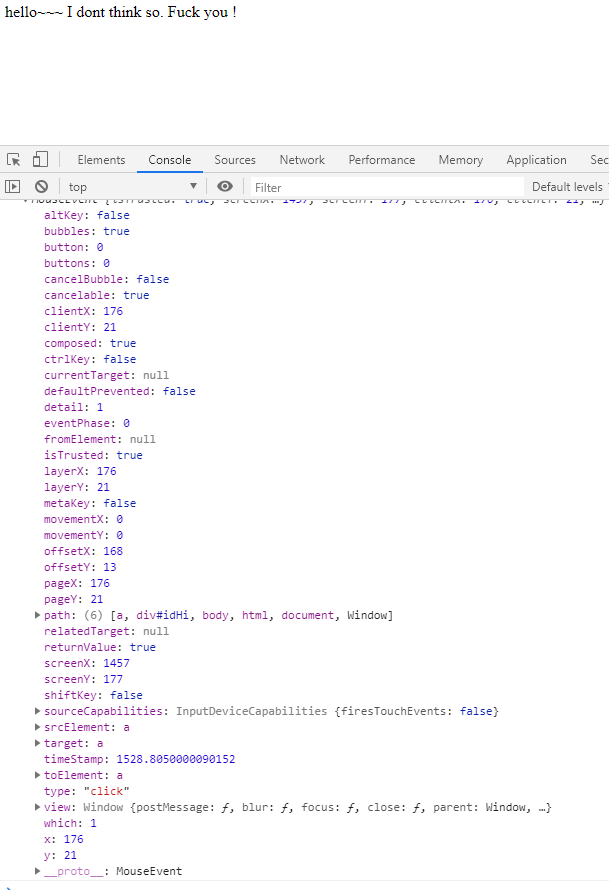
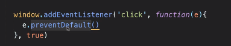

# JavaScript 初探

## 1. 如何在瀏覽器執行 JavaScript

### 先想想，我們過去是怎麼執行 JS 的

1. node js

2. 用 html 執行

    - 第一種方式 :

        在 html 裡面使用 `<script> </script>`

        ```javascript
        <!DOCTYPE html>
        <html>
            <header>
                <title>變色點擊小遊戲</title>
                <link rel="stylesheet" href="style.css" />
                <style>
                    .window__change {
                        background:orange;
                    }
                </style>
            </header>
            <body>
                <div class='window'>
                    <div class="wrapper">
                        <div class="title">
                            畫面變色時點擊
                        </div>
                    </div>
                </div>
                <script>
                    const time = Math.random() * 3;
                    console.log(time)
                    document.querySelector('html').addEventListener('mousedown',function(){
                        alert(time);
                    })
                </script>
            </body>
        </html>
        ```

        通常是要放在 `<body>` 裡面的最下方，因為這樣 JS 才抓得到它要的標籤

        重點是因為，程式碼是一行一行執行的

    - 第二種方式 ( 最常用 )

        `<script src="./index.js">  <script>`

        適用於 js 程式碼太長的情況

        本週課程介紹都會先用第一種方法展示

        但記得實際使用請用第二種方法

### Node.js 與瀏覽器跑的差別

1. 有些東西 node.js 支援，但瀏覽器不支援

    比如說 require 套件在瀏覽器上是無法跑的

2. 瀏覽器能跑的東西也是相對比較少

-----

## 2. DOM (Document Object Model)

DOM 到底是什麼 ?

其實 DOM 就是瀏覽器在讀取 html 時，會將所有的標籤排列成一個樹狀圖

然後這個樹狀圖本身有一套自己的運算邏輯

而這個樹狀圖允許 js 來控制這個 Web 的頁面，當你使用你的 js 操控這個樹狀圖，就可以綜合 DOM 的運作邏輯與 js 的表示方法，在瀏覽器上呈現你想做出的效果與結果

這個就是 DOM 樹

Document 就是你在 html 寫的東西

所以簡單來說，接下來所有的操作，就是用 js 去改變 DOM 樹，去呈現你要的效果。

js -> DOM -> 瀏覽器頁面

所以 DOM 在這邊你也可以看成是兩者之間的橋樑

-----

## 3. 用 JS 選 DOM 的元素 getElement

1. getElementsByTagName

    ```html
    <!DOCTYPE html>
    <html>
        <header>
            <link rel="stylesheet" href="./test.css" />
            <meta charset="utf-8" />
            <meta name="viewport" content="width=device-width,initial-scale=1" />
            <title>測試頁面</title>
        </header>
        <body>
            <div>
                hello~~~
            </div>
            <script>
                const element = document.getElementsByTagName('div');
                console.log(element)
            </script>
        </body>
    </html>
    ```

    注意，doucment 是選取 DOM 的標準開頭

    然後是getElements，有 s ，因為你抓的是 TagName 標籤，不會只抓取一個

    然後在參數內部必須要放字串，所以用 ' ' 包起來

    如果你要抓

    印出後得到

    看得出來是一個陣列，但是它其實不是陣列，索引值 0 為 div，長度為 1 ，很合理

2. getElementsByClassName

    ```html
    <!DOCTYPE html>
    <html>
        <header>
            <link rel="stylesheet" href="./test.css" />
            <meta charset="utf-8" />
            <meta name="viewport" content="width=device-width,initial-scale=1" />
            <title>測試頁面</title>
        </header>
        <body>
            <div class='classHi'>
                hello~~~
            </div>
            <script>
                const element = document.getElementsByClassName('classHi');
                console.log(element)
            </script>
        </body>
    </html>
    ```

    因為直接表明了要抓 ClassName，所以也只要在參數放類別名稱就好了，不用加 .

    印出來也是

3. getElementById

    注意這次的沒有加 s，所以是取單個，當然啦，因為 id 只能有一個

    ```html
    <!DOCTYPE html>
    <html>
        <header>
            <link rel="stylesheet" href="./test.css" />
            <meta charset="utf-8" />
            <meta name="viewport" content="width=device-width,initial-scale=1" />
            <title>測試頁面</title>
        </header>
        <body>
            <div class='classHi'>
                hello~~~
                <div id="idHi">
                    lululullululu
                </div>
            </div>
            <script>
                const element = document.getElementById('idHi');
                console.log(element)
            </script>
        </body>
    </html>
    ```

    你會發現它直接印出元素，因為這個函式只取「一個」，所以會直接展示內容

    而前面抓取複數的語法則不是，這點值得注意

4. querySelector

    後面接的是 CSS 的選擇器，也就是你的 .css 怎麼用，這裡就怎麼用

    要注意的是，它也是只取一個，所以它會把內中內容印出來

    這是最常用也最直覺的，推薦使用

    ```html
    <!DOCTYPE html>
    <html>
        <header>
            <link rel="stylesheet" href="./test.css" />
            <meta charset="utf-8" />
            <meta name="viewport" content="width=device-width,initial-scale=1" />
            <title>測試頁面</title>
        </header>
        <body>
            <div class='classHi'>
                hello~~~
                <div id="idHi">
                    lululullululu
                </div>
            </div>
            <script>
                const element = document.querySelector('.classHi');
                console.log(element)
            </script>
        </body>
    </html>
    ```

    印出來為什麼沒有內容呢 ?

    那是因為裡面還有內含其他元素

5. querySelectorAll

    這就是抓取複數的方式

-----

## 4. 改變各種東西

### 改變元素的 CSS

- style

    ```html
    <!DOCTYPE html>
    <html>
        <header>
            <link rel="stylesheet" href="./test.css" />
            <meta charset="utf-8" />
            <meta name="viewport" content="width=device-width,initial-scale=1" />
            <title>測試頁面</title>
        </header>
        <body>
            <div class='classHi'>
                hello~~~
            </div>
            <script>
                const element = document.querySelector('.classHi');
                element.style.background = "red";
            </script>
        </body>
    </html>
    ```

    注意，如果你要改變的元素有 -

    比如說 padding-top，你有兩種寫法

    element.style.paddingTop = 10px;

    或是用物件屬性的寫法

    `element.style['padding-top'] = 10px`;

- 改變 class

    這邊讓你的元素套用不同 class ，剛剛只是換一點內容，現在你可以整個套用不同風格

    首先，看到我在程式碼加了一個 class 名為 bg-red

    ```html
    <!DOCTYPE html>
    <html>
        <header>
            <link rel="stylesheet" href="./test.css" />
            <meta charset="utf-8" />
            <meta name="viewport" content="width=device-width,initial-scale=1" />
            <title>測試頁面</title>
            <style>
                .bg-red {
                    background: rgb(90, 11, 11);
                }
            </style>
        </header>
        <body>
            <div id='idHi'>
                hello~~~
            </div>
            <script>
                const element = document.querySelector('#idHi');
                element.classList.add('bg-red');
            </script>
        </body>
    </html>
    ```

    原本的 hello~~~ 是沒有任何風格的

    現在使用

    *.classList.add()*

    將新的 class 套用上去

    如果要新增多個，就寫多行。

    如果要移除，可以使用

    *.classList.remove()*

    ```html
    <!DOCTYPE html>
    <html>
        <header>
            <link rel="stylesheet" href="./test.css" />
            <meta charset="utf-8" />
            <meta name="viewport" content="width=device-width,initial-scale=1" />
            <title>測試頁面</title>
            <style>
                .bg-red {
                    background: rgb(90, 11, 11);
                }
            </style>
        </header>
        <body>
            <div id='idHi' class='classHi'>
                hello~~~
            </div>
            <script>
                const element = document.querySelector('#idHi');
                element.classList.remove('classHi')
            </script>
        </body>
    </html>
    ```

    如此就可以把該 class 移除了

    最後一個特殊的用法

    *.classList.toggle()*

    意思是，如果有這個 class , 就移除

    如果沒有這個 class，就加入

    -----

    插入與刪除元素

    改變內容

- innerText

    其實就是指內部的「文本」

    ```html
    <!DOCTYPE html>
    <html>
        <header>
            <link rel="stylesheet" href="./test.css" />
            <meta charset="utf-8" />
            <meta name="viewport" content="width=device-width,initial-scale=1" />
            <title>測試頁面</title>
        </header>
        <body>
            <div id='idHi'>
                hello~~~
                I dont think so.
                <a>Fuck you ! </a>
            </div>
            <script>
                const element = document.querySelector('#idHi');
                console.log(element.innerText)
                console.log()
            </script>
        </body>
    </html>
    ```

    

    可以看到印出裡面的所有字，包含標籤 `<a>` 裡面的文字

    ```javascript
    const element = document.querySelector('#idHi > a');
                console.log(element.innerText)
                console.log()
    ```

    

    這樣就是印出 `<a>` 下面的文本

- innerHTML

    如果改成 innerHTML

    ```html
    <!DOCTYPE html>
    <html>
        <header>
            <link rel="stylesheet" href="./test.css" />
            <meta charset="utf-8" />
            <meta name="viewport" content="width=device-width,initial-scale=1" />
            <title>測試頁面</title>
        </header>
        <body>
            <div id='idHi'>
                hello~~~
                I dont think so.
                <a>Fuck you ! </a>
            </div>
            <script>
                const element = document.querySelector('#idHi');
                console.log(element.innerHTML)
                console.log()
            </script>
        </body>
    </html>
    ```

    就會如下呈現:

    

    你可以看到它印出了文本與標籤，和標籤裡面的內容

    `innerHTML` 就是拿出「該標籤下全部的內容」

- outerHTML

    其實也很簡單，就是和 innerHTML 相比也把「自己也抓起來」

    ```html
    <!DOCTYPE html>
    <html>
        <header>
            <link rel="stylesheet" href="./test.css" />
            <meta charset="utf-8" />
            <meta name="viewport" content="width=device-width,initial-scale=1" />
            <title>測試頁面</title>
        </header>
        <body>
            <div id='idHi'>
                hello~~~
                I dont think so.
                <a>Fuck you ! </a>
            </div>
            <script>
                const element = document.querySelector('#idHi');
                console.log(element.outerHTML)
                console.log()
            </script>
        </body>
    </html>
    ```

    就會是這樣

    

    看到了吧，連 `idHI` 本身的 `HTML` 也被抓出來了

    改變的話就是這樣

    ```html
    <!DOCTYPE html>
    <html>
        <header>
            <link rel="stylesheet" href="./test.css" />
            <meta charset="utf-8" />
            <meta name="viewport" content="width=device-width,initial-scale=1" />
            <title>測試頁面</title>
        </header>
        <body>
            <div id='idHi'>
                hello~~~
                I dont think so.
                <a>Fuck you ! </a>
            </div>
            <script>
                const element = document.querySelector('#idHi');
                //console.log(element.outerHTML)
                element.outerHTML = '<div> 123123123123 </div>'
                console.log(element.outerHTML)
            </script>
        </body>
    </html>
    ```

    瀏覽器頁面顯示

    

    注意在 `console.log` 的情況還是原本的文本

    這是為什麼呢 ?

    最後最通常用的是 innerText / innerHTML

    -----

    插入和刪除元素

    ```html
    <!DOCTYPE html>
    <html>
        <header>
            <link rel="stylesheet" href="./test.css" />
            <meta charset="utf-8" />
            <meta name="viewport" content="width=device-width,initial-scale=1" />
            <title>測試頁面</title>
        </header>
        <body>
            <div id='idHi'>
                hello~~~
                I dont think so.
                <a>Fuck you ! </a>
            </div>
            <script>
                const element = document.querySelector('#idHi');

            </script>
        </body>
    </html>
    ```

### 移除你的小孩子，移除標籤*

*`.removeChild`* ( 選定元素 )

我現在要刪除 `<a>`

那我要先知道「它爸是誰」

所以我要先找到他上一層

他上一層就是 idHi

所以

```html
<!DOCTYPE html>
<html>
    <header>
        <link rel="stylesheet" href="./test.css" />
        <meta charset="utf-8" />
        <meta name="viewport" content="width=device-width,initial-scale=1" />
        <title>測試頁面</title>
    </header>
    <body>
        <div id='idHi'>
            hello~~~
            I dont think so.
            <a>Fuck you ! </a>
        </div>
        <script>
            const element = document.querySelector('#idHi'); // 找到老爸
            element.removeChild(document.querySelector('a')) // 拿掉小孩
        </script>
    </body>
</html>
```

可以看到

記得如果你選錯老爸，就不會有事情發生

### 創造元素 / 新增元素

`var item = document.createElement ( '要 create 的標籤' )`

`.appendChild ( item )`

```html
<!DOCTYPE html>
<html>
    <header>
        <link rel="stylesheet" href="./test.css" />
        <meta charset="utf-8" />
        <meta name="viewport" content="width=device-width,initial-scale=1" />
        <title>測試頁面</title>
    </header>
    <body>
        <div id='idHi'>
            hello~~~
            I dont think so.
            <a>Fuck you ! </a>
        </div>
        <script>
            const element = document.querySelector('#idHi');
            const item = document.createElement('div') // 先創造一個元素
            element.appendChild(item) //將此元素插入
        </script>
    </body>
</html>
```

可以看到有出現了


那既然我們的步驟是先創造一個元素，當然也可以先把這個元素加一點東西再插進去

```html
<!DOCTYPE html>
<html>
    <header>
        <link rel="stylesheet" href="./test.css" />
        <meta charset="utf-8" />
        <meta name="viewport" content="width=device-width,initial-scale=1" />
        <title>測試頁面</title>
    </header>
    <body>
        <div id='idHi'>
            hello~~~
            I dont think so.
            <a>Fuck you ! </a>
        </div>
        <script>
            const element = document.querySelector('#idHi');
            const item = document.createElement('div')
            item.innerText = '安安我是新來的'　// 幫這個元素加一點東西
            element.appendChild(item)
        </script>
    </body>
</html>
```

顯示這樣

那如果你只希望你插入的不是個元素標籤，而是個純文字的話

你可以使用

`document.createTextNode('安安 我是新來的')`

```html
<!DOCTYPE html>
<html>
    <header>
        <link rel="stylesheet" href="./test.css" />
        <meta charset="utf-8" />
        <meta name="viewport" content="width=device-width,initial-scale=1" />
        <title>測試頁面</title>
    </header>
    <body>
        <div id='idHi'>
            hello~~~
            I dont think so.
            <a>Fuck you ! </a>
        </div>
        <script>
            const element = document.querySelector('#idHi');
            const item = document.createTextNode('安安 我是新來的')
            element.appendChild(item)
        </script>
    </body>
</html>
```

你會發現 append 是直接插在「最後面」

所以我們還要找找有沒有插在前面或中間的語法

<http://www.w3school.com.cn/jsref/met_element_removeattribute.asp>
刪除元素標籤裡面的屬性

## 5. addEventListener()

`addEventListener()`

是一個用來監聽事件的函式

`element.addElementListener()` 代表你是在監聽這個元素

`window.addElementListener()`，則是代表你在監聽這整個視窗

### addEventListener() 介紹

`addEventListener()` 裡面有三個參數：

1. 事件 event
2. 觸發後做什麼 (一個 CallBack Function)
3. 冒泡還是捕獲階段 ?

```html
<!DOCTYPE html>
<html>
    <header>
        <link rel="stylesheet" href="./test.css" />
        <meta charset="utf-8" />
        <meta name="viewport" content="width=device-width,initial-scale=1" />
        <title>測試頁面</title>
    </header>
    <body>
        <div id='idHi'>
            hello~~~
            I dont think so.
            <a>Fuck you ! </a>
        </div>
        <script>
            const element = document.querySelector('#idHi'); // 選到你
            element.addEventListener('click',function(e){
                alert('123')
            })
        </script>
    </body>
</html>
```


點上述任何字都會觸發，是因為這些字都被包含在我的目標裡面

觸及 `click` 再來運作裡面的函式，代表這個函式我先寫，卻不先用

如果按照程式碼是一行一行看下來的確是這樣，但函式先寫卻不先用，代表說我等等遇到再回來用，這個方法叫做 callback ，又稱回呼

至於事件本身可以有很多，比如說滾動 scroll，按鍵 keydown 等等

### CallBack Function

這是我們對它的第一印象，跟瀏覽器說，當事件發生時再呼叫函式


如果不是用匿名函式，記得在第二個參數直接放參數名稱，不是呼叫`()`

另外關於 event，addEventListener() 的運作上

當第二個函式被呼叫的時候，其實它會被傳進去一個參數

叫做 event or e

這名稱可以自己取，e / evt / event 但是是約定俗成的

畢竟參數是看順序的，而不是看名稱，我爽取 yoyoyo 也可以

現在我們接著看

```html
<!DOCTYPE html>
<html>
    <header>
        <link rel="stylesheet" href="./test.css" />
        <meta charset="utf-8" />
        <meta name="viewport" content="width=device-width,initial-scale=1" />
        <title>測試頁面</title>
    </header>
    <body>
        <div id='idHi'>
            hello~~~
            I dont think so.
            <a>Fuck you ! </a>
        </div>
        <script>
            const element = document.querySelector('#idHi'); // 選到你
            element.addEventListener('click',function(e){
                console.log(e)
            })
        </script>
    </body>
</html>
```

現在我要把我要做的事情，改為要把這個 `e` 給印出來



可以看到很多東西，

其中有一個　target 可以顯示你點了哪一個元素

現在我將 `console.log(e.target)`


它可以明確指出我觸動了哪些元素

比如說我今天是用 `e.key`

我就可以看到 `e` 裡面的 `key` 資訊看 `key` 了什麼

當然在這樣做的時候我會需要弄個 `input` 讓我打字

而我要獲取這個 `e.key`，配合的事件則是要 keydown

現在做一個點擊就可以變色的背景的按紐

```html
<!DOCTYPE html>
<html>
    <header>
        <link rel="stylesheet" href="./test.css" />
        <meta charset="utf-8" />
        <meta name="viewport" content="width=device-width,initial-scale=1" />
        <title>測試頁面</title>
        <style>
            .ch {
                background: red;
            }
        </style>
    </header>
    <body>
        <div id='idHi'>
            hello~~~
            I dont think so.
            <a>Fuck you ! </a>
            <button class='bt'>ch</button>
        </div>
        <script>
            const element = document.querySelector('.bt'); // 選到你
            element.addEventListener('click',function(e){
                document.querySelector('body').classList.toggle('ch') // 不要寫 .ch           })
        </script>
    </body>
</html>
```

其實很簡單，原理是我宣告一個變數 element 作為選取到這個標籤

然後設定監聽函式監聽 element，只要我點選我選到的這個元素，我就啟動下列這個函式 :

body 套上紅色 class ，若有則脫掉該 class

-----

所以我們也可以來做一個表單事件的處理

```html
<!DOCTYPE html>
<html>
    <header>
        <link rel="stylesheet" href="./test.css" />
        <meta charset="utf-8" />
        <meta name="viewport" content="width=device-width,initial-scale=1" />
        <title>測試頁面</title>
        <style>
            .ch {
                background: red;
            }
        </style>
    </header>
    <body>
        <form class='lg-form'> 　
            <div>
                你的帳號:<input name=username />
            </div>
            <div>
                你的密碼:<input name=password type="password" />
            </div>
            <div>
                確認密碼:<input name=password2 type="password" />
            </div>
            <div>
                <input type="submit" />
            </div>
            <script>
                //const element = document.querySelector('.lg-form')
                const element = document.querySelector('.lg-form')
                element.addEventListener('submit',function(e){
                    const input1 = document.querySelector('input[name=password]')
                    const input2 = document.querySelector('input[name=password2]')
                    if (input1.value !== input2.value) {
                        alert('密碼不符合')
                        e.preventDefault()
                    }
                })
            </script>
        </form>
    </body>
</html>
```

注意

在選取的過程中你可以看到 input 標籤裡面有一個 name=password

選取的內容是 `('input[name=password]')`

注意這個用法

另外就是取值是　input.value

這個是表單專用的屬性

如此就可以做一個驗證密碼的工具了

-----

### preventDefalut ()

阻止預設的行為

假設剛剛那個例子預設的行為是 submit，那就是阻止登入

如果是 Click，就是阻止 Click

如果是 keypress，就是阻止你按下按鍵

當然也可能阻止超連結。

## 6. 捕獲與冒泡

先提供[好文閱讀](https://blog.techbridge.cc/2017/07/15/javascript-event-propagation/)

首先，先搞懂下面這個圖在幹嘛


請看成 addEvent 把裡面的東西包起來

然後讓 addEvent 的參數進入裡面包起來的東西去使用

之後請直接看老師捕獲與冒泡的文章

簡單來說當你對一個目標點擊 click

那麼包含它以外的 div html 甚至是 window 都會被 click 到

所以你也可以對一個 button 按鈕時

在外層的 window 掛一個監聽

因為事件電流一定會通過 window



像這個例子，它把這個監聽設定在觀察捕獲階段

然後給小放了一個 e.pre

這樣就變成說只要事件電流通過 window 就會被截斷了

過不去 window 底下的事件觸及位置

或者這樣理解才是最正確的，e.pre 會因為冒泡而發散到後面所有東西

那如果你在裡面放一個紀錄的事件

就可以偷偷記錄目標經過了什麼觸及

-----

截斷冒泡

首先你要知道 `addEventListener` 有第三個參數

false 是將這個事件監聽器 ( 第一個參數 ) 放在冒泡階段

true 是將這個事件監聽器放在捕獲階段

現在討論冒泡階段

現在我們都知道冒泡階段會把這個事件再繼續往上級傳

這時候我可以用一個函式截斷它

`e.stopPropagation()`


這樣這個東西就不會冒到到下一個階段

所以你也可以這樣玩


將這個截斷監聽器掛在捕獲階段的 window

所以你後來怎麼點東西都沒反應

再來來一個更猛的立即停止

就算是兩個 監聽器也只會觸發一個


## 可能搞錯的部分

```html


<!DOCTYPE html>
<html>
    <header>
        <link rel="stylesheet" href="./test.css" />
        <meta charset="utf-8" />
        <meta name="viewport" content="width=device-width,initial-scale=1" />
        <title>測試頁面</title>
        <style>
            .ch {
                background: red;
            }
        </style>
    </header>
    <body>
        <div class=outer>
            <button class='bt'>1</button>
            <button class='bt'>2</button>
        </div>
        <script>
            document.querySelector('.bt')
            .addEventListener('click',function(){
                alert(1)
            })
        </script>
    </body>
</html>


創造兩個按鈕


點了按紐 1 跳出視窗 1 是 OK 的


點了按鈕 2 沒反應，是正常的，因為 .querySelector('.bt') 只會選到一個 class


所以 2 沒選到是正常的


所以我們只幫按鈕 1 加了監聽器


那如果我要每一個都加呢 ?


第一個錯誤：以為每點一次，for loop 就執行一次


<!DOCTYPE html>
<html>
    <header>
        <link rel="stylesheet" href="./test.css" />
        <meta charset="utf-8" />
        <meta name="viewport" content="width=device-width,initial-scale=1" />
        <title>測試頁面</title>
        <style>
            .ch {
                background: red;
            }
        </style>
    </header>
    <body>
        <div class=outer>
            <button class='bt'>1</button>
            <button class='bt'>2</button>
            <button class='bt'>3</button>
            <button class='bt'>4</button>
            <button class='bt'>5</button>
            <button class='bt'>6</button>
        </div>
        <script>
            const elements = document.querySelectorAll('.bt') // 回傳是類陣列，用變數來放
            for (var i = 0; i < elements.length; i++) {
                elements[i].addEventListener('click',function(){
                    alert(i + 1)
                })
            }
        </script>
    </body>
</html>


解釋一下，先宣告一個常數　elements，用來放陣列 ( SeletorAll )


然後執行一個 for 迴圈來放函式


這個 for 的意思是迭代，從按鈕 1 到 按紐 6 都被放置監聽，他們一但被 click，就會返回自己的按鈕數 ( i +1 )


但你點每個按鈕都會是 6


問題在哪 ???


請注意，for loop 裡面的監聽器的第二個參數，它並不是再被放進去監聽器的時候觸發的


而是你點擊的時候它才觸發的


所以當這個第二參數被觸發的時候


i 早就跑到 5 了


所以我們 alert 裡面不能放 i


我們可以幫每一個按鈕加上一個 data-value ( 約定俗成 )


並且使用 e.target.getAttribute() 取得這個 data-value


<!DOCTYPE html>
<html>
    <header>
        <link rel="stylesheet" href="./test.css" />
        <meta charset="utf-8" />
        <meta name="viewport" content="width=device-width,initial-scale=1" />
        <title>測試頁面</title>
        <style>
            .ch {
                background: red;
            }
        </style>
    </header>
    <body>
        <div class=outer>
            <button class='bt' data-value="1">1</button>
            <button class='bt' data-value="2">2</button>
            <button class='bt' data-value="3">3</button>
            <button class='bt' data-value="4">4</button>
            <button class='bt' data-value="5">5</button>
            <button class='bt' data-value="6">6</button>
        </div>
        <script>
            const elements = document.querySelectorAll('.bt') // 回傳是類陣列，用變數來放
            for (var i = 0; i < elements.length; i++) {
                elements[i].addEventListener('click',function(e){
                    alert(e.target.getAttribute("data-value")) // 取得 bt (e.target) 裡面的值
                })
            }
        </script>
    </body>
</html>


說一下 e.target 可以顯示知道我們觸及的點在哪裏


我們都是點按紐，所以 e.target 也都會是各按鈕的元素


所以我們只要取這個元素裡面的值，也就是剛剛預先設好的 data-value


就可以得到我們想要的答案了。


現在我們想再新增一個 button


<!DOCTYPE html>
<html>
    <header>
        <link rel="stylesheet" href="./test.css" />
        <meta charset="utf-8" />
        <meta name="viewport" content="width=device-width,initial-scale=1" />
        <title>測試頁面</title>
        <style>
            .ch {
                background: red;
            }
        </style>
    </header>
    <body>
        <div class=outer>
            <button class='add-btn'>add</button>　// 設置一個按鈕 add
            <button class='bt' data-value="1">1</button>
            <button class='bt' data-value="2">2</button>
        </div>
        <script>
            let num = 3; // 從第三個開始
            const elements = document.querySelectorAll('.bt') // 回傳是類陣列，用變數來放
            for (var i = 0; i < elements.length; i++) {
                elements[i].addEventListener('click',function(e){
                    alert(e.target.getAttribute("data-value")) // 取得 bt (e.target) 裡面的值
                })
            }
            document.querySelector('.add-btn')
            .addEventListener('click',function(){
                const newOne = document.createElement('button') //這個新按鈕的資訊
                newOne.setAttribute('data-value', num) // 值為這些
                newOne.innerText = num; // 內容為該按鈕編號
                num++; 做完加一
                document.querySelector('.outer')
                .appendChild(newOne) // 插入 outer 之下
            })
        </script>
    </body>
</html>


可是你會發現點新增的按鈕沒有反應


那是因為前面的 forloop 是為了按紐1 和按鈕2 寫的


那要如何讓新增的按紐也可以有視窗彈出呢 ?


另外就是我如果做一千個按鈕，我要做一千個彈出效果嗎　？


其實這時候我們可以用冒泡的特性來做這件事情


既然我點擊按紐，window 也會偵測到事件電流


那我可以把 window 當一個閘門，只要通過這個門，都會觸發彈出視窗


這就叫做 event delegation 事件代理


<!DOCTYPE html>
<html>
    <header>
        <link rel="stylesheet" href="./test.css" />
        <meta charset="utf-8" />
        <meta name="viewport" content="width=device-width,initial-scale=1" />
        <title>測試頁面</title>
        <style>
            .ch {
                background: red;
            }
        </style>
    </header>
    <body>
        <div class=outer>
            <button class='add-btn'>add</button>
            <button class='bt' data-value="1">1</button>
            <button class='bt' data-value="2">2</button>
        </div>
        <script>
            let num = 3;
            const elements = document.querySelectorAll('.bt') // 回傳是類陣列，用變數來放
            for (var i = 0; i < elements.length; i++) {
                elements[i].addEventListener('click',function(e){
                    alert(e.target.getAttribute("data-value")) // 取得 bt (e.target) 裡面的值
                })
            }
            document.querySelector('.add-btn')
            .addEventListener('click',function(){
                const newOne = document.createElement('button')
                newOne.setAttribute('data-value', num)
                newOne.classList.add('btn') // 統一幫它加上 class
                newOne.innerText = num;
                num++;
                document.querySelector('.outer')
                .appendChild(newOne)
            })


            document.querySelector('.outer') // 製作閘門
            .addEventListener('click',function(e){
                if (e.target.classList.contains('btn')) {
                    alert(e.target.getAttribute('data-value'))
                }
            })
        </script>
    </body>
</html>

```

創造兩個按鈕

點了按紐 1 跳出視窗 1 是 OK 的

點了按鈕 2 沒反應，是正常的，因為 .querySelector('.bt') 只會選到一個 class

所以 2 沒選到是正常的

所以我們只幫按鈕 1 加了監聽器

那如果我要每一個都加呢 ?

-----

第一個錯誤：以為每點一次，for loop 就執行一次

```html
<!DOCTYPE html>
<html>
    <header>
        <link rel="stylesheet" href="./test.css" />
        <meta charset="utf-8" />
        <meta name="viewport" content="width=device-width,initial-scale=1" />
        <title>測試頁面</title>
        <style>
            .ch {
                background: red;
            }
        </style>
    </header>
    <body>
        <div class=outer>
            <button class='bt'>1</button>
            <button class='bt'>2</button>
            <button class='bt'>3</button>
            <button class='bt'>4</button>
            <button class='bt'>5</button>
            <button class='bt'>6</button>
        </div>
        <script>
            const elements = document.querySelectorAll('.bt') // 回傳是類陣列，用變數來放
            for (var i = 0; i < elements.length; i++) {
                elements[i].addEventListener('click',function(){
                    alert(i + 1)
                })
            }
        </script>
    </body>
</html>
```

解釋一下，先宣告一個常數　elements，用來放陣列 ( SeletorAll )

然後執行一個 for 迴圈來放函式

這個 for 的意思是迭代，從按鈕 1 到 按紐 6 都被放置監聽，他們一但被 click，就會返回自己的按鈕數 ( i +1 )

但你點每個按鈕都會是 6


問題在哪 ???

請注意，for loop 裡面的監聽器的第二個參數，它並不是再被放進去監聽器的時候觸發的

而是你點擊的時候它才觸發的

所以當這個第二參數被觸發的時候

i 早就跑到 5 了

所以我們 alert 裡面不能放 i

我們可以幫每一個按鈕加上一個 data-value ( 約定俗成 )

並且使用 e.target.getAttribute() 取得這個 data-value

```html
<!DOCTYPE html>
<html>
    <header>
        <link rel="stylesheet" href="./test.css" />
        <meta charset="utf-8" />
        <meta name="viewport" content="width=device-width,initial-scale=1" />
        <title>測試頁面</title>
        <style>
            .ch {
                background: red;
            }
        </style>
    </header>
    <body>
        <div class=outer>
            <button class='bt' data-value="1">1</button>
            <button class='bt' data-value="2">2</button>
            <button class='bt' data-value="3">3</button>
            <button class='bt' data-value="4">4</button>
            <button class='bt' data-value="5">5</button>
            <button class='bt' data-value="6">6</button>
        </div>
        <script>
            const elements = document.querySelectorAll('.bt') // 回傳是類陣列，用變數來放
            for (var i = 0; i < elements.length; i++) {
                elements[i].addEventListener('click',function(e){
                    alert(e.target.getAttribute("data-value")) // 取得 bt (e.target) 裡面的值
                })
            }
        </script>
    </body>
</html>
```

說一下 e.target 可以顯示知道我們觸及的點在哪裏

我們都是點按紐，所以 e.target 也都會是各按鈕的元素

所以我們只要取這個元素裡面的值，也就是剛剛預先設好的 data-value

就可以得到我們想要的答案了。

現在我們想再新增一個 button

```html
<!DOCTYPE html>
<html>
    <header>
        <link rel="stylesheet" href="./test.css" />
        <meta charset="utf-8" />
        <meta name="viewport" content="width=device-width,initial-scale=1" />
        <title>測試頁面</title>
        <style>
            .ch {
                background: red;
            }
        </style>
    </header>
    <body>
        <div class=outer>
            <button class='add-btn'>add</button>　// 設置一個按鈕 add
            <button class='bt' data-value="1">1</button>
            <button class='bt' data-value="2">2</button>
        </div>
        <script>
            let num = 3; // 從第三個開始
            const elements = document.querySelectorAll('.bt') // 回傳是類陣列，用變數來放
            for (var i = 0; i < elements.length; i++) {
                elements[i].addEventListener('click',function(e){
                    alert(e.target.getAttribute("data-value")) // 取得 bt (e.target) 裡面的值
                })
            }
            document.querySelector('.add-btn')
            .addEventListener('click',function(){
                const newOne = document.createElement('button') //這個新按鈕的資訊
                newOne.setAttribute('data-value', num) // 值為這些
                newOne.innerText = num; // 內容為該按鈕編號
                num++; 做完加一
                document.querySelector('.outer')
                .appendChild(newOne) // 插入 outer 之下
            })
        </script>
    </body>
</html>
```

可是你會發現點新增的按鈕沒有反應

那是因為前面的 forloop 是為了按紐1 和按鈕2 寫的

那要如何讓新增的按紐也可以有視窗彈出呢 ?

另外就是我如果做一千個按鈕，我要做一千個彈出效果嗎　？

其實這時候我們可以用冒泡的特性來做這件事情

既然我點擊按紐，window 也會偵測到事件電流

那我可以把 window 當一個閘門，只要通過這個門，都會觸發彈出視窗

這就叫做 event delegation 事件代理

```html
<!DOCTYPE html>
<html>
    <header>
        <link rel="stylesheet" href="./test.css" />
        <meta charset="utf-8" />
        <meta name="viewport" content="width=device-width,initial-scale=1" />
        <title>測試頁面</title>
        <style>
            .ch {
                background: red;
            }
        </style>
    </header>
    <body>
        <div class=outer>
            <button class='add-btn'>add</button>
            <button class='bt' data-value="1">1</button>
            <button class='bt' data-value="2">2</button>
        </div>
        <script>
            let num = 3;
            const elements = document.querySelectorAll('.bt') // 回傳是類陣列，用變數來放
            for (var i = 0; i < elements.length; i++) {
                elements[i].addEventListener('click',function(e){
                    alert(e.target.getAttribute("data-value")) // 取得 bt (e.target) 裡面的值
                })
            }
            document.querySelector('.add-btn')
            .addEventListener('click',function(){
                const newOne = document.createElement('button')
                newOne.setAttribute('data-value', num)
                newOne.classList.add('btn') // 統一幫它加上 class
                newOne.innerText = num;
                num++;
                document.querySelector('.outer')
                .appendChild(newOne)
            })


            document.querySelector('.outer') // 製作閘門
            .addEventListener('click',function(e){
                if (e.target.classList.contains('btn')) {
                    alert(e.target.getAttribute('data-value'))
                }
            })
        </script>
    </body>
</html>
```

另外補充，如果要實現這種每個元素都加監聽器，建議使用 forEach 比較美觀